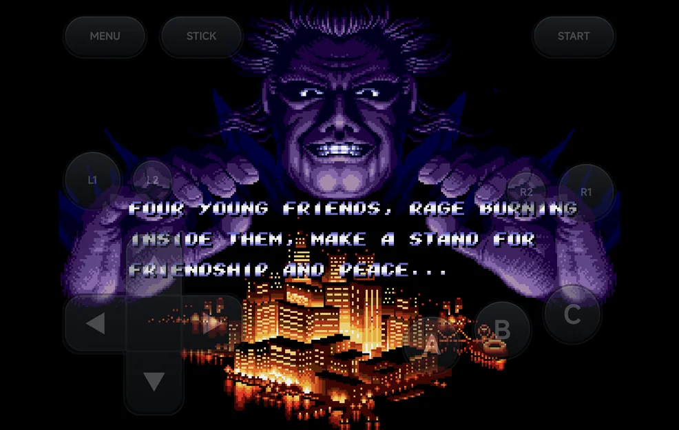
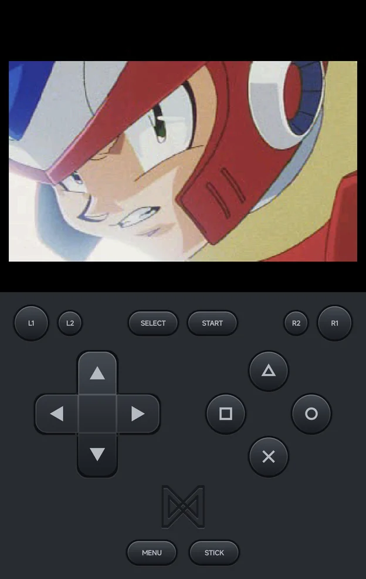
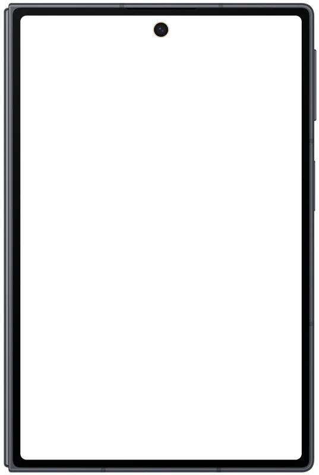
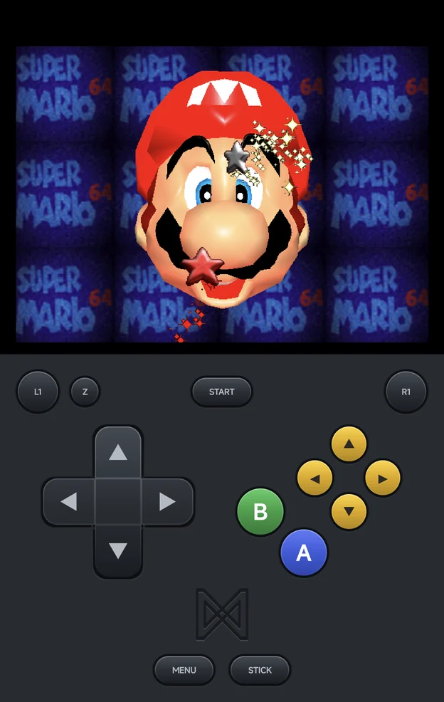
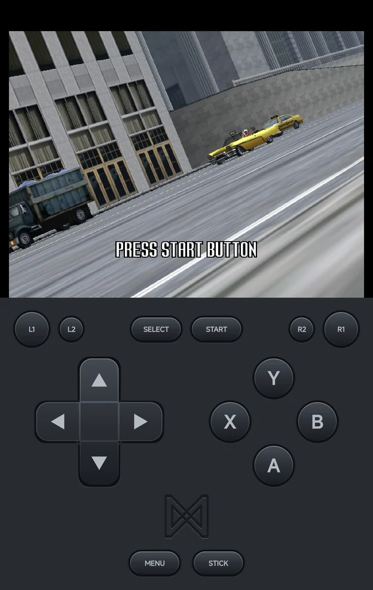
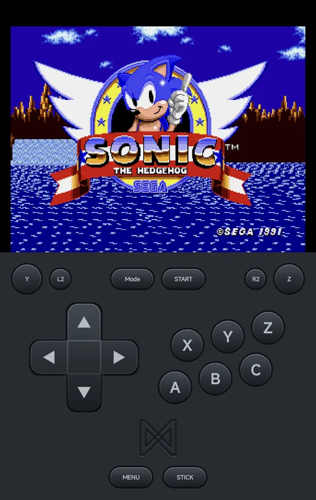
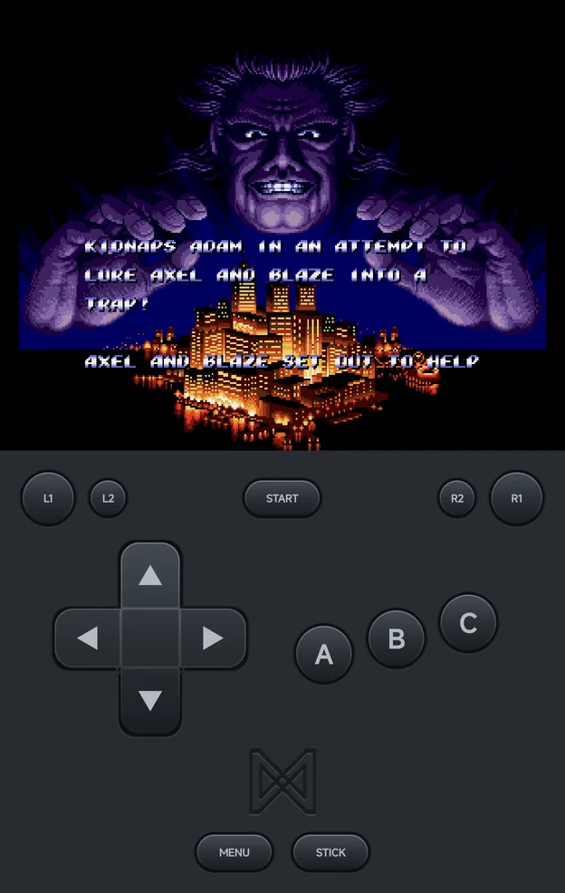
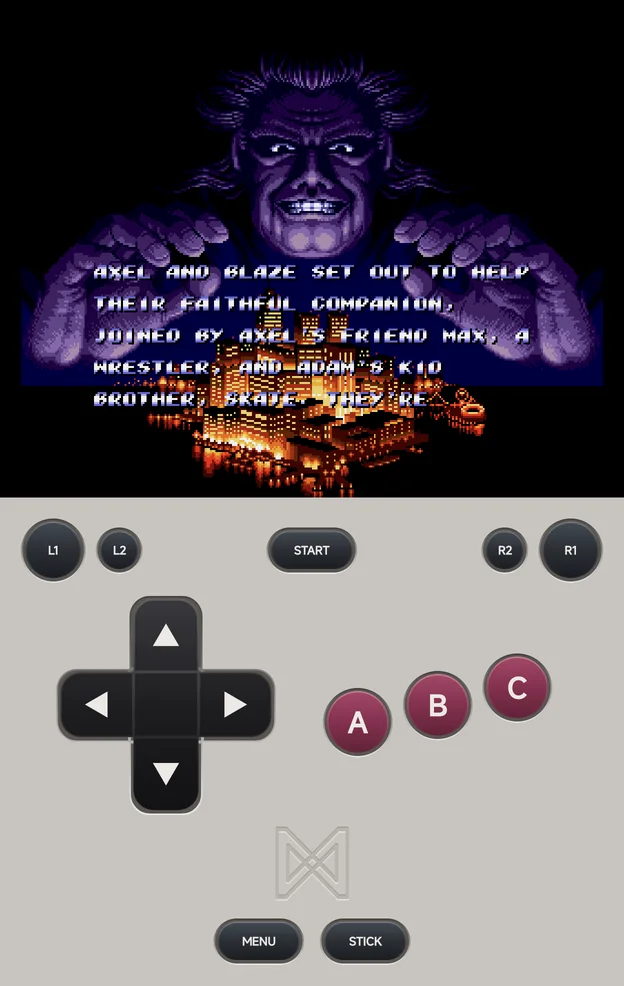

# Controls

## On-screen pad and controllers

Without a controller the app shows an on-screen pad. Connect any Android
controller to play with real buttons instead.

- **Portrait:** the pad sits in a band below the screen, in the menus and in
  games. On Nintendo DS, the band goes away while a controller is connected,
  so both screens get the full height (see
  [Nintendo DS](emulators.md#nintendo-ds)).
- **Landscape:** the buttons sit in two clusters over the game. See
  [Landscape](#landscape).
- **`STICK`** switches the on-screen d-pad to an analog stick and back. While
  the stick is on, the button reads **D-PAD**.

### Landscape

In landscape the pad splits into two clusters over the game:

- The system buttons sit in the top corners: `MENU` and `STICK` on the left,
  `SELECT` and `START` on the right.
- The shoulders, the d-pad and the face buttons sit at the bottom.
- Both clusters keep clear of the camera cutout, on whichever side it is.

**Pad Opacity (landscape)** sets how opaque the clusters are: 100%, 60%, 40% or
25% (40% by default). It is in the in-game menu under **Options →
[Frontend](in-game-menu.md#frontend)**, not in Settings. It is saved per game
or console with Save Changes.

### Each console's buttons

The pad draws each console's own buttons, and leaves out the ones the console
doesn't have:

| Console | What the pad shows |
| --- | --- |
| Sega Genesis, Sega CD, 32X | The Sega pad: `A` `B` `C` on a 3-button pad, plus `X` `Y` `Z` and `Mode` on a 6-button pad (`Y` and `Z` are on the shoulder buttons, and `Mode` is in place of `SELECT`) |
| Master System, Game Gear, SG-1000 | `1` and `2` |
| TurboGrafx-16 | `I` to `VI`, `Run` and `Mode` |
| PlayStation, PSP | `○` `×` `△` `□` |
| Nintendo 64 | `A`, `B`, a yellow C-button diamond, and `Z` on `L2` |
| Dreamcast | `A` `B` `X` `Y` in the Dreamcast's colours |

The Sega pad follows the game's [Controller Type](#controller-type-sega).

<figure class="nx-phone" markdown>
{ .nx-phone__screen }
{ .nx-phone__frame }
</figure>

<figure class="nx-phone" markdown>
{ .nx-phone__screen }
{ .nx-phone__frame }
</figure>

<figure class="nx-phone" markdown>
{ .nx-phone__screen }
{ .nx-phone__frame }
</figure>

<figure class="nx-phone" markdown>
{ .nx-phone__screen }
{ .nx-phone__frame }
</figure>

### Pad themes

**Pad theme** in **Tools → Settings → [Appearance](appearance.md)** colours
the portrait pad:

| Theme | Look |
| --- | --- |
| **Charcoal** (default) | The dark pad |
| **Retro** | A light grey body with magenta face buttons |

The landscape clusters always stay Charcoal.

<figure class="nx-phone" markdown>
{ .nx-phone__screen }
{ .nx-phone__frame }
</figure>

<figure class="nx-phone" markdown>
{ .nx-phone__screen }
{ .nx-phone__frame }
</figure>

## Controller buttons

A controller's face buttons work **by position**, like the console's own pad:
the bottom button does the same thing on every controller, whatever letter it
shows. So the bottom button is the Super Nintendo's `B`, the PlayStation's `×`
and the Dreamcast's `A`.

To do that the app reads the controller's layout:

- A **Nintendo-layout** pad (`B` at the bottom) is used as it is. Nintendo's
  own controllers and pads in Switch mode are recognised.
- Any other pad is read as **Xbox layout** (`A` at the bottom), and its `A`/`B`
  and `X`/`Y` are swapped.

If a controller is read wrongly, set **Controller Layout** in the in-game
menu's **Options → [Console Settings](in-game-menu.md#console-settings)**:

| Value | Use it for |
| --- | --- |
| **Auto-detect** (default) | Let the app decide |
| **Xbox (A at the bottom)** | A pad with `A` at the bottom |
| **Nintendo (B at the bottom)** | A pad with `B` at the bottom |

Every console has it except Nintendo 64. Save it for the console or the game
with Save Changes.

The other buttons:

| Controller | NX Redux |
| --- | --- |
| `L1`, `R1`, `L2`, `R2` | `L1`, `R1`, `L2`, `R2` |
| `START`, `SELECT` | `START`, `SELECT` |
| Mode button (Android's `BUTTON_MODE`) | `MENU` |
| D-pad | `UP`, `DOWN`, `LEFT`, `RIGHT` |
| Left and right sticks | The core's analog sticks (on Nintendo DS the left stick works as the d-pad, or moves the pen in stylus mode) |

On a controller without a mode button, hold `SELECT` and `START` together to
open the in-game menu.

### Nintendo 64

The Nintendo 64 goes by name instead: the button printed `A` is the N64's `A`
on every controller.

| Controller | Nintendo 64 |
| --- | --- |
| `A`, `B` | `A`, `B` |
| `X` | C-Left |
| `Y` | C-Down |
| `L1`, `R1` | `L`, `R` |
| `L2` | `Z` |
| Right stick | The C buttons |

### Controller Type (Sega)

Sega Genesis, Sega CD and 32X games have **Controller Type** in **Options →
[Console Settings](in-game-menu.md#console-settings)**:

| Value | What the game sees |
| --- | --- |
| **Auto** (default) | A 6-button pad only for games made for one, else a 3-button pad |
| **3 buttons** | A 3-button pad |
| **6 buttons** | A 6-button pad |

Some older games misbehave with a 6-button pad. The on-screen pad changes to
match.

## In the menus

| Button | What it does |
| --- | --- |
| `A` | Open or start the highlighted item |
| `B` | Back. Android's Back gesture does the same. |
| `X` | In a game list, resume the highlighted game when it can be resumed |
| `SELECT` | Open the [Game Switcher](game-switcher.md). The main menu's hint reads **Recent**. |
| `MENU`, or a long press | Open the context menu |
| `L1` / `R1` | Switch main menu tabs |

**Which button confirms:**

- On a controller, `A` confirms and `B` goes back, by the letters printed on
  it.
- On the on-screen pad, the button drawn as `A` confirms and the one drawn as
  `B` goes back. On PlayStation and PSP, `×` confirms and `○` goes back.

Menus show key hints you can tap when a controller or the on-screen pad is
present, and real buttons in landscape without one.

## Game-list context menu

Press `MENU`, or long-press a game, for its context menu: Pin Item, Hide
Game, Rename Rom, Add to Collection, Game Settings, Fetch art and Emulator.
See [Context menus](main-menu.md#context-menus) for what each does and where
it shows.

## In-game menu

Press `MENU`, hold `SELECT` + `START`, or use Android's Back gesture during a
game. The menu has save states and Options: Console Settings, Frontend,
Shaders, Core Options, Cheats, Achievements and Save Changes. See
[In-game Menu](in-game-menu.md).
