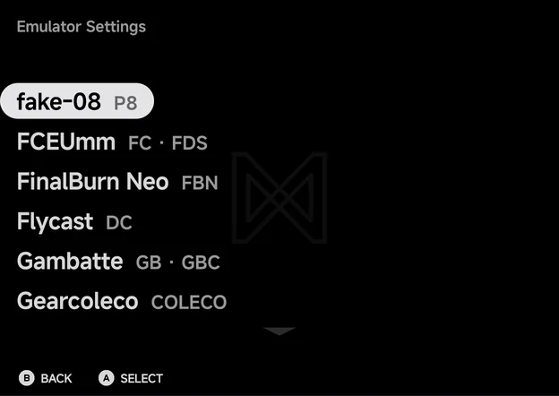
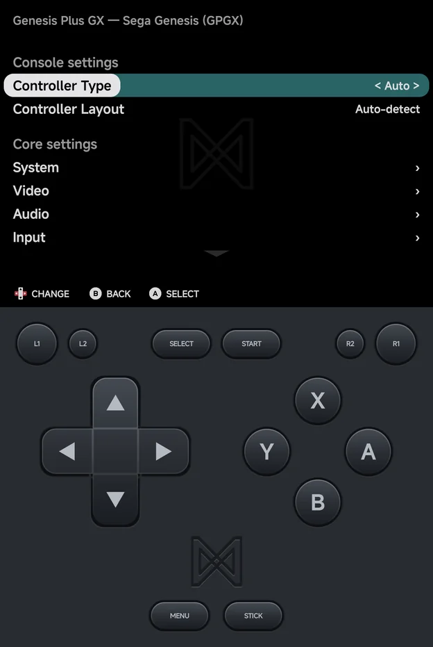
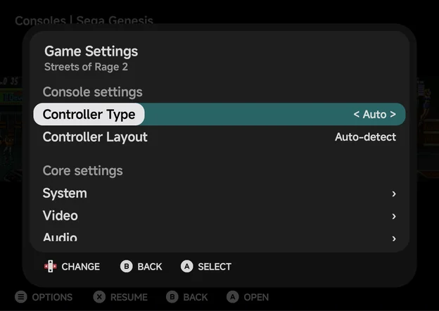
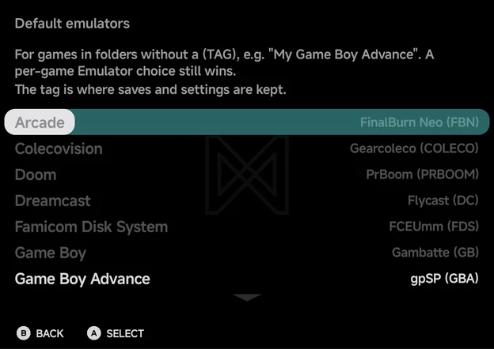

# Emulator Settings

**Tools → Settings → Emulators → Settings** opens **Emulator Settings**. It
sets each emulator's options for a whole console, without starting a game
first.

For one game, use **Game Settings** in the game's context menu instead. See
[Game Settings](#game-settings).

## The emulator list

The page lists every emulator that runs at least one of your consoles, with
the tags it covers beside it, such as **Gambatte GB · GBC**. Emulators for
consoles you have no games for are not listed.

Press `A` on an emulator. When it covers more than one tag, the app asks for
the console first.

## An emulator's settings

The page is titled with the emulator, the console and the tag, such as
**Genesis Plus GX — Sega Genesis (MD)**. It has two groups:

| Group | What it holds |
| --- | --- |
| **Console settings** | The app's own settings for the console: **Controller Layout** for every console but N64, **Controller Type** for Sega Genesis, Sega CD and Sega 32X, and the **Layout** and **Big Screen** rows for Nintendo DS. These are the rows of the in-game [Console Settings](in-game-menu.md#console-settings) page. |
| **Core settings** | The emulator's own options. Rows with `›` open a group of options, such as **Video** or **Audio**. |

- `LEFT` and `RIGHT` change a value. `A` steps it forward too.
- Each change is saved straight away. There is no **Save** row.
- The page also offers options that only take effect when a game starts,
  such as the N64 resolution. The in-game
  [Core Options](in-game-menu.md#core-options) page leaves those out. The
  new value is used the next time you start a game.
- When the app cannot read an emulator's options outside a game, **Core
  settings** shows **This core's options aren't available outside a game.**
  Change them from the in-game menu instead.

What you set here is the console's setting. It is the same file the in-game
menu's **Save Changes → Save for console** writes. See the
[in-game menu](in-game-menu.md) for the options themselves.

## Game Settings

Open a game's context menu with `MENU` in a game list and choose **Game
Settings**. The same page opens over the list, for that one game.

- The first change gives the game its own settings, starting from the
  console's. It is the same file **Save Changes → Save for game** writes.
- While the game has its own settings, the page starts with **Use emulator
  settings**. `A` on it deletes the game's settings, so the game follows the
  console's again.
- `B` goes back to the game list, on the same game.

## Default emulators

Some consoles can run on more than one emulator. **Tools → Settings →
Emulators → Default emulators** picks the one used for a folder that has no
tag.

The page explains:

> For games in folders without a (TAG), e.g. "My Game Boy Advance". A
> per-game Emulator choice still wins.
>
> The tag is where saves and settings are kept.

Each console you have games for has a row, showing its emulator and tag,
such as **gpSP (GBA)**. Only two consoles have a choice, and their rows
always show:

| Console | Choices |
| --- | --- |
| **Game Boy Advance** | **gpSP (GBA)**, **mGBA (MGBA)** |
| **Super Nintendo ES** | **Snes9x (SFC)**, **Supafaust (SUPA)** |

`A`, `LEFT` or `RIGHT` cycles them. The other rows are dimmed and only show
the emulator in use.

- A folder with a tag, such as `Game Boy Advance (MGBA)`, always uses that
  tag's emulator.
- To switch one game to another emulator, use **Emulator** in its context
  menu. See [Emulators](emulators.md).
