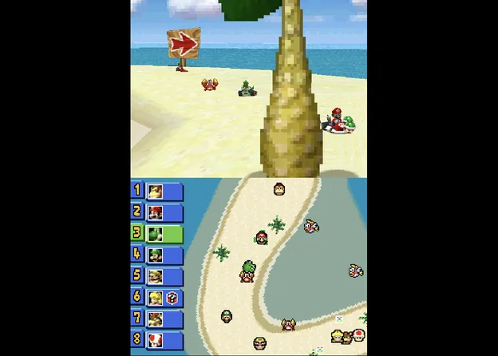
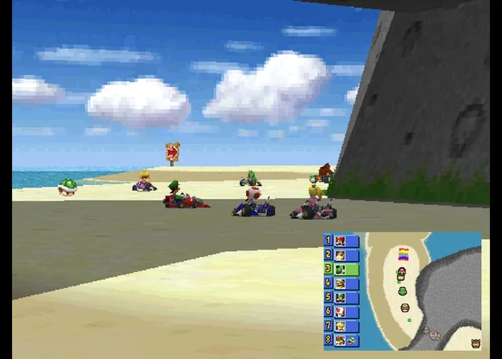
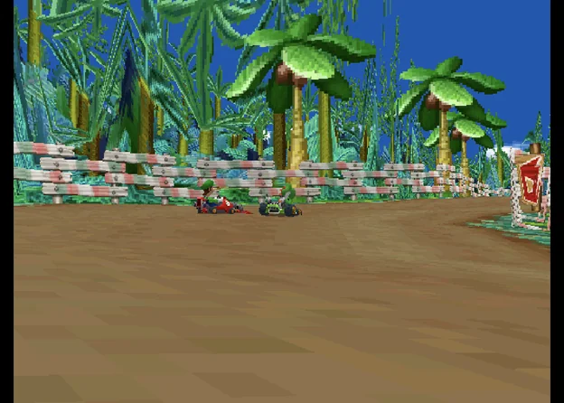
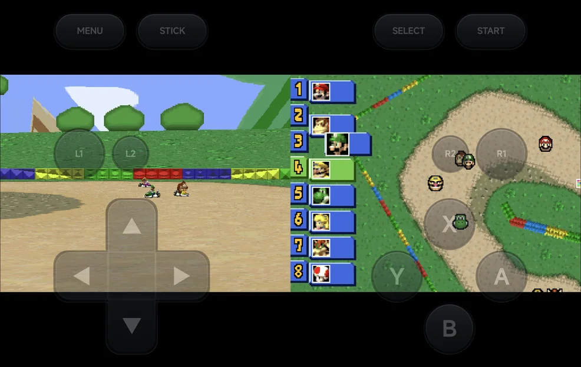
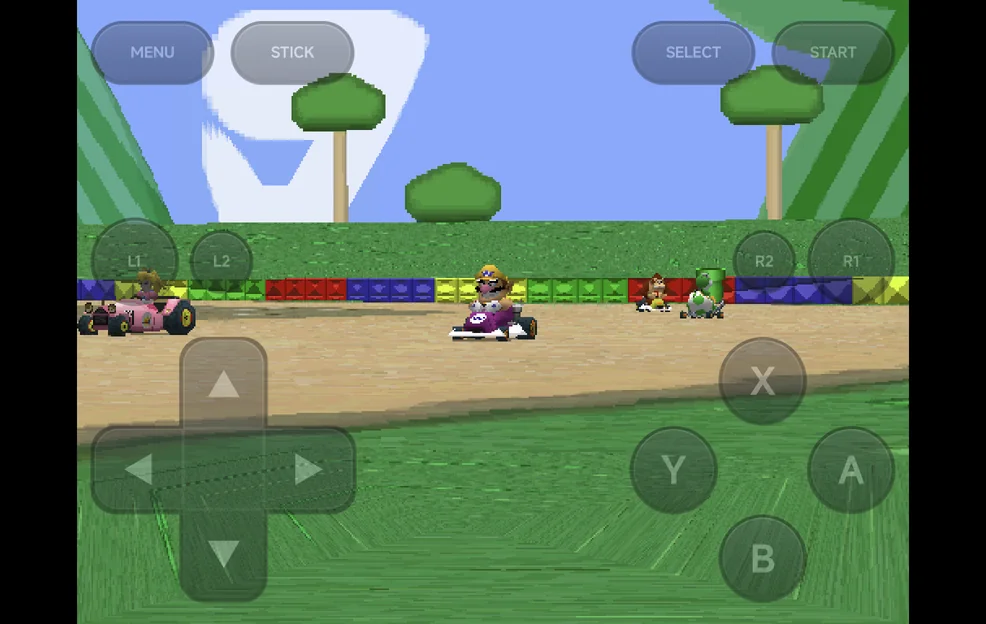
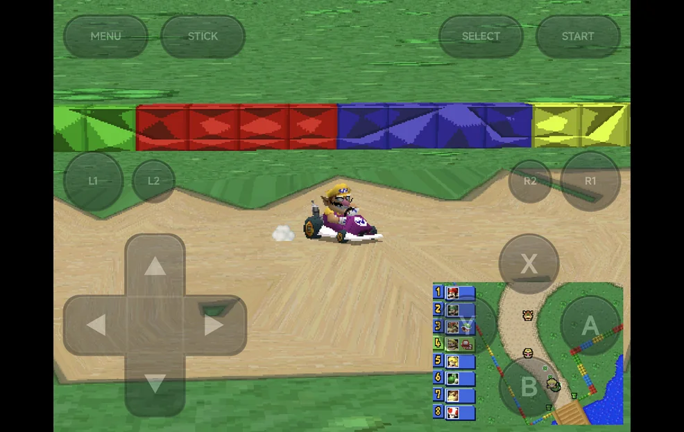
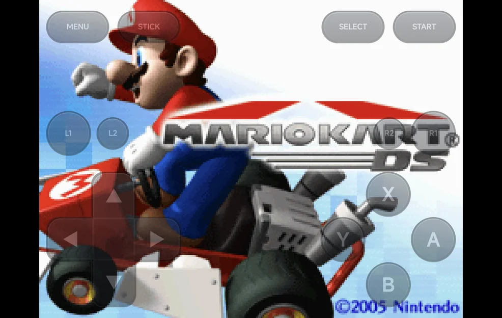
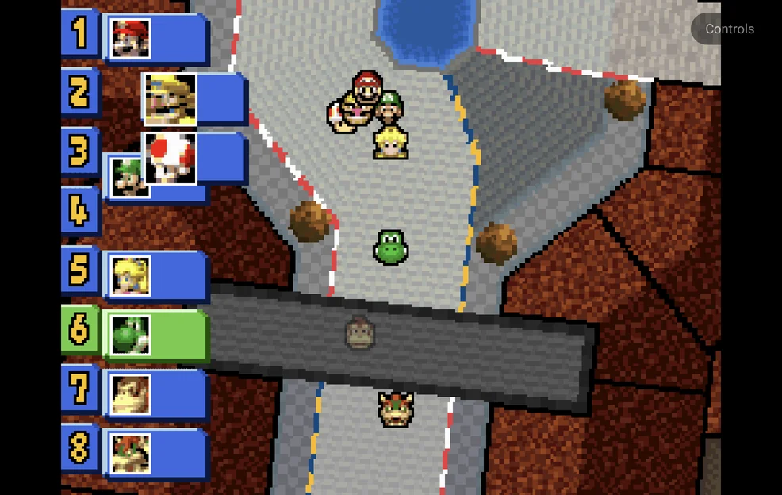

# Emulators

Every core is bundled in the app. There is nothing to download. Folder and
tag names match NX Redux on the handheld.

| System | Tag(s) | Core |
| --- | --- | --- |
| Nintendo DS | `NDS` | melonDS DS |
| Nintendo 64 | `N64` | Mupen64Plus-Next |
| PlayStation Portable | `PSP` | PPSSPP |
| Game Boy / Game Boy Color | `GB`, `GBC` | Gambatte |
| Game Boy Advance | `GBA` | gpSP |
| Game Boy Advance, Super Game Boy | `MGBA`, `SGB` | mGBA |
| NES / Famicom Disk System | `FC`, `FDS` | FCEUmm |
| Super Nintendo | `SFC` | Snes9x |
| Super Nintendo | `SUPA` | Supafaust |
| Genesis / Mega Drive, Master System, Game Gear, SG-1000, Sega CD | `MD`, `SMS`, `GG`, `SG1000`, `SEGACD` | Genesis Plus GX |
| Sega 32X | `32X` | PicoDrive |
| Dreamcast, NAOMI, Atomiswave | `DC` | Flycast (see [Sega Dreamcast](dreamcast.md)) |
| PlayStation | `PS` | PCSX-ReARMed |
| Neo Geo Pocket / Color | `NGP`, `NGPC` | RACE |
| PC Engine / TurboGrafx-16 | `PCE` | Beetle PCE Fast |
| Virtual Boy | `VB` | Beetle VB |
| Atari Lynx | `LYNX` | Handy |
| Atari 2600 | `A2600` | Stella 2014 |
| Atari 5200 | `A5200` | a5200 |
| Atari 7800 | `A7800` | ProSystem |
| Pokémon Mini | `PKM` | PokeMini |
| WonderSwan Color | `WSC` | Beetle WonderSwan |
| PICO-8 | `P8` | fake-08 |
| Doom | `PRBOOM` | PrBoom |
| ColecoVision | `COLECO` | Gearcoleco |
| Arcade | `FBN` | FinalBurn Neo |
| Android | none | The game's own app (see [Launcher Mode & Android Games](launcher.md)) |

**Android** shows as a console once you add Android games. They are apps
installed on your phone, and the app starts them for you. They have no core
and no folder.

## Choosing an emulator

Two consoles have a second emulator, each with its own tag:

| Console | Tags |
| --- | --- |
| Game Boy Advance | `GBA` (gpSP), `MGBA` (mGBA) |
| Super Nintendo ES | `SFC` (Snes9x), `SUPA` (Supafaust) |

- A folder named with a tag, such as `Game Boy Advance (MGBA)`, uses that
  tag.
- For folders without a tag, pick the emulator in **Tools → Settings →
  Emulators → Default emulators**.
- For one game, press `MENU` on it in a game list and pick **Emulator**. This
  choice wins over both.

The tag is where saves and settings are kept. To set a core's options outside
a game, for a whole console or for one game, see
[Emulator Settings](emulator-settings.md).

## Sega Genesis

Sega Genesis uses the `MD` tag, and the app creates
`Roms/Sega Genesis (MD)/`. Genesis, Master System, Game Gear, SG-1000 and
Sega CD all run Genesis Plus GX. Only 32X runs PicoDrive.

??? info "Coming from a legacy GPGX folder"
    A legacy `Sega Genesis (GPGX)` folder from the handheld still lists under
    Sega Genesis and plays, with its saves in the legacy `Saves/GPGX/`.
    The app never offers the legacy GPGX tag as an emulator. Read
    [the FAQ](../reference/faq/mobile.md#my-sega-genesis-save-states-are-gone)
    before you move those games to the `MD` folder.

### Controller Type

Sega Genesis, Sega CD and 32X games have **Controller Type** in the in-game
menu's **Options → Console Settings**:

| Value | What the game sees |
| --- | --- |
| **Auto** (default) | A 6-button pad only for games made for one, else a 3-button pad |
| **3 buttons** | A 3-button pad |
| **6 buttons** | A 6-button pad |

Some older games misbehave with a 6-button pad. The on-screen pad changes to
match: `A` `B` `C` on a 3-button pad, plus `X` `Y` `Z` and `Mode` on a
6-button pad (`Y` and `Z` are on the shoulder buttons, and `Mode` is in
place of `SELECT`). See [Controls](controls.md#controller-type-sega).

## Nintendo 64

The Nintendo 64 maps a controller **by name**: the button printed `A` is the
N64's `A` on every controller.

| Controller | Nintendo 64 |
| --- | --- |
| `A`, `B` | `A`, `B` |
| `X` | C-Left |
| `Y` | C-Down |
| `L1`, `R1` | `L`, `R` |
| `L2` | `Z` |
| `START` | `START` |
| Right stick | The C buttons |

- The on-screen pad draws a C-button diamond, with `Z` on `L2`.
- `R2` and `SELECT` do nothing on the N64.
- N64 has no **Controller Layout** setting. Every other console maps face
  buttons by position; see [Controls](controls.md#nintendo-64).

## BIOS files

Put BIOS files in `Bios/<TAG>/`.

- These systems need their BIOS: Famicom Disk System, Sega CD, PC Engine CD,
  ColecoVision (`Bios/COLECO/colecovision.rom`) and Dreamcast
  ([Sega Dreamcast](dreamcast.md#bios)).
- The app checks for it before launch and names the missing file, such as
  **Sega CD needs a BIOS: put bios_CD_U.bin (or bios_CD_E.bin,
  bios_CD_J.bin) in Bios/SEGACD/**.
- PlayStation has a BIOS built in, and uses a real one when present.

??? info "More detail"
    A launch also reads the folders of tags that share its core. So a
    handheld's layout (`Bios/FC/disksys.rom`, `Bios/MD/bios_CD_*.bin`,
    `Bios/PS/psxonpsp660.bin`) works unchanged.

## Zip and 7z files

An archive holding one game plays on every core. An archive with one game
beside extras, such as a readme, plays too.

Archives with several games, a password, or a game the chosen core can't run
are refused with a message.

??? info "More detail"
    The app unpacks the archive on first launch. Saves use the archive's name,
    as on the handheld. The unpacked copies are trimmed automatically; see
    [Unpacked games cache](library.md#unpacked-games-cache).

    Arcade sets are the exception. For FinalBurn Neo, NAOMI and Atomiswave the
    zip *is* the game, and it is never unpacked.

## Multi-disc games

A multi-file disc (`.cue`, `.gdi`) or a disc list (`.m3u`) loads as one game.

To change disc, open the [in-game menu](in-game-menu.md#the-first-page). For a
game with more than one disc it shows a **Disc** row under **Continue**, with
the disc in the drive, such as `1/2`. `LEFT` / `RIGHT` change the disc, as
opening the lid and swapping it would. The disc choice is not saved.

## Arcade (FBNeo)

- An arcade set's zip or 7z *is* the game and is never unpacked.
- Parent and BIOS sets, such as `neogeo.zip`, are read from the same folder or
  from `Bios/FBN/`. BIOS sets are not listed as games.
- A missing BIOS set stops the launch with a message. A missing parent set
  does not: the game is tried without it.
- Games show their arcade titles, with bracketed text dropped as on the
  handheld.
- Arcade has no cheats.

NAOMI and Atomiswave games run on Flycast instead, from the Dreamcast folder.
See [Sega Dreamcast](dreamcast.md#naomi-and-atomiswave).

## Nintendo DS

Nintendo DS runs **melonDS DS**. The core draws both screens and the app lays
them out.

The layout options are in the in-game menu under **Options → Console
Settings**. Like the other options, they are kept per game or console with
[Save Changes](in-game-menu.md#save-changes). Screen Scaling and the screen
offsets don't apply to the DS screens.

### Portrait layouts

**Layout (portrait)** sets how the two screens share a portrait screen:

| Layout | What you see |
| --- | --- |
| **Auto** (default) | **Stacked** when both screens fit the width, else **Picture in picture**. |
| **Picture in picture** | One screen big, the other small in a corner. |
| **Stacked** | One screen above the other. |
| **Single screen** | Only the big screen. |

With a controller connected in portrait, the on-screen pad band goes away, so
the screens get the full height. **Layout (portrait, controller)** is used
instead. Its choices are the same, and its default is **Stacked**.

A clip-on controller that holds the phone keeps the pad band and the normal
portrait layout. The GameSir Pocket Taco is recognised as one. The 8BitDo
FlipPad is expected to be recognised too.

### Landscape layouts

**Layout (landscape)** sets how the two screens share a landscape screen:

| Layout | What you see |
| --- | --- |
| **Side by side** (default) | Each screen takes half the width. |
| **Single screen** | The big screen only, centred. |
| **Picture in picture** | The big screen centred, the other small in a corner. |

Without a controller, the on-screen buttons sit over the game in landscape.
**Pad Opacity (landscape)** in **Options → Frontend** sets how opaque they
are: 100%, 60%, 40% or 25%, 40% by default.

### Big screen and inset

These apply in both orientations:

| Option | Values | Default | What it does |
| --- | --- | --- | --- |
| **Big Screen** | Top screen, Bottom screen | Top screen | The screen shown big in picture in picture and single screen, and first in stacked and side by side. |
| **Inset Corner** | Top left, Top right, Bottom left, Bottom right | Bottom right | Where the small screen sits in picture in picture. |
| **Inset Size** | Small, Medium, Large | Medium | The small screen's width: 25%, 33% or 40% of the big screen's width. |
| **Inset Opacity** | 100%, 75%, 50% | 100% | How opaque the small screen is. Below 100%, the big screen shows through it. |

- The small screen in picture in picture never takes touches.
- Overlays are off while the DS screens are drawn apart. The **Overlay** row
  shows **Unavailable**.
- Shader presets apply to the big screen, and to both screens in stacked and
  side by side.

### Hotkeys

With a controller or the on-screen pad:

| Buttons | What they do |
| --- | --- |
| `R2` | Swap the big screen. |
| `SELECT` + `LEFT` / `RIGHT` | Change the layout of the orientation you're in. In portrait this steps through Picture in picture, Stacked and Single screen. |
| `SELECT` + `UP` / `DOWN` | Move the inset to the previous or next corner, clockwise. |
| `L2` | Turn stylus mode on or off, or start touch mode (see below). |

A short label shows the new setting. The layout hotkeys (`R2` and `SELECT` +
a direction) are saved straight away, without Save Changes. Stylus mode and
touch mode are not saved.

??? info "More detail"
    Saving a layout hotkey gives the game its own settings, copied from the
    console's if it had none. From then on the game uses only its own
    settings. Later **Save for console** changes don't reach it until you use
    **Restore defaults** in that game.

### Stylus mode

In stylus mode, the d-pad or left stick moves a pen on the bottom screen,
faster the longer you hold it, and `A` touches. Stylus mode is off each time a
game starts.

### Touch

You can touch the bottom screen whenever it is drawn full size. You can't when
it is the small inset in picture in picture.

- Touch works in portrait.
- In landscape it works with a controller, or in touch mode.
- While the on-screen buttons sit over the game in landscape, the DS screens
  take no touches.

**Touch mode:** in landscape with the on-screen buttons shown and stylus mode
off, `L2` hides the buttons and shows the bottom screen big, so you can touch
it. A **Controls** button in a free corner brings the on-screen buttons back.

- In single screen and picture in picture, the bottom screen becomes the big
  one. Side by side already shows it full size.
- Rotating the phone, or connecting or disconnecting a controller, also ends
  touch mode.
- `R2` does nothing in touch mode, and touch mode is not saved.
- With stylus mode on, `L2` turns stylus mode off first.

### 3D rendering

**Internal Resolution** in **Core Options → Video** upscales 3D: 1× to 8×, 2×
by default. Some games slow down at 4× or higher.

??? info "More detail"
    - 3D renders on the GPU on devices with OpenGL ES 3.2, else in software.
    - Internal Resolution works with the GPU renderer only. The 2D layers stay
      at native resolution.
    - A **Render Mode** change in Core Options applies the next time the game
      starts, once you keep it with Save Changes.
    - If the GPU renderer can't start, the game runs in software and the app
      shows **GPU renderer unavailable — using software** once. The next
      launch tries the GPU again.

### Saves from other DS emulators

Battery saves from the older melonDS core and from DraStic carry over
(converted to `.srm` on a game's first launch). Save
states from the older melonDS core don't load.

??? info "More detail"
    Battery saves from the older melonDS core (`.sav`) and from DraStic
    (`.dsv`) are converted to `.srm` on a game's first launch.

## Limits

- **PlayStation `.exe` homebrew** doesn't load.
- **PICO-8** games have no save states, and don't resume where you left off.
