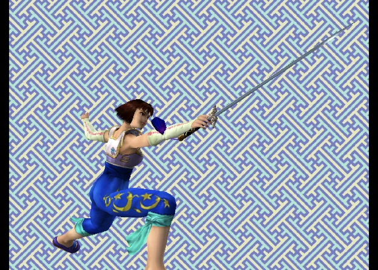

# Sega Dreamcast

Play Dreamcast games, plus the **Sega NAOMI** and **Sammy Atomiswave**
arcade games built on the same hardware. They all run on **Flycast**, from one
folder: `Roms/Dreamcast (DC)/`.



Dreamcast gets the same features as the other systems:

- the [in-game menu](../in-game-menu.md) with save states and auto-resume
- the [Game Switcher](../game-switcher.md)
- play time in the [Game Tracker](../game-tracker.md)
- [RetroAchievements](#retroachievements) for disc games

Dreamcast has no cheats.

## BIOS

Dreamcast discs need the real BIOS. Put `dc_boot.bin` in `Bios/DC/`.

Without it, the game doesn't start and the app says:

**Dreamcast needs a BIOS: put dc_boot.bin in Bios/DC/**

The arcade games need their own BIOS instead (see
[NAOMI and Atomiswave](#naomi-and-atomiswave)). They don't need
`dc_boot.bin`.

| File | For |
| --- | --- |
| `dc_boot.bin` | Dreamcast discs |
| `naomi.zip` | NAOMI games |
| `awbios.zip` | Atomiswave games |

!!! warning "Coming from the handheld"
    The handheld can run Dreamcast discs without a BIOS. The app can't: put
    `dc_boot.bin` in `Bios/DC/` even if your handheld played the games
    without it.

## Adding games

Put Dreamcast discs in `Roms/Dreamcast (DC)/`. The app plays `.chd`, `.cdi`,
`.gdi`, `.cue` and `.m3u`. A zip or 7z holding one disc plays too; the app
unpacks it on first launch.

A **GDI game** is a `.gdi` file plus its track files. Give each GDI game its
own folder, and name the `.gdi` after the folder:

```
Roms/Dreamcast (DC)/
├── Soulcalibur (USA).chd
└── Shenmue (USA)/
    ├── Shenmue (USA).gdi
    ├── track01.bin
    ├── track02.raw
    └── track03.bin
```

The folder shows as one game in the list.

!!! warning "Rename a `disc.gdi`"
    Some sets name every sheet `disc.gdi`. The app doesn't list a folder
    whose `.gdi` is named differently from the folder. Saves, states and
    the memory card are named after the file, so every `disc.gdi` game
    would share them. Rename the `.gdi` to match its folder.

A multi-disc game plays as one game from an `.m3u` that lists its discs. The
in-game menu then has a **Disc** row; see
[Multi-disc games](index.md#multi-disc-games).

## Controls

The face buttons map to the Dreamcast pad **by position**, the way the
Dreamcast controller is laid out:

| Position | Dreamcast button |
| --- | --- |
| Bottom | `A` |
| Right | `B` |
| Left | `X` |
| Top | `Y` |

| Control | Dreamcast control |
| --- | --- |
| D-pad | D-pad |
| Left stick | Analog stick |
| `L2` / `R2` | Analog triggers |
| `START` | `START` |
| `SELECT` | Insert a coin (NAOMI and Atomiswave) |
| `L3` (press the left stick) | Test, the operator menu (NAOMI and Atomiswave) |
| `R3` (press the right stick) | Service (NAOMI and Atomiswave) |

- The on-screen pad draws `A` `B` `X` `Y` in the Dreamcast's colours, in the
  positions above.
- With the on-screen pad, the in-game menu follows the drawn letters: the
  bottom button (`A`) confirms and the right one (`B`) goes back.
- A controller is read by position too, so a "Press A" prompt means the
  bottom button, whatever letter it shows. If a controller is read wrongly,
  set **Controller Layout** in **Options → Console Settings** (see
  [Controls](../controls.md)).
- `L3` and `R3` are on controllers only: the on-screen pad has no stick
  buttons.
- On a controller the triggers press as far as you pull them. On the
  on-screen pad, `L2` and `R2` press fully.
- `MENU`, or `SELECT` + `START`, opens the
  [in-game menu](../in-game-menu.md). On NAOMI and Atomiswave the game sees
  the `SELECT` press first, so it may count a coin.

## Memory cards (VMU)

Every game gets **its own memory card**, kept with your other saves:

```
Saves/DC/<game>.A1.bin
```

For example `Saves/DC/Soulcalibur (USA).A1.bin`. A GDI game's card is named
after its folder, and an `.m3u` game shares one card across its discs.

To give a game a **fresh, empty card**:

1. Delete the game's `.A1.bin` file in `Saves/DC/`.
2. Launch the game. It starts with a blank card.

!!! warning "Renaming a ROM"
    Renaming a ROM leaves its card behind under the old name, as with any
    save. Rename the card to match.

??? info "More detail"
    - The names match the handheld's NX Redux, so you can copy a card between
      your phone and your handheld.
    - The arcade games keep their high scores and cabinet settings in
      `Saves/DC/reicast/`.

## Save states

Save states work as on every other system: eight slots, plus the auto-save
the app makes when you quit.

A Dreamcast save state is **about 36 MB**, the console's memory stored as it
is. Eight full slots for one game take close to 300 MB on your phone.

## Settings

Change Dreamcast's settings in **Options → Core Options** in the in-game menu.
You can also set them outside a game, for every game or for one, in
[Emulator Settings](../emulator-settings.md).

The internal resolution starts at 640×480, the Dreamcast's own. Higher values
look sharper but cost speed.

## NAOMI and Atomiswave

NAOMI and Atomiswave games are MAME-style zips (or 7z). To play them:

1. Put the zips straight into `Roms/Dreamcast (DC)/`, next to your Dreamcast
   discs.
2. Put the board's BIOS zip in `Bios/DC/`: `naomi.zip` for NAOMI,
   `awbios.zip` for Atomiswave.
3. Launch the game and press `SELECT` to insert a coin, then `START`.

A few sets need another BIOS zip, such as `naomi2.zip` for NAOMI 2 games. The
message names the one that's missing.

!!! warning "Don't rename the zips"
    Flycast finds a game by its short zip name (`mslug6.zip`, not
    `Metal Slug 6.zip`). The game list still shows readable names:
    `mslug6.zip` shows as *Metal Slug 6*.

??? info "More detail"
    - **Names.** Each zip gets its full title from Flycast's own game list.
      A **Rename Rom** or `map.txt` alias always wins over that title.
    - **BIOS zips are hidden.** A BIOS zip put in the game folder by mistake
      is not listed as a game. It still has to be in `Bios/DC/`.
    - **Clones.** A clone set loads its parent set from the same folder.
    - **Zipped discs.** A zip that isn't one of Flycast's arcade sets is
      treated as a zipped Dreamcast disc and unpacked.
    - **Atomiswave BIOS.** Both MAME versions of `awbios.zip` work.

### When a set won't start

The app checks the BIOS before launch. When the zip is missing, it says, for
example:

**Metal Slug 6 needs awbios.zip: put it in Bios/DC/**

When the BIOS zip is there but a file in it is missing, it names the file:

**‹Game› needs naomi.zip with ‹file› in it: put a complete naomi.zip in Bios/DC/**

When the game's own zip is incomplete:

**‹Game› needs ‹file›, which ‹set›.zip does not have: the set is incomplete or from another MAME version**

Get a complete set that matches Flycast's version of MAME.

## RetroAchievements

Dreamcast discs use the app's
[RetroAchievements](../retroachievements.md) support, like the other systems.
The app recognises `.chd`, `.gdi`, `.cue` and `.m3u` games, and a zipped
disc once it is unpacked.

- `.cdi` games are not recognised.
- NAOMI and Atomiswave games are not on RetroAchievements.
