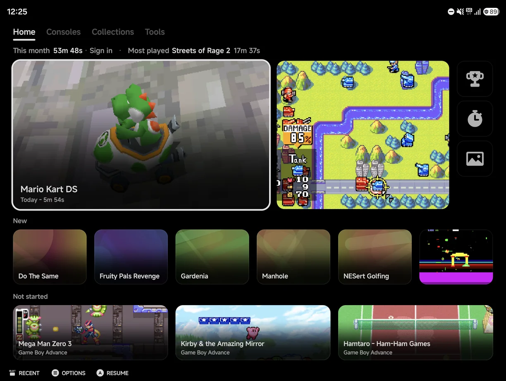
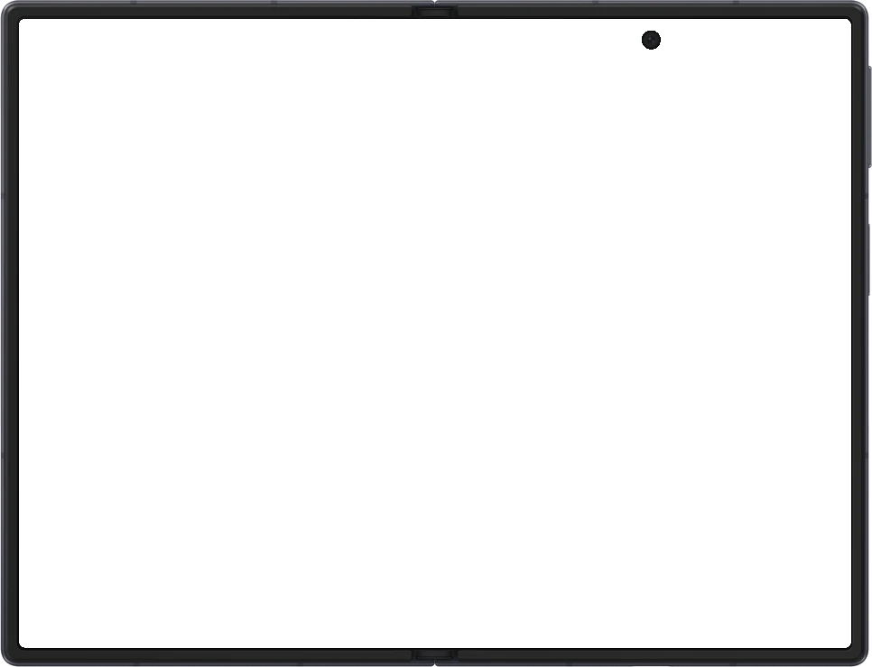
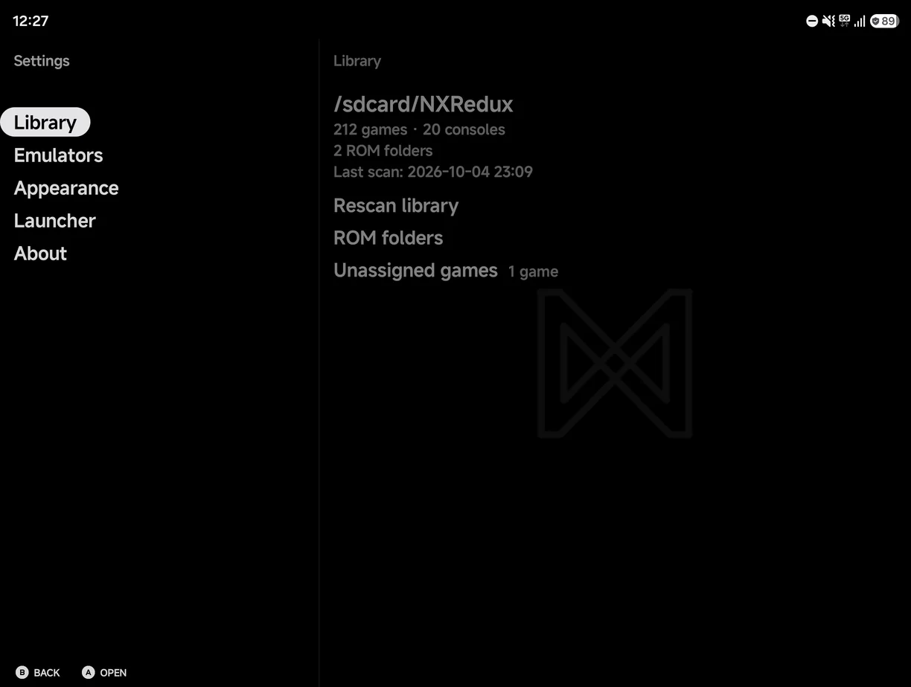
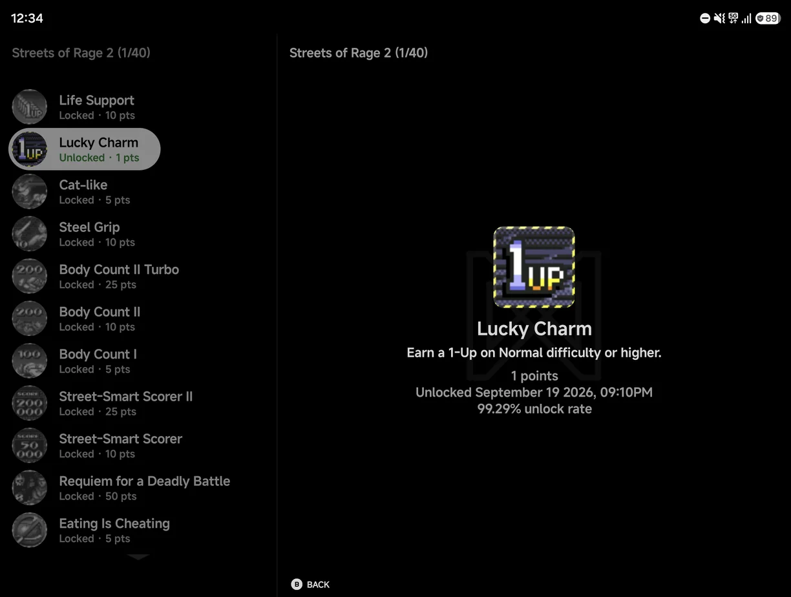
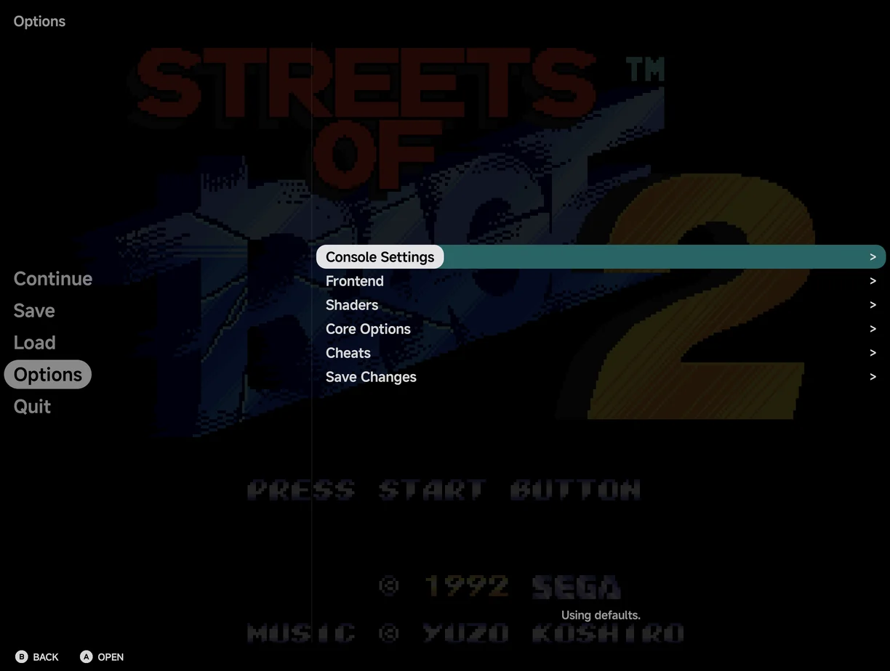

# Foldables & Large Screens

NX Redux Mobile fits itself to the screen it's on. A half-folded foldable
gets Flex mode, a wide or large screen gets a fuller Home, and Settings and
the in-game menu split into two panes when there is room.

## Flex mode

Fold a foldable partway, like a small laptop, with the hinge running across
the screen. The app splits at the hinge:

- **Above the hinge:** the game, or the menu.
- **Below the hinge:**
    - in portrait, the portrait pad;
    - in landscape, the two pad clusters, drawn solid instead of over the
      game;
    - with a controller connected, nothing. The lower half stays empty.

There is no setting. Flex mode starts when you fold the phone and stops when
you open it flat. It works in games and in the main menu alike.

??? info "More detail"
    - The hinge must run across the screen, and each half must be at least a
      quarter of the screen. A book-style fold, with the hinge from top to
      bottom, keeps the usual layout.
    - On a phone that doesn't report its half-folded state, such as the
      Galaxy Z Fold, the app reads the hinge angle: between 30° and 150°
      counts as folded.
    - Nintendo DS games keep their usual layout.

## Home on wide and large screens

Home lays itself out for the screen's shape. In portrait and on most
screens it looks as in [Main Menu](main-menu.md#home).

**Wide face:** a phone in landscape with a 20:9 or wider screen, such as a
Galaxy Z Flip.

- One or two pinned games sit beside the Continue card, in the top section.
  With three or more, they go in rows below it instead.
- The pinned tools are smaller squares, up to six. With more, the last square
  is **+N**, which opens Tools.

**Large face:** a landscape screen at least 840 × 480 dp, such as an
unfolded Galaxy Z Fold or a tablet.

- The top section is as on the wide face: Continue, one or two pinned games
  and the tool squares.
- With three or more pinned games, they fill a **Pinned** band below, four
  to a row.
- Under them come the shelves.

<figure class="nx-phone nx-phone--open" markdown>
{ .nx-phone__screen }
{ .nx-phone__frame }
</figure>

### Shelves

The large face adds up to three shelves of games from your library. Each
shelf shows only when it has games, and a game is never on two shelves.

| Shelf | What it holds |
| --- | --- |
| **New** | Games the app first found in the last 30 days, newest first. Up to 6. |
| **Not started** | Games you have never played. Three wide tiles, picked again each day. |
| **Pick up again** | Games you last played more than 14 days ago, most played first. Up to 6. |

The game on the Continue card, your pinned games, Unassigned games and
Android games are left off the shelves.

## Two-pane screens

On a wide window, at least 600 dp wide and at least 1.3 times as wide as it
is tall, some pages show two panes side by side. An unfolded Fold in landscape
and most phones in landscape qualify. Portrait screens keep one page at a
time.

### Settings

**Tools → Settings** shows its sections on the left and the selected
section's page on the right. Moving through the sections previews each page.

<figure class="nx-phone nx-phone--open" markdown>
{ .nx-phone__screen }
{ .nx-phone__frame }
</figure>

### RetroAchievements

Below the [RetroAchievements](retroachievements.md) page, each level opens
beside the one it came from. The page you came from stays on the left,
dimmed, with the row that opened it highlighted. An achievement's details
show beside the game's achievements list, and a game's achievements beside
the games list. The
[Game Tracker](game-tracker.md) shows a game's sessions the same way.

<figure class="nx-phone nx-phone--open" markdown>
{ .nx-phone__screen }
{ .nx-phone__frame }
</figure>

### In-game menu

The [in-game menu](in-game-menu.md) splits too:

- On the first page, the right pane previews the highlighted row: the save
  slot on **Save** and **Load**, or the page a row opens.
- Deeper in, the open page is on the right and the page it came from on the
  left, dimmed.
- `RIGHT` on a row that opens a page opens it, as `A` does. Value rows still
  change with `LEFT` / `RIGHT`.
- Tap a row in the dimmed pane to go back to it.

<figure class="nx-phone nx-phone--open" markdown>
{ .nx-phone__screen }
{ .nx-phone__frame }
</figure>
