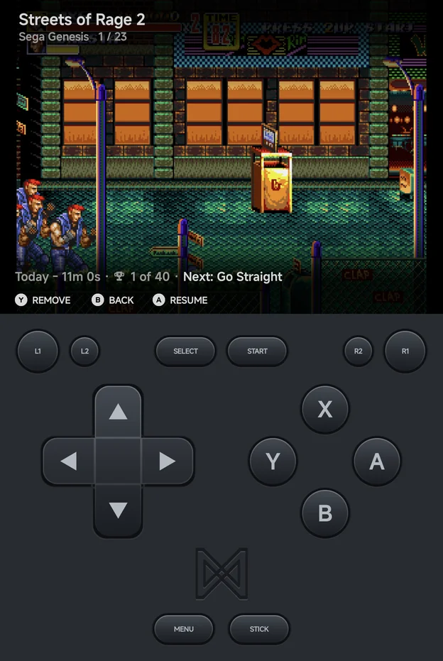

# Game Switcher

Press `SELECT` on the main menu or in a game list to open the Game Switcher:
a full-screen view of your recent games that resumes any of them where you
left off. On the main menu the `SELECT` hint reads **Recent**.

Each game fills the screen with its picture. On top are its name, its console
and its place in the list, such as **1 / 23**. Above the hints is the game's
info line: when you last played it and for how long, its achievements and the
next one to unlock.

- `LEFT` / `RIGHT`, or a swipe left or right, move between games.
- `A` **Resume**, or a tap on the picture, continues the game where you left
  off.
- `Y` **Remove** asks **Remove "‹name›" from recents?** Choose **Remove** to
  take the game out of your recent games.
- `B` **Back**, or `SELECT` again, returns to where you were.

## The picture

The switcher shows the first of these it has for the game:

1. the screenshot of its resume point,
2. its 3D box art,
3. its 2D cover, or else its SteamGridDB grid image, shown in a case,
4. **No Preview**.

See [Artwork](artwork.md) for where box art comes from.

## Always resumable

Quitting a game from the [in-game menu](in-game-menu.md) saves a hidden resume
state, and so does leaving the app while a game is open. So with nearly every
core, every game you have played can be resumed. No manual save state is
needed. PICO-8 is the exception for now (see
[Emulators](emulators/index.md#limits)).

## Only resumable games are listed

The switcher lists only recent games that can be resumed. With none, it shows
**No Recents** and **Play a game to see it here**. Unlike the handheld, there
is no setting to list every recent game instead. Android games are never
listed.

In a game list, `X` **Resume** does the same for the highlighted game when it
can be resumed.
