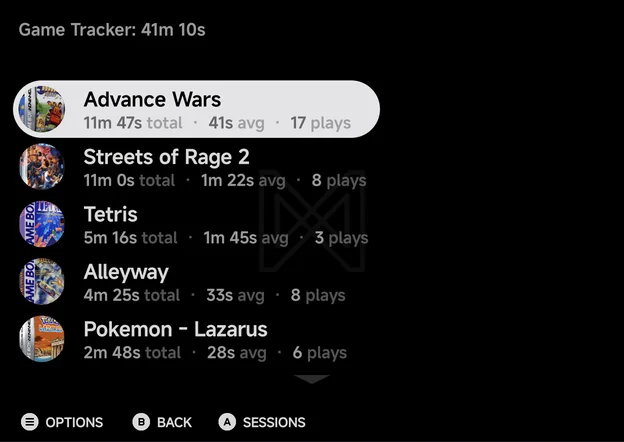
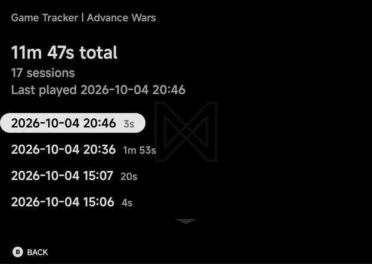

# Game Tracker

**Tools → Game Tracker** shows how long you have played each game. The app
records every play session on its own, with nothing to set up.

- The title shows your total play time, such as **Game Tracker: 41m 10s**.
- Games are listed by play time, most played first, with their box art.
- Each game shows its total time, its average session and how many times you
  played it, such as **11m 47s total · 41s avg · 17 plays**.

Before you have played anything, the page shows **No play activity** and
**Play a game and its time shows up here.**

| Button | What it does |
| --- | --- |
| `A` **Sessions** | Opens the game's sessions |
| `MENU` **Options** | Merge, unmerge or delete the game's play time. A long press does the same. |
| `B` **Back** | Go back |

## Sessions

`A` on a game opens its **Sessions** page. It shows the game's total time,
how many sessions it has and when you last played it, then every session with
its date, time and length, newest first.

The page is read-only. `B` goes back to the list, on the same game.

## Options

`MENU` on a game opens its options.

| Option | What it does |
| --- | --- |
| **Merge into…** | Adds this game's play time to another game. Lists every other game with its time. Shown when the tracker has two games or more. |
| **Unmerge…** | Splits a merged game back out. Lists the games merged into this one. Shown only on a game with others merged into it. |
| **Delete** | Deletes the game's play time |

- **Merge into…** suits one game kept as two files, such as two regions or a
  renamed ROM. When the two names differ, the app asks for the **Name to
  keep**.
- **Delete** asks **Delete play time?** with **Delete play time for *game*?**
  On a merged game, it names the games merged into it too, which are deleted
  with it. The record starts fresh the next time you play.

## What is recorded

- Sessions shorter than 1 second or longer than 24 hours are dropped.
- Android games are not tracked. They start as their own app, so nothing is
  recorded for them.

Home's stats strip shows this month's play time and your most played game,
from the same records. See [Home](main-menu.md#home).
