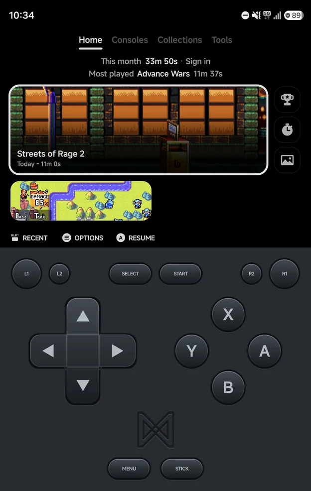
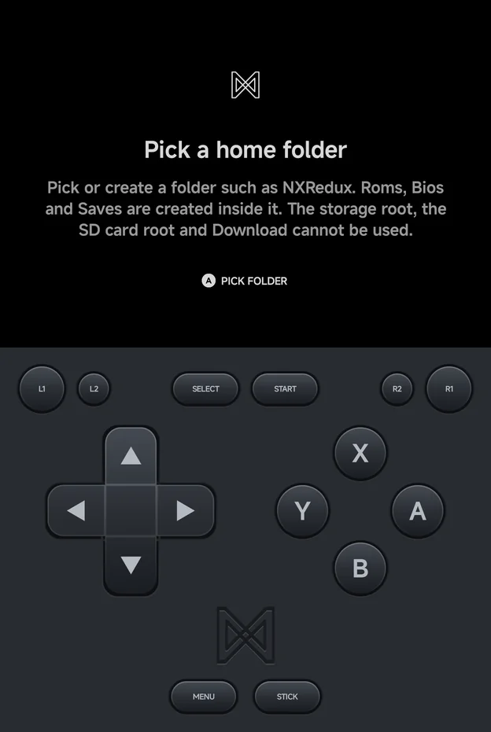
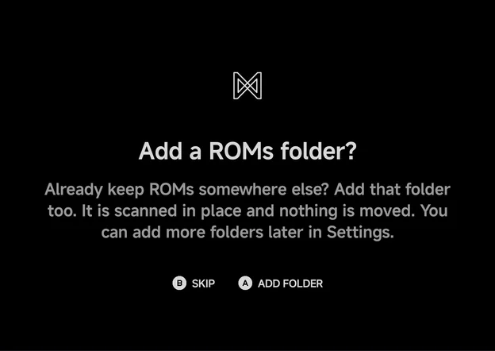
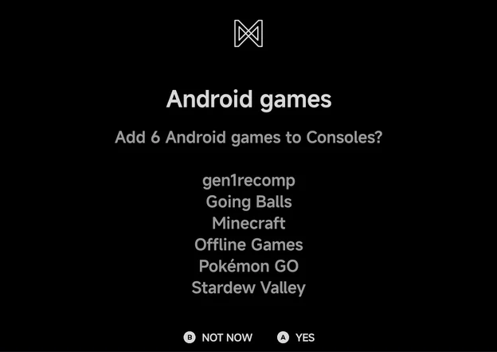

# Getting Started

!!! info "Coming soon"
    NX Redux for Android is not released yet. These pages describe the app as it
    is today.

NX Redux for Android brings the NX Redux look, folder layout and in-game
features to Android phones, tablets, foldables and Android handhelds. It runs retro
systems through emulators bundled in the app, with nothing extra to download.

<figure class="nx-phone" markdown>
{ .nx-phone__screen }
{ .nx-phone__frame }
</figure>

New to NX Redux? See [About NX Redux](../about.md) first.

## What's different from the handheld

- **Emulators:** Sega Dreamcast, NAOMI, Atomiswave and Nintendo 3DS are
  included. Nintendo DS runs melonDS DS (DraStic is not available). See
  [Emulators](emulators/index.md) and [Sega Dreamcast](emulators/dreamcast.md).
- **Library:** besides the home folder, the app can scan extra folders in
  place. See [Library & ROM folders](library.md).
- **Controls:** an on-screen pad, or any Android controller. See
  [Controls](controls.md).
- **Artwork:** the app downloads box art and screenshots for your games. See
  [Artwork](artwork.md).
- **Home screen:** the app can be your phone's home screen, and list your
  Android games and apps. See [Launcher Mode & Android Games](launcher.md).
- **Foldables:** on a half-folded phone, Flex mode puts the game above the
  hinge and the pad below it. See [Foldables & Large Screens](foldables.md).
- **Local multiplayer:** two to four players on one phone, each on their
  own controller. See [Local Multiplayer](multiplayer.md).
- **In a later release:** Netplay, Device Sync, and more systems, such as
  home computers (Amiga, C64 and so on).
- **Not available:** RetroAchievements hardcore mode, the same as on the
  handheld.
- **Left to Android:** Wi-Fi and Bluetooth management, the on-screen display,
  the music player, PortMaster and firmware updates are not part of the app.

## Install

When it's released, the APK is listed on the
[Download](../reference/download.md) page.

## Choose a home folder

On first start the app asks you to **Pick a home folder**. Press `A`
**Pick folder** to open Android's folder picker.

The app creates the NX Redux layout inside the folder you pick:

| Folder | What goes there |
| --- | --- |
| `Roms/<Display Name (TAG)>/` | Games, one folder per system |
| `Bios/<TAG>/` | BIOS files for systems that need them |
| `Saves/<TAG>/` | Battery saves, mirrored from the app |
| `Collections/` | Your game collections, once you make one |

The folders are visible to file managers, so you can copy games in from a
computer. The home folder can sit on an SD card.

If your games already follow the NX Redux layout from a handheld, the same
folder names and `Bios/<TAG>/` files work unchanged.

!!! note "Pick a folder, not a root"
    The picker can't use the storage root, the SD card root or the Download
    folder. Pick or create a folder inside one of them, such as `NXRedux`.

## Add a ROMs folder

Right after you pick the home folder, the app asks **Add a ROMs folder?**

- If you already keep games somewhere else on the phone, press `A`
  **Add folder** and pick that folder. It is scanned in place and nothing is
  moved.
- Press `B` **Skip** to go on without one.

You can add more folders later in **Tools → Settings → Library → ROM folders
→ Add ROM folder**. See [Library & ROM folders](library.md).

## Android games

When the app finds games installed on your phone, the last step asks
**Add N Android games to Consoles?** and lists them.

- Press `A` **Yes** to add them. They show up as an **Android** console on
  the Consoles tab.
- Press `B` **Not now** to leave them out.

The question is asked once. On an install that already has a library, it can
show once as a dialog over the main menu instead. Change the list any time in
**Tools → Settings → Launcher → Android games**. See
[Launcher Mode & Android Games](launcher.md).

## Next steps

- [Main Menu & Home](main-menu.md): the tabs, Home and the game lists.
- [Controls](controls.md): the on-screen pad, controllers and the buttons in
  the menus.
- [In-game Menu](in-game-menu.md): save states, options and Save Changes.
- [Game Switcher](game-switcher.md): resume recent games.
