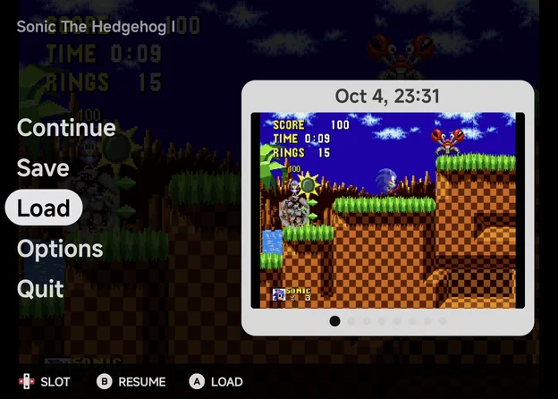
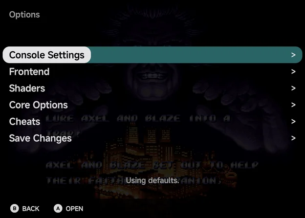
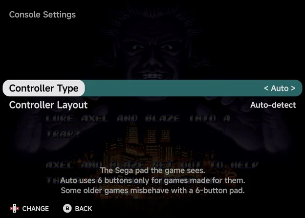
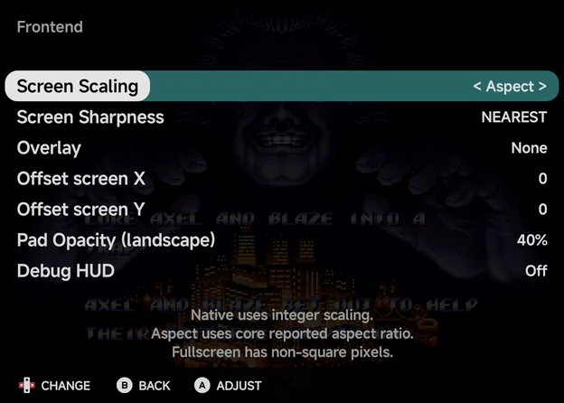
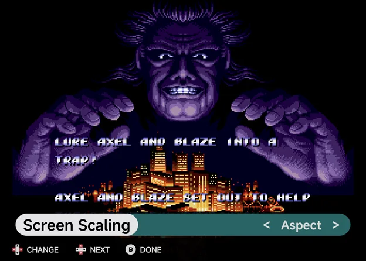
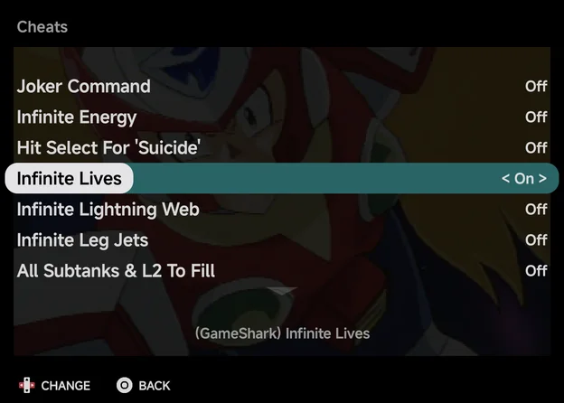
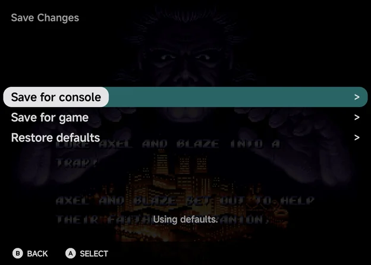

# In-game Menu

While a game is running, open the in-game menu in any of these ways:

- press `MENU` on the on-screen pad or a controller,
- hold `SELECT` and `START` together,
- use Android's Back gesture or button.

The game pauses while the menu is open.

- `B` goes back one page.
- `B` on the first page, or `MENU` on any page, returns to the game.

The menu uses your **Accent** and **Secondary accent** from
[Appearance](appearance.md): the highlighted row sits on the accent, and the
value bar on the secondary accent.

On a wide landscape screen, such as an unfolded foldable held sideways or a
phone in landscape, the menu shows two pages side by side. See [Foldables & Large Screens](foldables.md#two-pane-screens).

## The first page

| Row | What it does |
| --- | --- |
| **Continue** | Return to the game. |
| **Disc** | Only for games with more than one disc. Shows the disc in the drive, such as `1/2`. `LEFT` / `RIGHT` change the disc, as opening the lid and swapping it would. |
| **Save** | Save a state to the chosen slot. |
| **Load** | Load the state in the chosen slot. |
| **Options** | Open the options pages below. |
| **Quit** | Leave the game. |

There are 8 save state slots. On **Save** and **Load**:

- `LEFT` / `RIGHT` choose the slot.
- The preview shows the slot's screenshot and date, or **Empty Slot**.
- `A` saves or loads.

Quitting also saves a hidden resume state, and so does leaving the app with
the game open. That is what lets the [Game Switcher](game-switcher.md) resume
a game where you left it.

## Options

| Row | When it shows | What it's for |
| --- | --- | --- |
| [Console Settings](#console-settings) | Every console except Nintendo 64 | The controller rows, and the Nintendo DS screen layouts. |
| [Frontend](#frontend) | Always | Scaling, sharpness, overlay, screen offset, pad opacity and the debug HUD. |
| [Shaders](#shaders) | Always | Shader presets and their parameters. |
| [Core Options](#core-options) | Always | The emulator core's own settings. |
| [Cheats](#cheats) | When the core takes cheats | Turn the game's cheats on and off. |
| [Achievements](#achievements) | When the game's RetroAchievements session has started | The game's achievements. Your progress, such as `12 / 40 unlocked`, shows in the description lines when the row is highlighted. |
| [Save Changes](#save-changes) | Always | Keep your changes for this console or this game, or restore defaults. |

The line under the list says which settings the game uses right now:
**Using defaults.**, **Using console config.** or **Using game config.**

!!! important "Changes aren't saved until you use Save Changes"
    Changes in Options apply straight away but last only for this session.
    To keep them, use [Save Changes](#save-changes) before you quit. To undo
    a change, quit without saving.

??? info "More detail"
    Two things are saved straight away instead: the Nintendo DS layout
    hotkeys (see [Nintendo DS](emulators.md#hotkeys)) and achievement mutes
    (`X` on the Achievements page).

To set these before a game starts, for a whole emulator or one game, use
[Emulator Settings](emulator-settings.md).

## Console Settings

The console's own rows. `LEFT` / `RIGHT` change a value.

| Row | Consoles | Values | Default |
| --- | --- | --- | --- |
| **Controller Type** | Sega Genesis, Sega CD, 32X | Auto, 3 buttons, 6 buttons | Auto |
| **Controller Layout** | Every console except Nintendo 64 | Auto-detect, Xbox (A at the bottom), Nintendo (B at the bottom) | Auto-detect |
| **Layout (portrait)** and the other screen rows | Nintendo DS | See [Nintendo DS](emulators.md#nintendo-ds) | |

**Controller Type** is the Sega pad the game sees. **Auto** uses 6 buttons
only for games made for them. **Controller Layout** tells the app which way
round your controller's face buttons are. See
[Controls](controls.md#controller-buttons) for both.

## Frontend

Settings handled by NX Redux Mobile rather than the core. The list is the
same for every console. `LEFT` / `RIGHT` change a value.

| Option | Values | Default | What it does |
| --- | --- | --- | --- |
| **Screen Scaling** | Native, Aspect, Fullscreen | Aspect | **Native** uses integer scaling. **Aspect** uses the aspect ratio the core reports. **Fullscreen** fills the screen, with non-square pixels. |
| **Screen Sharpness** | NEAREST, LINEAR | NEAREST | **LINEAR** smooths lines. It works best when the final image is high resolution: a core that outputs a high resolution, or upscaling with shaders. |
| **Overlay** | None, or an overlay bundled for this console | None | A frame image drawn around the game. |
| **Offset screen X** / **Offset screen Y** | −64 to 64 | 0 | Move the game image by this many pixels. |
| **Pad Opacity (landscape)** | 100%, 60%, 40%, 25% | 40% | How opaque the on-screen buttons are in landscape, where they sit over the game. The portrait pad has its own band and is not affected. |
| **Debug HUD** | Off, On | Off | Show frames per second, the core, the resolution and scaler information. |

Overlays are bundled for Game Boy, Game Boy Color, Game Boy Advance (`GBA`
and `MGBA`), NES, Super Nintendo (`SFC` and `SUPA`), Mega Drive (`MD`),
Game Gear, Atari Lynx and Neo Geo Pocket Color. None is shown until you pick
one.

## Shaders

| Row | What it does |
| --- | --- |
| **Shader** | The shader preset to run, or None (the default). **Screen Sharpness** is used where the preset leaves the filter unset. |
| **Shader Parameters** | The settings the active shader exposes, each with its own values. Shows **No settings for this shader.** when it has none. |
| **Reset Parameters** | Restore the shader's default parameter values. |

The bundled presets include `crt/crt-geom`, `crt/zfast-crt`, `crt/crt-pi`,
`crt/crt-easymode`, `handheld/dot`, `handheld/lcd3x`, `handheld/gameboy`,
`interpolation/sharp-bilinear`, `xbrz/xbrz-freescale`, `nx/line` and
`nx/grid`, plus the single shaders in `glsl/` (such as `lcd-perfect`,
`crt-perfect` and `pixel-perfect`). Unlike the handheld, you can't add your
own shaders.

## Adjust mode

On a row that changes the picture, press `A` to see each change on the game
as you make it.

??? info "More detail"
    In adjust mode the menu shrinks to a strip over the paused game.

    - `LEFT` / `RIGHT` change the value.
    - `UP` / `DOWN` move to the previous or next picture setting on the same
      page.
    - `B` returns to the page, and `MENU` returns to the game.

    These rows open adjust mode: **Screen Scaling**, **Screen Sharpness**,
    **Overlay**, **Offset screen X** and **Y**, **Shader**, each shader
    parameter, and the Nintendo DS screen rows in **Console Settings**.

## Descriptions

The three lines under the list describe the highlighted row.

- When a description is cut off, `X` opens it in full.
- `UP` / `DOWN` scroll a long one.
- On a row that doesn't change the picture, `A` also opens its
  description.

## Core Options

The running core's own settings, grouped into the categories the core
defines. `LEFT` / `RIGHT` change a value.

Only options that can change while the game runs are listed (except the DS
**Render Mode**; see [Nintendo DS](emulators.md#3d-rendering)). If there are
none, the menu says **This core has no options that can be changed while
running.**

## Cheats

Lists the cheats found for the game. `LEFT` or `RIGHT` turns the highlighted
cheat **On** or **Off**, and it applies straight away. `A` shows a cheat's full
description.

To keep the cheats you turned on, use **Save Changes → Save for game**. See
[Cheats](cheats.md) for where the cheat files come from.

- With no cheats for the game, the page says **No cheats for this game.** and
  names the file it looked for.
- The row is hidden for Arcade (`FBN`), ColecoVision and Dreamcast (with
  NAOMI and Atomiswave), whose cores don't take cheats.

## Achievements

The row shows once the game's [RetroAchievements](retroachievements.md)
session has started: RetroAchievements is on, you are signed in, and the game
is on a system RetroAchievements covers. It shows the game's achievements, in the order set by
**Achievement sort order**. Each row shows **Unlocked**, **Pending sync** or
**Locked · N pts**.

- `A` opens an achievement's details. `LEFT` / `RIGHT` step to the previous
  or next one.
- `Y` switches between all achievements and only the locked ones.
- `X` mutes or unmutes the achievement's notifications. A muted achievement
  shows `[M]` before its name.

If the game isn't recognised or has no achievements, a message says so.

## Save Changes

Keeps what you changed in Console Settings, Frontend, Shaders and Core
Options.

| Choice | What it does |
| --- | --- |
| **Save for console** | Save as the settings for every game on this console. If this game had its own settings, they are removed, so it follows the console again. That also removes the cheats kept with **Save for game** and any DS layout hotkey changes. |
| **Save for game** | Save for this game only. This also keeps the cheats you turned on. |
| **Restore defaults** | Delete the saved settings the game is using now and go back one level: from game to console, or from console to the defaults. |

When a game has its own settings, it uses only those. The console's settings
apply only to games without their own.

## Notifications

In-game notifications, such as achievement unlocks, show in the top-left and
bottom-left corners of the game. While the landscape pad is over the game,
they move to the top centre, between the pad's system buttons, so they don't
cover the controls.
