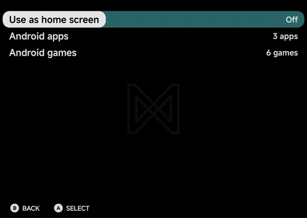
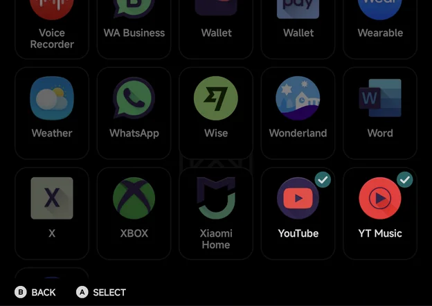
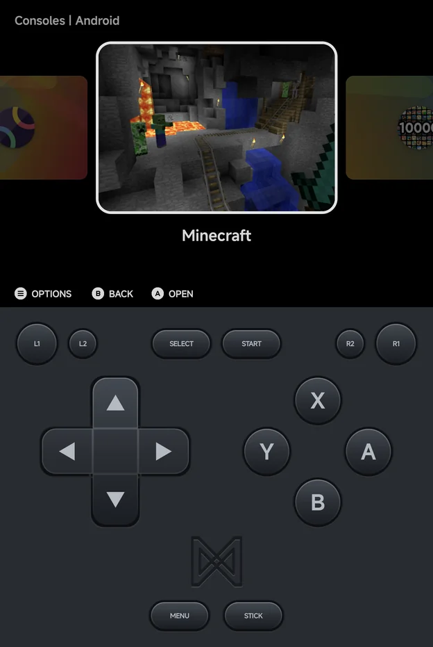

# Launcher Mode & Android Games

NX Redux Mobile can be your phone's home screen, show your Android apps in
Tools, and list your Android games as a console. All three are in **Tools →
Settings → Launcher**.

| Row | Values | What it does |
| --- | --- | --- |
| **Use as home screen** | On, Off | Make the app your Android home screen. See [Use as home screen](#use-as-home-screen). |
| **Android apps** | None, 1 app, N apps | Pick the apps shown in Tools. See [Android apps](#android-apps). |
| **Android games** | None, 1 game, N games | Pick the apps in the Android console. See [Android games](#android-games). |

## Use as home screen

Turn **Use as home screen** On and Android asks whether to make NX Redux your
home app. Say yes, and the phone opens to the main menu.

While the app is the home screen:

- **Home** (the button or the gesture) brings you back to the main menu's
  Home tab.
- **Back** on the main menu stays where it is, since there is nothing under a
  home screen.
- The screen sleeps as usual on the main menu.

If you turn the question down, the row stays Off and a notice says where to
set it by hand: **Set NX Redux as the home app in Android settings → Default
apps**.

To stop using it, turn the row Off. Android's home settings open, so you can
pick your old launcher again.

## Android apps

**Android apps** opens a grid of your installed apps. Press `A`, or tap, to
tick an app: ticked apps show in the Tools tab, after the built-in tools.

- An app in Tools opens like any other tool. Pin it to Home with `MENU` →
  **Pin**, as with the other tools.
- Apps you put in the Android console aren't offered here.
- With no other app to show, the picker reads **No apps to show**.

## Android games

**Android games** opens the same kind of grid. Apps Android marks as games
come first, then every other app, so you can add any of them.

Ticked apps leave Tools and join the **Android** console on the Consoles tab.
If one was pinned to Home as a tool, its pin moves with it.

On first setup, if you have games installed, the app asks **Add N Android
games to Consoles?** and lists them. Choose **Yes** to add them all, or
**Not now**. It asks only once. On an install that was set up before, the
question may show once over the main menu instead.

## The Android console

`A` **Open** starts the game's app. Android games differ from the other
consoles:

- **Art:** each game shows its screenshot fetched with
  [Artwork](artwork.md). Until it has one, it gets abstract art made from its
  icon's colours.
- **Not tracked:** an Android game never shows on the Continue card or in the
  [Game Switcher](game-switcher.md), and it has no play time in the
  [Game Tracker](game-tracker.md).
- **Context menu:** only **Pin Item** or **Unpin Item**. A pinned Android
  game sits on Home with your other pinned games.

To take a game out of the console, untick it in **Tools → Settings →
Launcher → Android games**.

## Back to a running game

With a game open, tap the NX Redux icon to come back to it. The app brings
the running game forward instead of starting over at the menu.
