# Menu Layouts

The Consoles, Collections and Tools tabs, and every game list, can each be
drawn in their own style. Pick them in **Tools → Settings → Layouts**, which
also lets you hide the page title, the button hints and the game stats. Home
has no layout setting: it looks the same whatever style you pick here.

| Style | Tabs | Game lists | In short |
| --- | :---: | :---: | --- |
| [**List**](#list) | ✓ | ✓ | Text rows over the art, the most entries per screen |
| [**Grid**](#grid) | ✓ | ✓ | Two rows of tiles |
| [**Carousel**](#carousel) | ✓ | ✓ | One large item at a time, across or down the screen |
| [**Backdrop**](#backdrop) | | ✓ | Box art over the game's screenshot |

Out of the box, Consoles, Collections and game lists use **Carousel**, and
Tools uses **Grid**.

## The Layouts page

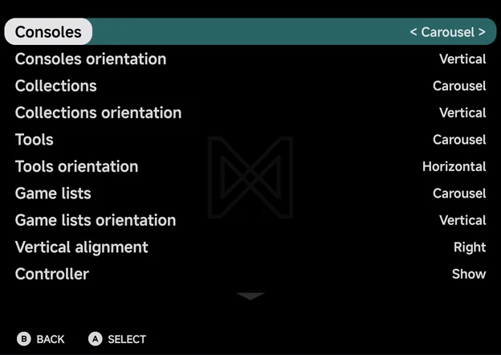

`Right` and `A` step the highlighted row to its next value, and `Left` to
the previous one. Some rows
only show when they apply.

| Row | Values | Default | Shows |
| --- | --- | --- | --- |
| **Consoles** | List, Grid, Carousel | Carousel | Always |
| **Consoles orientation** | Horizontal, Vertical | Horizontal | When Consoles is Carousel |
| **Collections** | List, Grid, Carousel | Carousel | Always |
| **Collections orientation** | Horizontal, Vertical | Horizontal | When Collections is Carousel |
| **Tools** | List, Grid, Carousel | Grid | Always |
| **Tools orientation** | Horizontal, Vertical | Horizontal | When Tools is Carousel |
| **Game lists** | List, Grid, Carousel, Backdrop | Carousel | Always |
| **Game lists orientation** | Horizontal, Vertical | Horizontal | When Game lists is Carousel or Backdrop |
| **Vertical alignment** | Left, Right | Left | When Game lists orientation is Vertical |
| **Controller** | Show, Hide | Show | Always |
| [**Page title**](#page-title-and-button-hints) | Show, Hide | Show | Always |
| [**Button hints**](#page-title-and-button-hints) | Show, Hide | Show | Always |
| [**Extra info**](#extra-info) | Show, Hide | Show | Always |
| [**Reset to defaults**](#reset-to-defaults) | | | Always |

## List

A plain list. On the Consoles tab the selected console's controller sits
beside the list. In a game list the selected game's screenshot fills the
background.

*Consoles tab*

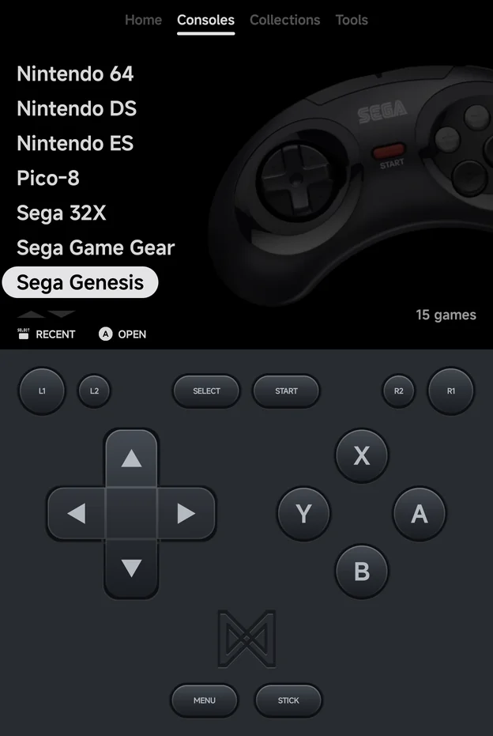

*Game list*

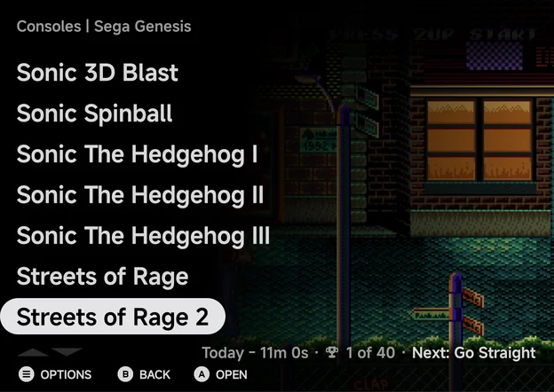

The line at the bottom shows the selected game's last-played time,
achievements and next achievement in a game list, and the game count on the
Collections tab. On the Consoles tab it holds only the scroll arrows, with no
shade behind them.

`Up` on the first row wraps to the last, and `Down` on the last row wraps to
the first. Only a fresh press wraps: holding the button stops at the end.

## Grid

Two rows of tiles that slide sideways as you move. Consoles show their logo
and game count. Games show their screenshot, and the selected tile adds its
name, last-played time and achievement count.

*Consoles tab*

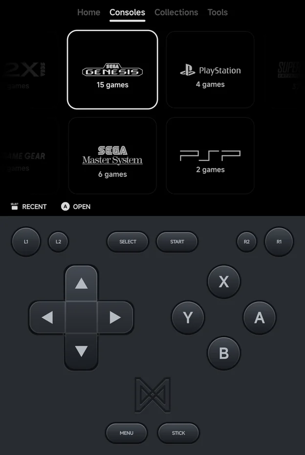

*Game list*

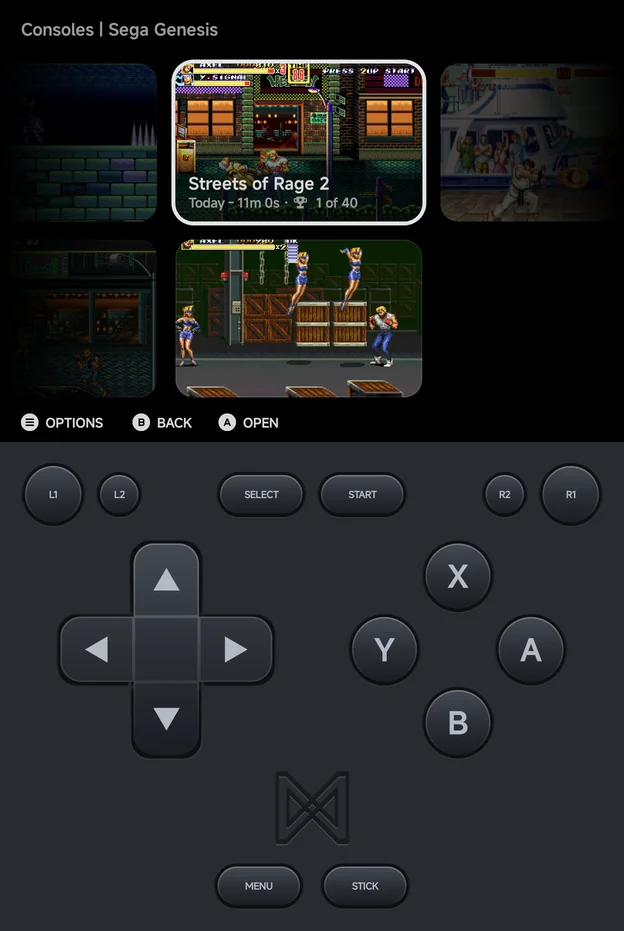

## Carousel

A single row with the selected item large in the middle and its neighbours
to the sides. Consoles show their logo over their controller, collections
their name, tools their icon. In a game list the caption under the selected
game gives its name, play time and achievements.

*Consoles tab*

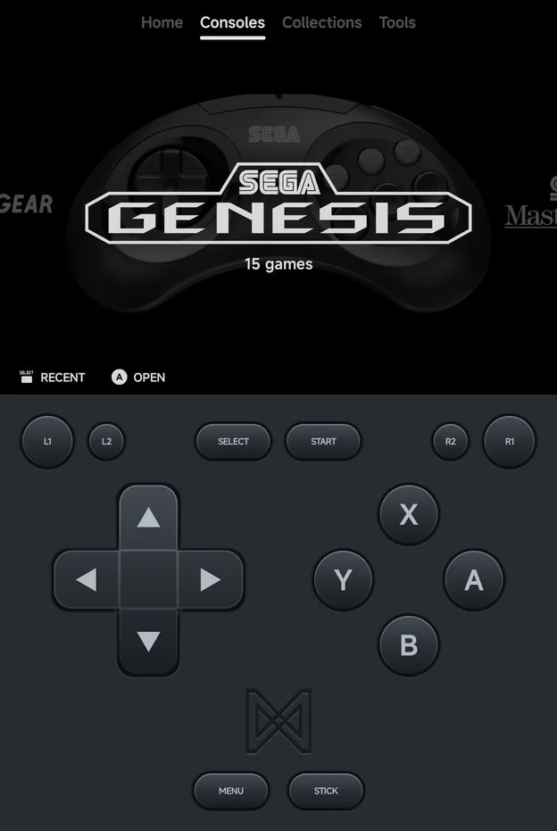

*Game list*

## Backdrop

Game lists only. The selected game's box art stands over its dimmed
screenshot, with its neighbours' boxes to the sides.

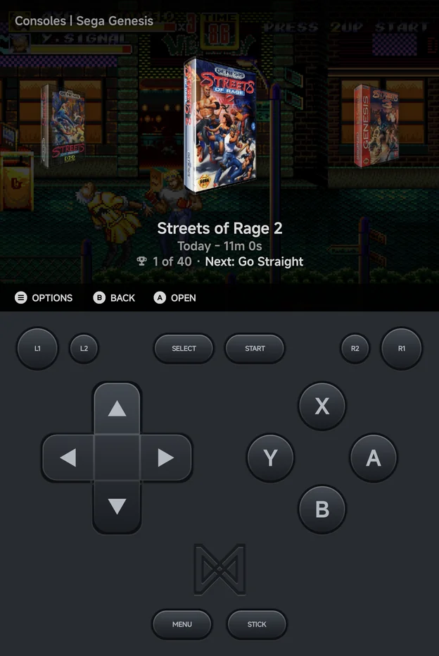

## Orientation

Carousel and Backdrop can also run **down** the screen instead of across:
set the **orientation** row under the style to **Vertical**. `Up` / `Down`
then move through the items, wrapping as a List does: `Up` on the first item
goes to the last and `Down` on the last to the first, on a fresh press only.
`Left` / `Right` switch tabs on a tab, and do nothing in a game list.

<figure markdown>

<figcaption>Consoles, Horizontal</figcaption>
</figure>

<figure markdown>

<figcaption>Consoles, Vertical</figcaption>
</figure>

## Vertical alignment

In a vertical game list the stack sits on the left and the details on the
right. Set **Vertical alignment** to **Right** to swap the sides.

<figure markdown>

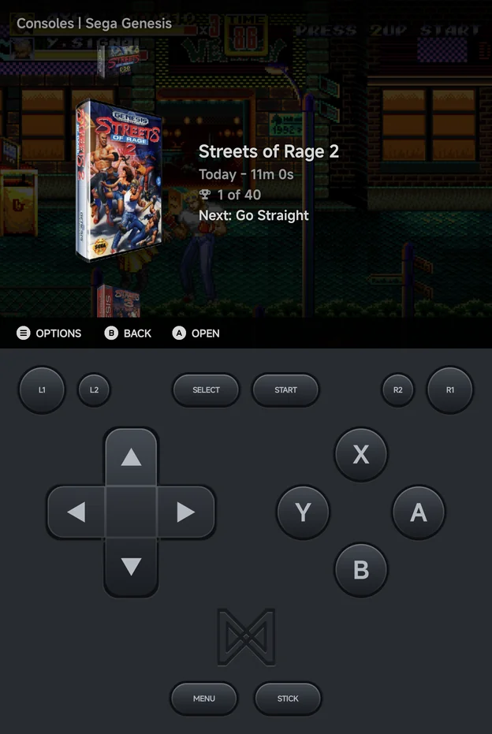

<figcaption>Backdrop, Vertical, Left</figcaption>
</figure>

<figure markdown>

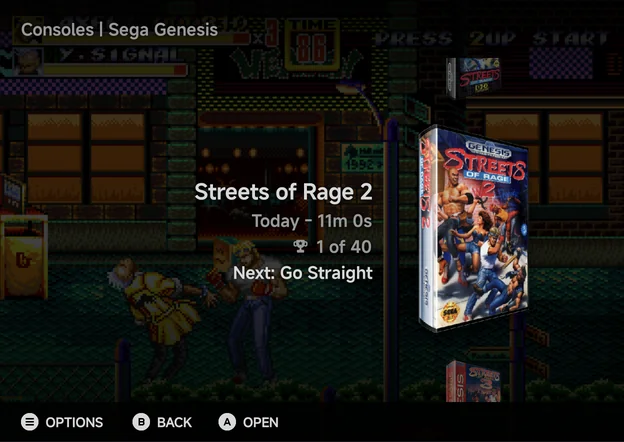

<figcaption>Backdrop, Vertical, Right</figcaption>
</figure>

## In landscape

Turn the phone sideways and the same layouts spread across the wider screen.
These are the Carousel and Backdrop game lists, both Horizontal.

<figure markdown>

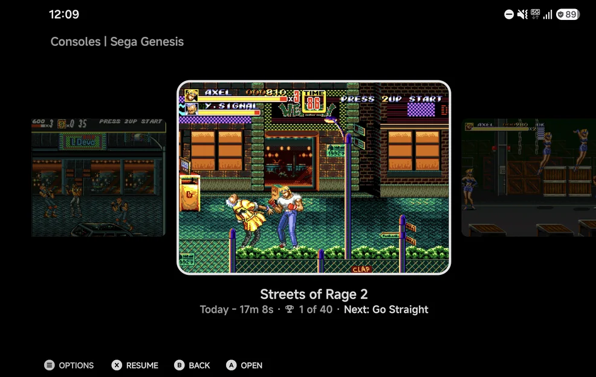

<figcaption>Carousel, landscape</figcaption>
</figure>

<figure markdown>

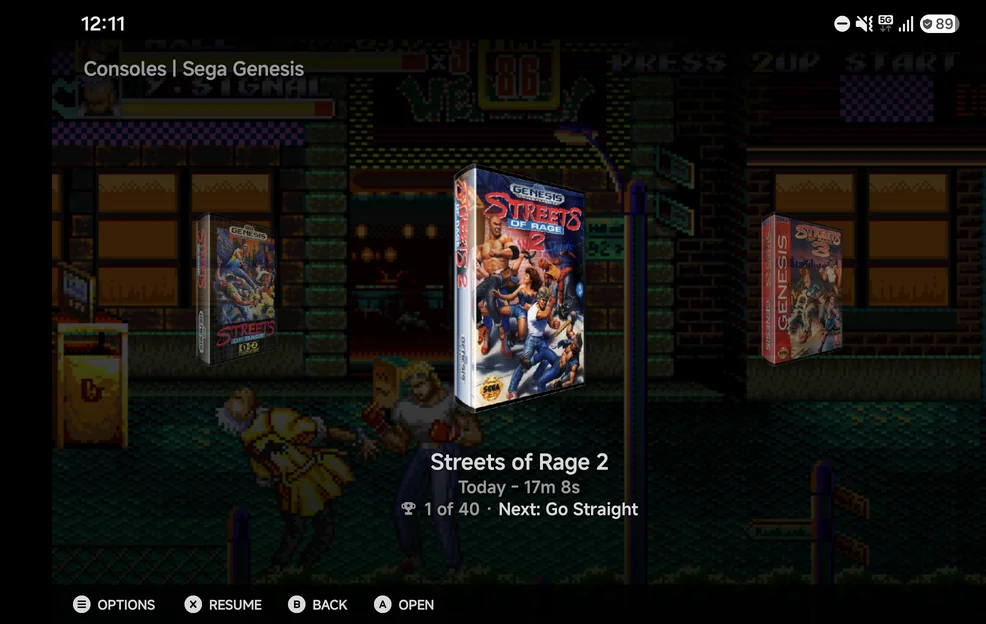

<figcaption>Backdrop, landscape</figcaption>
</figure>

## Controller art

The Consoles tab shows each console's controller behind it in the List and
Carousel styles. Set **Controller** to **Hide** for plain logos.

## Page title and button hints

**Page title** set to **Hide** removes the main menu's tab row and a game
list's title. `L1` / `R1` still switch tabs. **Button hints** set to **Hide**
removes the hint bar along the bottom of the main menu and the game lists.
Other screens, such as Settings and the in-game menu, keep both.

- They only take effect while a controller is connected or the portrait pad
  shows. With touch alone in landscape, the hints stay and the main menu
  keeps its tab row (a tap on a tab is the only touch way to switch tabs),
  while a game list's title still hides.
- With the title hidden, its space goes to the page. A List shows more rows.
  Home moves its stats strip to the top of the screen and gains a row of tool
  squares. Grid, Carousel and Backdrop keep their size and centre in the full
  height.
- With the hints hidden, their space stays empty, Home included. In a List
  game list, the selected game's play time and achievements move down into
  that row.

## Extra info

**Extra info** set to **Hide** removes the game stats from the main menu and
the game lists, for a cleaner look:

- **Home** drops its stats strip (**This month**, **Most played**) and the
  play time and achievements on the Continue card, pinned games and the
  [shelves](foldables.md#shelves).
- A **List** game list leaves the selected game's play time, achievements
  and next achievement out of the bottom line, and out of the hint row when
  the hints are hidden.
- The selected **Grid** tile shows only the game's name.
- **Carousel** and **Backdrop** captions show only the name, horizontal and
  vertical alike.

Home gives the strip's space to the top section: the Continue card and the
tool squares grow, and a column of squares gains one more only when a whole
square fits.

Unlike the page title and hints, this works in every mode: touch alone,
with a controller, portrait or landscape. A console's or collection's game
count stays, and the [Game Switcher](game-switcher.md), the
[in-game menu](in-game-menu.md), the [Game Tracker](game-tracker.md) and
[RetroAchievements](retroachievements.md) keep all their info.

## Reset to defaults

**Reset to defaults** puts every row on the Layouts page back to its
default: each tab's style and orientation, the game lists' style,
orientation and alignment, **Controller**, **Page title**,
**Button hints** and **Extra info**. It does not ask first.

??? info "Games without artwork"
    A game with no screenshot or box art gets a generated abstract picture,
    the same one every time. To fetch real art, press `MENU` on a game and
    choose **Fetch art**, or use [Artwork](artwork.md) for many games at
    once.
