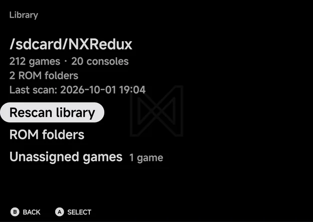
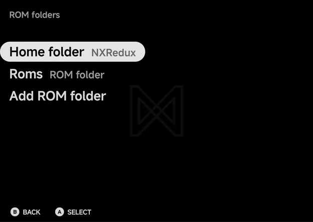
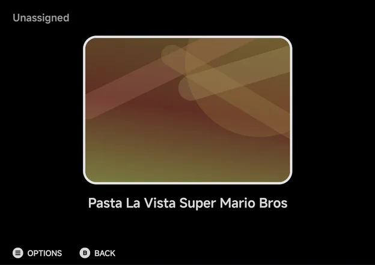

# Library & ROM folders

## Home folder and extra folders

The library comes from two kinds of folder:

- **The home folder**, laid out as `Roms/<Name (TAG)>/`. The app created it
  and writes only inside it.
- **Extra folders**, any number of them, scanned in place and never written
  to.

The app matches the files in an extra folder to a console by the folder's
name or the file's extension. Anything left over lands in
[Unassigned games](#unassigned-games) until you pick its console.

??? info "More detail"
    Files in an extra folder are matched to a console:

    1. by a `(TAG)` or an alias in the folder name (a short alias such as
       `GBA` may be followed only by roms, games or isos, singular or plural),
    2. then by an extension only one console uses (a zip by its first entry, a
       7z only by its folder).

    The console you pick for an Unassigned game is saved in a `systems.txt`
    (`<file><TAB><TAG>`). For extra folders this file lives in the home folder
    under `Roms/.sources/`, so the extra folder itself is never changed.

## Settings → Library

**Tools → Settings → Library** shows what the library holds, then its rows.



The lines at the top show:

- the home folder's path,
- how many games and consoles the library has, such as **212 games · 20
  consoles**,
- how many ROM folders it reads, the home folder included,
- **Last scan:** with the date and time of the last full scan.

| Row | What it does |
| --- | --- |
| **Rescan library** | Scan every folder again. A notice then says how many games the library has. |
| **ROM folders** | Open the [ROM folders](#rom-folders) page. |
| **Unassigned games** | Only when some games have no console. Shows how many, and opens their list. See [Unassigned games](#unassigned-games). |
| **Hidden games** | Only when some games are hidden. Shows how many. `A` on a game shows it again. |

## ROM folders

**Tools → Settings → Library → ROM folders** lists every folder the library
reads.



| Row | What it does |
| --- | --- |
| **Home folder** | Shows the home folder's name. `A` picks a different one. |
| One row per extra folder | Shows the folder's name and its state. `A` offers to remove it. |
| **Add ROM folder** | Pick another extra folder to scan. |

An extra folder's row reads:

| State | Meaning |
| --- | --- |
| **ROM folder** | The folder was found at the last scan. |
| **Not available** | Its storage was missing, such as an SD card taken out. |
| **Not ready yet** | Its storage is in, but Android didn't list it in time. Use **Rescan library** in a moment. |

While the home folder's storage is missing, its row reads
**"<name> · not available"**.

Removing an extra folder opens the **Remove folder** dialog: **Stop scanning
this folder? Its ROMs stay where they are.** Choose **Remove** to stop
scanning it. Nothing in the folder is deleted.

## Unassigned games

Games the app couldn't match to a console are listed under **Tools →
Settings → Library → Unassigned games**. The row shows only while there are
some. They don't show on the main menu.



An Unassigned game can't start until it has a console. To give it one:

1. Highlight the game and press `MENU`, or long-press it.
2. Choose **Console**. It lists every console whose emulator can run the
   file's type. A zip or 7z file is unpacked at launch, so every console is
   offered for it.
3. Pick the console. The game moves to that console's list, using the
   console's [default emulator](#default-emulators).

The context menu for an Unassigned game offers only **Hide Game**, **Rename
Rom** and **Console**.

## Default emulators

Two consoles have two emulators, each with its own tag:

| Console | Tags | Default |
| --- | --- | --- |
| Game Boy Advance | `GBA` (gpSP), `MGBA` (mGBA) | `GBA` |
| Super Nintendo ES | `SFC` (Snes9x), `SUPA` (Supafaust) | `SFC` |

Sega Genesis has one tag, `MD`, on Genesis Plus GX. An older `Sega Genesis (GPGX)` folder uses a legacy tag and still lists under Sega Genesis.

**Tools → Settings → Emulators → Default emulators** sets the tag for games in
a folder without a `(TAG)`, such as an extra folder named `My Game Boy
Advance`, and for Unassigned games you give a console. A folder with a tag, in
the home folder or an extra one, always uses that tag. See
[Emulator Settings](emulator-settings.md#default-emulators).

To run one game on the other emulator, use **Emulator** in its context menu.
For consoles whose saves work on both emulators, the app then offers to copy
the newer save across, keeping a timestamped `.bak` of the save it replaces.

## Disc games in their own folder

A game with several files, such as a Dreamcast `.gdi` with its tracks, can
sit in its own subfolder of the console's folder. The subfolder is listed as
one game when it holds a `.m3u`, `.cue` or `.gdi` named after it:

```
Roms/Dreamcast (DC)/
└── Soulcalibur/
    ├── Soulcalibur.gdi
    ├── track01.bin
    ├── track02.raw
    └── track03.bin
```

A sheet named anything else, such as a TOSEC `disc.gdi`, doesn't make the
folder a game. Saves, states and the VMU are keyed by that name, so every such
game would share them. Rename the sheet after its folder. See
[Dreamcast](emulators/dreamcast.md).

## Android games as a console

Android games you add show as an **Android** console on the Consoles tab.
Add them on first setup, or later in **Tools → Settings → Launcher →
Android games**. See [Launcher Mode & Android Games](launcher.md).

## Rescanning

The app keeps the scanned library in an index, so it starts without walking
your folders. After adding or removing games outside the app, use **Rescan
library** in **Tools → Settings → Library**.

- An extra folder that was deleted, or whose access was revoked, is dropped
  with a notice.
- A home folder that is lost returns you to the folder picker.

If you take out an SD card:

- An extra folder's games are left out until the card is back.
- A home on that card keeps the last index on screen, and **ROM folders**
  shows **"<name> · not available"**.

## Game names

Bracketed region and version text is dropped from names, as on the handheld:
"Tetris (World) (Rev 1)" shows as "Tetris". If two games would end up with the
same name, both show their file names.

## Custom display names (map.txt)

--8<-- "map-txt.md"

**Rename Rom** in the game-list context menu writes these aliases for you.

??? info "More detail"
    For games in an extra folder, the alias goes into a `map.txt` under
    `Roms/.sources/` in the home folder. It overrides the extra folder's own
    `map.txt`.

## Collections

Use **Add to Collection** in the game-list context menu.

--8<-- "collections.md"

## Saves

Battery saves are mirrored to `Saves/<TAG>/` in the home folder.

!!! warning "Replace saves only while the game is closed"
    Replace files in `Saves/<TAG>/` only while that game is not running. The
    app's working copy wins on the next write.

- BIOS files are read from `Bios/<TAG>/` before each launch.
- Pinned and hidden games are stored inside the app. Hidden games can be shown
  again from **Tools → Settings → Library → Hidden games**.
- Nothing in the app deletes a ROM.

??? info "More detail"
    Cores play from a private working copy of each battery save. The mirror in
    `Saves/<TAG>/` is updated after each save write and when you quit.

## Unpacked games cache

Zip and 7z games are unpacked into the app's cache on their first launch. The
app trims this cache on its own. Clearing the app's cache in Android's
settings is safe too: games are unpacked again when needed.

??? info "More detail"
    - Some cores get a copy of the game file in the cache too.
    - The app trims the cache when it starts and after **Download all game
      data** in [RetroAchievements](retroachievements.md).
    - Anything not used (played or checked for achievements) in 30 days goes
      first. Then the least recently used goes, until the cache holds at most
      256 MiB.
    - The game that is running is never removed. A file bigger than the cap on
      its own stays while its game runs, and goes at the next trim.
