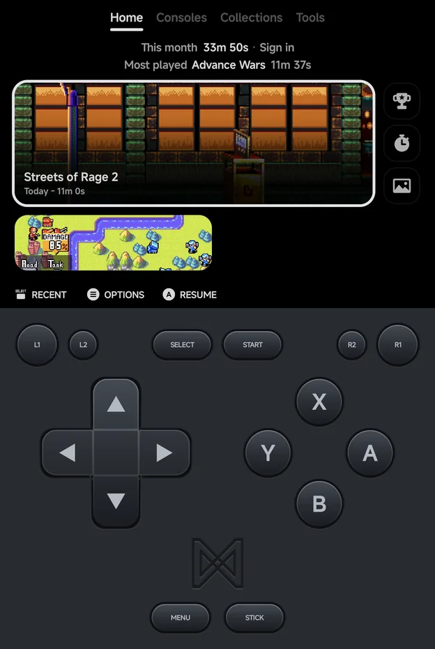
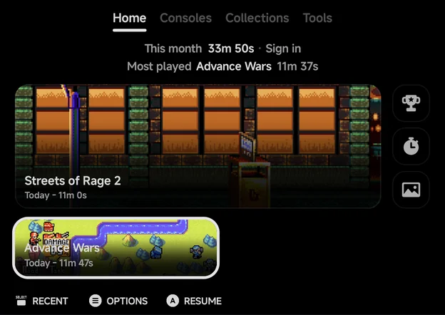
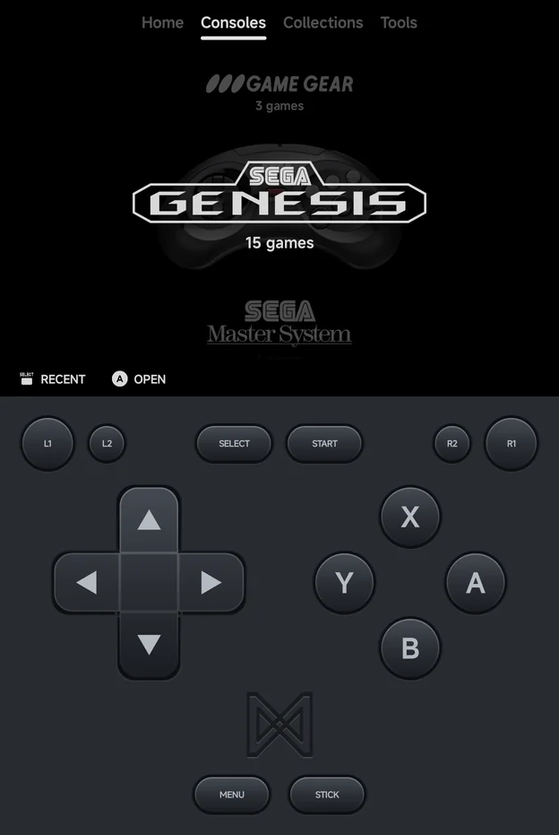
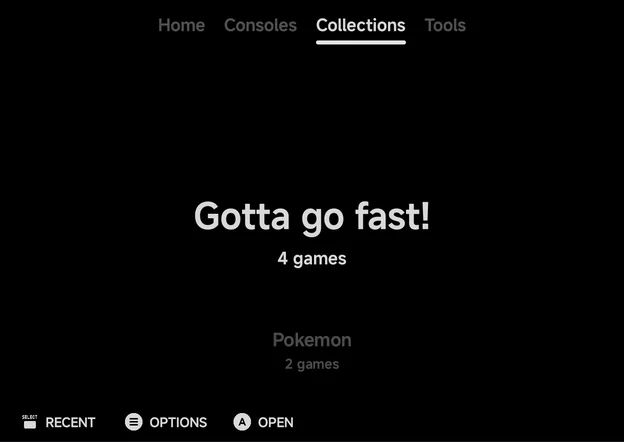
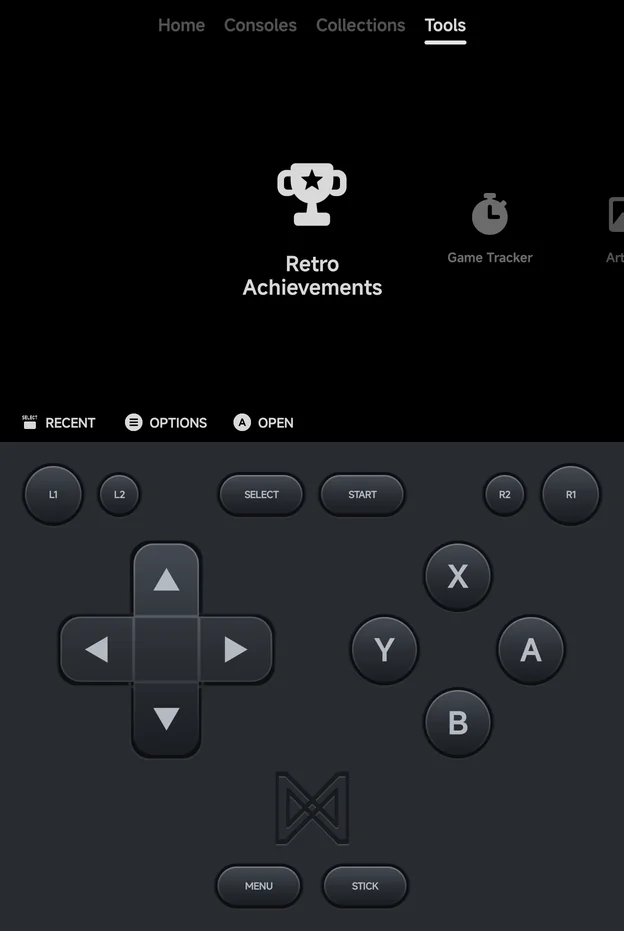
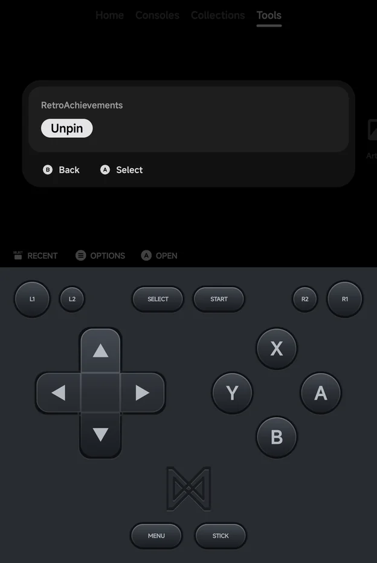
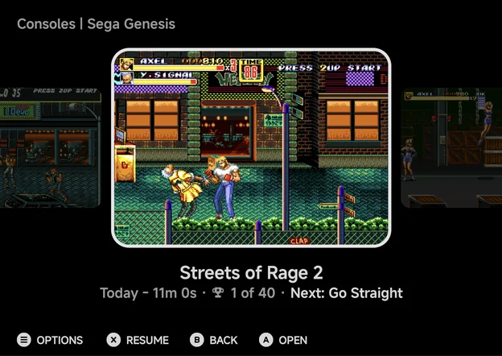
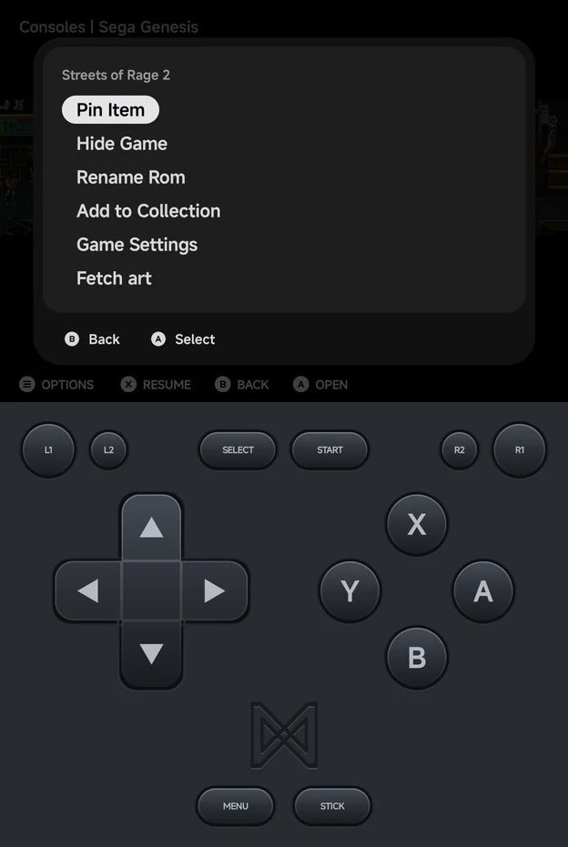

# Main Menu & Home

The main menu is split into four tabs: **Home**, **Consoles**,
**Collections** and **Tools**. The app opens on Home.

Consoles, Collections, Tools and the game lists can each be drawn as a list,
a grid or a carousel, and game lists have a fourth style, Backdrop.
[Menu Layouts](layouts.md) shows them all.

You can drive every screen with the on-screen pad, a controller or touch.
See [Controls](controls.md).

## Tabs

| Tab | What it holds |
| --- | --- |
| **Home** | Your last game, play stats, and the games and tools you pinned |
| **Consoles** | One entry per system that has games in it |
| **Collections** | Your [collections](#collections) |
| **Tools** | The built-in tools, Settings included |

- **Switch tabs** with `L1` / `R1`, or tap a tab. The tab order wraps around.
- `Left` / `Right` also switch tabs:
    - in List style and in a Vertical Carousel, always;
    - in Grid and a Horizontal Carousel, when you push past the first or last
      item;
    - on Home, when you push past the left or right edge.
- Home and Tools always show. A Consoles or Collections tab with nothing in
  it, such as Collections before you make one, is left out.

### The tab row

Press `Up` from the top of Home, from the top row of a Grid or from a
Horizontal Carousel to move the highlight onto the tab row. In List style and
a Vertical Carousel, `Up` on the first item wraps to the last instead. With
**Page title** hidden in [Layouts](layouts.md#page-title-and-button-hints)
there is no tab row, and `L1` / `R1` switch tabs.

| Button | What it does |
| --- | --- |
| `Left` / `Right`, `L1` / `R1` | Switch tabs |
| `Down`, `A` or `B` | Go back into the content |
| `Up` | Jump to the bottom of the content |
| `SELECT` **Recent** | Open the [Game Switcher](game-switcher.md) |

## Home

Home is the starting point: your most recent game, this month's play time,
and everything you pinned. It looks the same whatever layouts you pick.

- **Stats strip.** The top line shows **This month**'s total play time and
  the RetroAchievements you unlocked this month. It reads **Sign in** while
  you are signed out of [RetroAchievements](retroachievements.md). The second
  line shows the month's **Most played** game and its time. A month without
  play shows **No play yet**. "This month" is the calendar month.
  [Extra info](layouts.md#extra-info) can hide it.
- **Continue card.** Your most recent game, with when you last played it and
  for how long. Press `A` to jump back in.
- **Pick a game.** On a fresh install the Continue card is replaced by
  **Pick a game** ("Nothing played yet"), which opens the Consoles tab.
- **Pinned tools** sit beside the Continue card as square icon tiles. When
  more tools are pinned than fit, the last square becomes **+N**, which opens
  the Tools tab.
- **Pinned games** fill the rows below. Home scrolls when there are more. The
  selected pin shows its name and play time.
- Games without art get a generated abstract picture, so every card looks
  different.

| Button | What it does |
| --- | --- |
| D-pad | Move between the cards |
| `A` **Resume** / **Play** | Start the selected game. **Resume** continues from its auto-save; **Play** shows when it has none |
| `A` on a pinned tool | Open the tool. The hint names the tool, e.g. **Game Tracker** |
| `A` **More tools** | On **+N**: open the Tools tab |
| `MENU` **Options** | **Pin** or **Unpin** the selected game or tool |
| `SELECT` **Recent** | Open the [Game Switcher](game-switcher.md) |

??? info "Touch on Home"
    - Tap a card to select it, then tap it again to play or open it. This
      goes for the Continue card, pinned games and pinned tools.
    - A long press opens the same menu as `MENU`.
    - Drag up and down to scroll without selecting anything.

On an unfolded phone or a tablet in landscape, Home adds shelves of games to
pick from. See [Foldables & Large Screens](foldables.md).

## Pinning games and tools

- **Pin a game:** press `MENU` on it in a game list and choose **Pin Item**.
  **Unpin Item** removes it again. On Home, `MENU` on the Continue card offers
  **Pin**, and on a pinned game **Unpin**.
- **Pin a tool:** press `MENU` on it in the Tools tab and choose **Pin**.
  **Unpin** removes it.
- You can pin up to **12** games. At the limit the app says
  "Pins are full (12). Unpin one first."

## Consoles, Collections and Tools

These three tabs list their entries in the style chosen in
[Layouts](layouts.md). By default Consoles and Collections are a carousel,
and Tools is a grid.

- **Consoles** show their logo and how many games they hold. In the List and
  Carousel styles the selected console's controller shows too, unless you set
  **Controller** to **Hide** in [Layouts](layouts.md#controller-art).
- **Collections** show their name and game count.

- **Tools** show an icon for each tool: **RetroAchievements**,
  **Game Tracker**, **Artwork**, **Cheat Database** and **Settings**, plus any
  Android apps you choose to show there (see
  [Launcher Mode & Android Games](launcher.md)).

| Button | What it does |
| --- | --- |
| `A` **Open** | Open the console, collection or tool |
| `MENU` **Options** | **Rename** / **Delete** on a collection, **Pin** / **Unpin** on a tool |
| `SELECT` **Recent** | Open the [Game Switcher](game-switcher.md) |

The tools have their own pages: [RetroAchievements](retroachievements.md),
[Game Tracker](game-tracker.md), [Artwork](artwork.md),
[Cheat Database](cheats.md) and [Settings](settings.md).

## Game lists

Opening a console or a collection shows its games. The page title names the
console or collection, e.g. **Sega Genesis**.

Under the selected game you see when you last played it and your total play
time ("Today - 11m 0s"). For games with achievements, the line adds your
progress and the next achievement to go for. Game names leave out the region
and version text in brackets.

| Button | What it does |
| --- | --- |
| `A` **Open** | Launch the game |
| `X` **Resume** | Jump straight back into your auto-saved session (shown when the game has one) |
| `B` **Back** | Return to the tab |
| `SELECT` | Open the [Game Switcher](game-switcher.md) |
| `MENU` **Options** | Open the game's context menu |

A long press on a game opens the context menu too.

## Context menus

Press `MENU` on a game to see what you can do with it. The menu depends on
where the game is listed.

| Item | What it does |
| --- | --- |
| **Pin Item** / **Unpin Item** | Pin the game to Home, or take it off |
| **Hide Game** | Hide the game from its list |
| **Rename Rom** | Change the name the list shows |
| **Add to Collection** | Add the game to a collection, or start a new one |
| **Game Settings** | This game's own emulator settings. See [Emulator Settings](emulator-settings.md) |
| **Fetch art** | Download art for this game. See [Artwork](artwork.md) |
| **Emulator** | Pick which emulator runs this game. See [Emulators](emulators/index.md) |
| **Remove from Collection** | Take the game out of the collection you are in |

Not every item shows everywhere:

| List | Items |
| --- | --- |
| A console | **Pin Item**, **Hide Game**, **Rename Rom**, **Add to Collection**, **Game Settings**, **Fetch art**, and **Emulator** on systems with more than one emulator |
| A collection | The same, with **Remove from Collection** at the end |
| Unassigned games | **Hide Game**, **Rename Rom**, **Console** |
| The Android console | **Pin Item** / **Unpin Item** only |

- **Fetch art** shows only for systems the art sources know.
- **Unassigned games** are files in an extra ROM folder that the app could
  not match to a system. Open
  them from **Tools → Settings → Library → Unassigned games**, and use
  **Console** to say which system a game belongs to. See
  [Library & ROM folders](library.md).
- **Hidden games** are listed in **Tools → Settings → Library → Hidden games**.
  Press `A` **Unhide** there to bring one back.
- The Android console holds the Android games you added. See
  [Launcher Mode & Android Games](launcher.md).

## Collections

Build your own game collections from a game list:

1. Press `MENU` on a game.
2. Choose **Add to Collection**.
3. Pick an existing collection, or **New Collection…** to make one and name
   it.

Your collections live on the **Collections** tab, each with its game count.
The tab appears once you have a collection. Collections are saved in the
`Collections/` folder in your home folder.

Press `MENU` on a collection, or long-press it, to **Rename** or **Delete**
it. Delete asks first, and removes only the list: the games stay in your
library.
