# Main Menu & Home

The main menu is split into four tabs: **Home**, **Consoles**,
**Collections** and **Tools**. The app opens on Home, or on the first tab you
have not hidden.

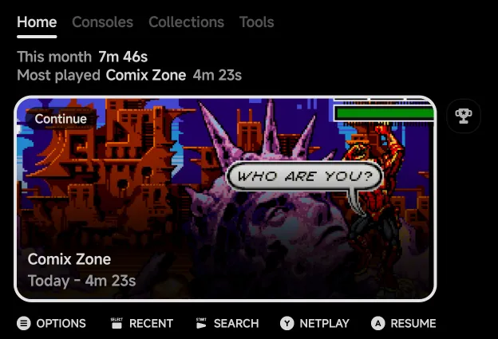

Each tab and the game lists can be drawn in different styles, picked in
[Menu Layouts](layouts.md): see [Home](#home), [Consoles](#consoles),
[Collections](#collections), [Tools](#tools) and [Game lists](#game-lists).

You can drive every screen with the on-screen pad, a controller or touch.
See [Controls](controls.md).

??? info "More detail"
    - Consoles, Collections, Tools and the game lists can each be a list, a
      grid, a carousel or Minimal (just the names), and game lists have one
      more style, Backdrop.
    - With touch only (no controller, and no pad on screen) there is no hint
      bar: tap the items, and use the icons at the top right.

## Tabs

| Tab | What it holds |
| --- | --- |
| [**Home**](#home) | Your last game, play stats, and the games and tools you pinned |
| [**Consoles**](#consoles) | One entry per system that has games in it |
| [**Collections**](#collections) | Your own lists of games |
| [**Tools**](#tools) | The built-in tools, Settings included |

- **Switch tabs** with `L1` / `R1`, or tap a tab. `Left` / `Right` switch
  tabs too.
- An empty tab, such as Collections before you make one, is left out.
- You can hide any tab in [Layouts](layouts.md#showing-and-hiding-tabs).
  `MENU` on any item still opens a hidden tab, so Settings is always
  reachable.

??? info "More detail"
    - The tab order wraps around.
    - `Left` / `Right` switch tabs:
        - in List style and in a Vertical Carousel, always;
        - in Grid and a Horizontal Carousel, when you push past the first or
          last item;
        - on Home, when you push past the left or right edge.
    - Touching and holding the tab row also opens a hidden tab. If a tab you
      are on goes away, the menu moves to the next tab.

### The tab row

Press `Up` from the top of the content to move onto the tab row.

| Button | What it does |
| --- | --- |
| `Left` / `Right`, `L1` / `R1` | Switch tabs |
| `Down`, `A` or `B` | Go back into the content |
| `Up` | Jump to the bottom of the content |
| `SELECT` **Recent** | Open the [Game Switcher](game-switcher.md) |
| `START` **Search** | [Search](#search) your games |

??? info "More detail"
    - `Up` reaches the tab row from the top of Home, the top row of a Grid or
      a Horizontal Carousel. In List style and a Vertical Carousel, `Up` on
      the first item wraps to the last instead.
    - With **Page title** hidden in
      [Layouts](layouts.md#page-title-and-button-hints) there is no tab row,
      and `L1` / `R1` switch tabs.
    - With only one tab left, an **NX Redux** title stands in its place, and
      `Up` does not move onto it. The same goes for a tab opened over another.
    - When the hint bar doesn't show **Recent** or **Search** (touch only,
      Button hints hidden, or their own hint hidden in
      [Layouts](layouts.md#page-title-and-button-hints)), they are icons at
      the right of the tab row instead.

## Home

Home is the starting point: your most recent game, this month's play time,
and everything you pinned. It comes in four layouts, **List**, **Grid** (the
default), **Carousel** and **Minimal**. Pick one in
[Settings → Layouts → Home → Home layout](layouts.md#the-layouts-page).

Every layout starts with a two-line stats strip:

- **This month:** your play time this calendar month, and the
  [RetroAchievements](retroachievements.md) you unlocked (while signed in).
- **Most played:** the month's most played game and its time.

In every layout the buttons are the same:

| Button | What it does |
| --- | --- |
| `A` **Play** / **Resume** / **Open** | Start the game, or open the tool. **Resume** continues from its auto-save |
| `Y` **Netplay** | Play the selected game with another device. Shown for games that have [netplay](netplay.md) |
| `MENU` **Options** | **Pin** / **Unpin**, and **Play from start** when the game has an auto-save |
| `SELECT` **Recent** | Open the [Game Switcher](game-switcher.md) |
| `START` **Search** | [Search](#search) your games |

With touch, tap an item to select it, tap it again to play or open it, and
long-press for the menu.

??? info "More detail"
    - A month without play shows **No play yet** on the first line, and no
      second line.
    - [Home stats](layouts.md#home-stats) in Layouts → Home hides the strip.
      [Extra info](layouts.md#extra-info) hides the play time and
      achievements on the cards. With **Page title** hidden, the strip moves
      up into the tab row's place.
    - `A` shows **Play** when the game has no auto-save.
    - **Play from start** leads the `MENU` list. There is no menu on **Pick a
      game**, unless a tab is hidden and the menu offers it.
    - Games without art get a generated abstract picture, so every card looks
      different.

### List

Everything on Home in one list, with the selected game's picture behind it.

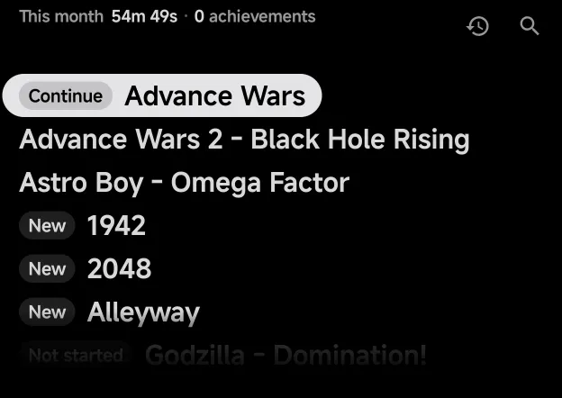

- **The list** starts with your most recent game, tagged **Continue** (or
  **Pick a game** on a fresh install). Then come your pinned games, games
  from the [shelves](foldables.md#shelves), and your pinned tools.
- **Game info** (when you last played, play time) shows only while
  [Button hints](layouts.md#page-title-and-button-hints) are hidden.

| Button | What it does |
| --- | --- |
| `Up` / `Down` | Move through the list. It wraps around at either end; a held button stops at the end |
| `Left` / `Right` | Switch tab |

??? info "More detail"
    - The stats sit on two lines under the tabs, left-aligned.
    - The Continue game is selected when Home opens. Pinned games follow in
      the order you pinned them, then the shelf games (**New**, **Not
      started**, **Pick up again**), each with its shelf name as a pill tag,
      then every pinned tool. Each shelf holds at most 3 games. The shelves
      show in List on any screen size.
    - Behind the Continue game you see where you left off. A selected tool
      shows its icon, large and dim, on the right.
    - The scroll arrows sit on the picture just above the button hints, with
      no shade behind them.
    - Game info also needs [Extra info](layouts.md#extra-info) on, and shows
      in the row where the hints were.
    - On a fresh install, with only **Pick a game** in the list, its card
      fills the screen.

### Grid

This is the default layout.

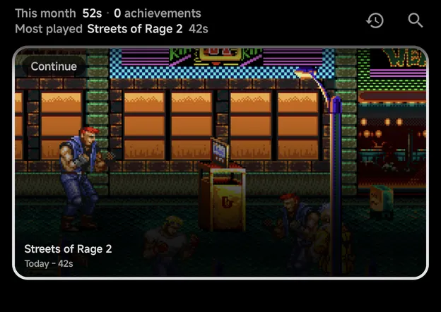

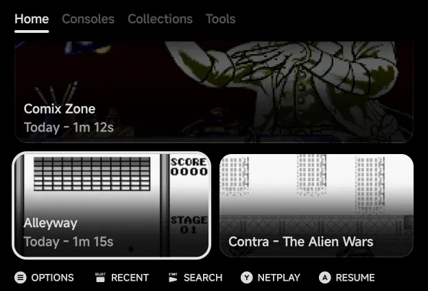

- **Continue card.** Your most recent game, with when you last played it and
  for how long. Press `A` to jump back in. On a fresh install it reads
  **Pick a game** ("Nothing played yet") and opens the Consoles tab.
- **Pinned tools** sit beside it as square icon tiles. If they don't all
  fit, the last square is **+N**, which opens the Tools tab.
- **Pinned games** fill the rows below, each with its name and play time.
- **Shelves** of games to pick from come last: **New**, **Not started** and
  **Pick up again**. See [Shelves](foldables.md#shelves).

| Button | What it does |
| --- | --- |
| D-pad | Move between the cards |
| `MENU` **Options** | **Pin** or **Unpin** the selected game or tool (**Play from start** first on a game with an auto-save) |
| `SELECT` **Recent** | Open the [Game Switcher](game-switcher.md) |
| `START` **Search** | [Search](#search) your games |
| `Y` **Netplay** | Play the selected game with another device. Shown for games that have [netplay](netplay.md) |
| `A` **Resume** / **Play** | Start the selected game. **Resume** continues from its auto-save; **Play** shows when it has none |
| `A` on a pinned tool | Open the tool. The hint names the tool, e.g. **Game Tracker** |
| `A` **More tools** | On **+N**: open the Tools tab |

??? info "Touch on Home"
    - Tap a card to select it, then tap it again to play or open it. This
      goes for the Continue card, pinned games and pinned tools.
    - A long press opens the same menu as `MENU`.
    - Drag up and down to scroll without selecting anything. Let go mid-drag
      and the page glides on.

??? info "More detail"
    - The stats strip sits on two lines under the tabs. The Continue card
      wears a **Continue** badge.
    - While the Consoles tab is hidden, **Pick a game** opens it over Home,
      and a long press opens the hidden-tab menu. **+N** works the same way
      while Tools is hidden.
    - Home scrolls when there are more pinned games than fit.
    - The shelves show on every screen size, portrait and landscape alike,
      at most 3 games each, each under its own label. Their cards are the
      pinned games' size, in the same grid: two to a row in portrait, four
      on a tablet. A **New** or **Not started** game shows its console under
      its name.

### Carousel

The same games in one row of cards, centred on the screen, with your pinned
tools in a row of squares underneath. Swipe the carousel to scroll it.

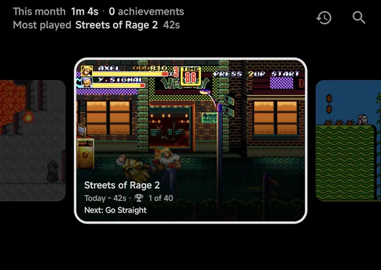

- **The carousel** starts on the **Continue** card (or **Pick a game** on a
  fresh install), then your pinned games, then the shelf games.
- **Game info** (name, last played, play time, achievements) shows inside
  the selected card.

| Button | What it does |
| --- | --- |
| `Left` / `Right` | Move along the carousel or the tools row. Past either end, switch tab |
| `Down` | From the carousel, go to the tools row (the square you last used) |
| `Up` | From the tools row, back to the carousel. From the carousel, the tab row |

??? info "More detail"
    - The stats sit on two centred lines under the tabs.
    - The Continue card has a **Continue** badge and is selected when Home
      opens. Shelf games follow in the order **New**, **Not started**,
      **Pick up again**, each badged with its shelf name. Each shelf holds at
      most 3 games. The shelves show in Carousel on any screen size.
    - Game info sits at the bottom of the selected card over a dark fade,
      like the Grid's Continue card. The cards beside it show their picture
      only.
    - The tool squares are the size of the Grid's portrait tool squares, in
      landscape too. The strip, the carousel and the tools row sit centred
      on the screen as one group. When the tools don't all fit, the last
      square is **+N**, which opens the Tools tab.

### Minimal

Just the names, big, on plain black: no art, no cards.

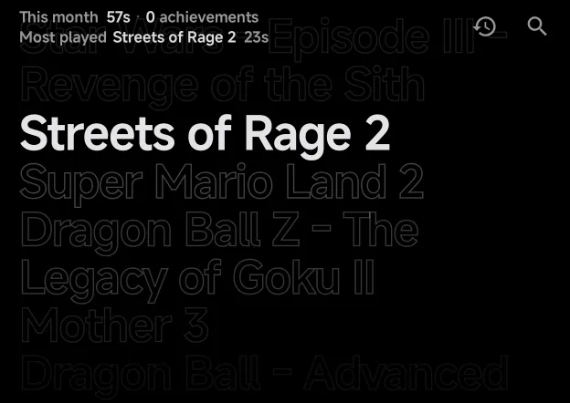

- **The list** holds the same items as [List](#list): Continue, your pinned
  games, the shelf games and your pinned tools.
- **The selected name** is solid in your accent colour, one row under the
  stats strip. The other names are its outline, fading the further they are
  from it: below it from half strength down to nothing at the bottom of the
  screen, above it fainter still.
- **Its tag** (**Continue**, **New**, **Not started**, **Pick up again**,
  **Tool**) sits at the end of the selected name, as a pill in your
  Secondary accent.

| Button | What it does |
| --- | --- |
| `Up` / `Down` | Move through the names. It wraps around at either end; a held button stops at the end |
| `Left` / `Right` | Switch tab |

??? info "More detail"
    - A long name wraps at its words onto up to three lines.
    - With touch, drag the names up and down; let go and they settle on the
      name you threw them to.
    - Opening a game fades the other names, then a dark band in your accent
      grows from the name over the screen as the game loads.

## Pinning games and tools

- **Pin a game:** press `MENU` on it in a game list and choose **Pin Item**.
  **Unpin Item** removes it again. On Home, `MENU` on the Continue card or a
  shelf game offers **Pin**, and on a pinned game **Unpin**.
- **Pin a tool:** press `MENU` on it in the Tools tab and choose **Pin**.
  **Unpin** removes it.
- You can pin up to **12** games. At the limit the app says
  "Pins are full (12). Unpin one first."

## Consoles

One entry per system that has games in it, each with its logo and how many
games it holds. The tab is drawn in its style from
[Layouts](layouts.md#consoles): **List**, **Grid**, **Carousel** (the
default) or **Minimal**.

| Button | What it does |
| --- | --- |
| `A` **Open** | Open the console's [game list](#game-lists) |
| `SELECT` **Recent** | Open the [Game Switcher](game-switcher.md) |
| `START` **Search** | [Search](#search) your games |

Collections and Tools take the same buttons, and `MENU` adds their options.

??? info "More detail"
    In the List and Carousel styles the selected console's controller shows
    too, unless you set **Consoles background** to **Background** or **None**
    in [Layouts](layouts.md#consoles-background).

### List { #consoles-list }

A plain list, with the selected console's controller beside it.

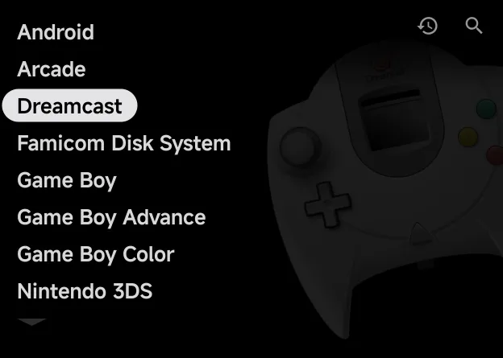

`Up` on the first row wraps to the last, and `Down` on the last row wraps to
the first.

??? info "More detail"
    - Only a fresh press wraps: holding the button stops at the end.
    - The scroll arrows sit at the bottom, above the button hints.
    - Collections and Tools lists work the same way.

### Grid { #consoles-grid }

Rows of tiles that slide sideways as you move, each console's logo with its
game count.

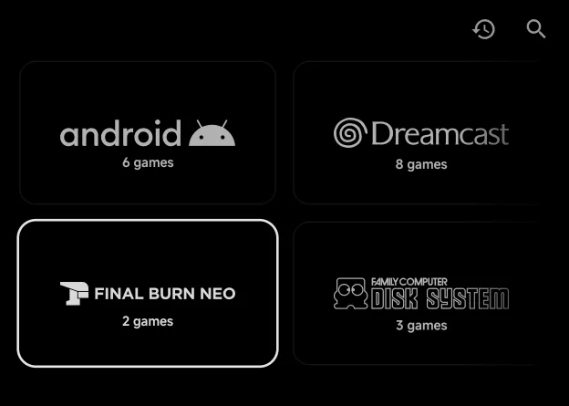

??? info "More detail: rows and columns"
    - Two rows on most phones, three on a tall phone held upright (such as a
      Galaxy Z Flip), and three or four on a large screen.
    - On a phone held upright the Consoles tab shows two consoles across,
      each half the screen wide. Once you move past the second, the selected
      console stays in the middle with half of each neighbour showing on
      either side, as on the handheld.
    - A tall phone's Grid starts with two or three columns across, and once
      it scrolls the selected column stays in the middle the same way.

### Carousel { #consoles-carousel }

A single row with the selected console's logo large in the middle, over its
controller, and its neighbours to the sides.

### Orientation

A Carousel, and a game list's Carousel or [Backdrop](#games-backdrop), can
also run **down** the screen instead of across: set its **orientation** row
in [Layouts](layouts.md) to **Vertical**.

- `Up` / `Down` move through the items, wrapping as a [List](#consoles-list) does.
- `Left` / `Right` switch tabs on a tab, and do nothing in a game list.

<figure markdown>

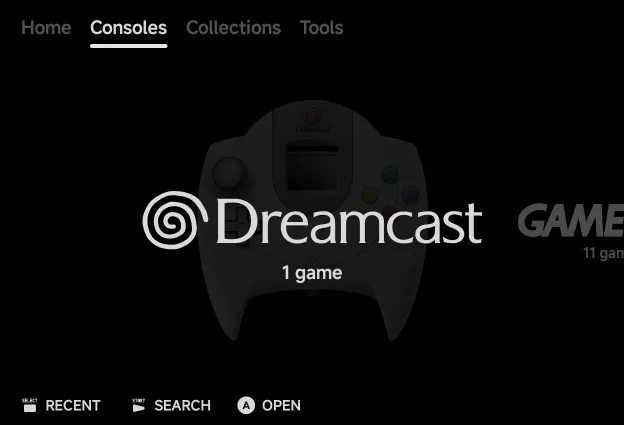

<figcaption>Consoles, Horizontal</figcaption>
</figure>

<figure markdown>

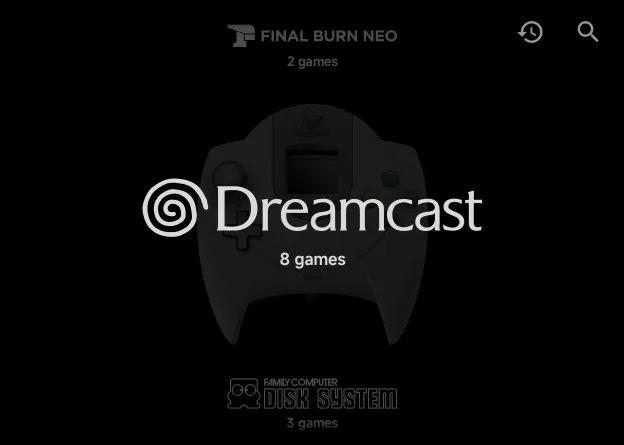

<figcaption>Consoles, Vertical</figcaption>
</figure>

### Minimal { #consoles-minimal }

The consoles' names alone, big, as on [Minimal Home](#minimal): the selected
one solid in your accent, the others outlined and fading away from it. `Up`
and `Down` wrap as a [List](#consoles-list) does.

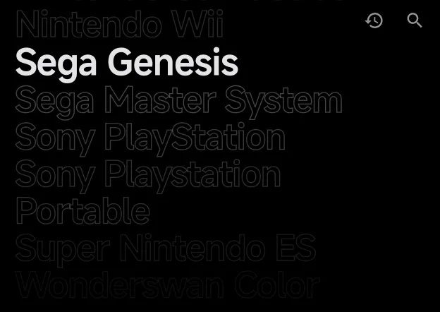

??? info "More detail"
    - `A` fades the other names, then the console's name flies up into the
      game list's title as its games rise in, when the game lists are
      Minimal too. `B` drops the title back into its place.
    - Collections and Tools in Minimal work the same way.

## Collections

Your own lists of games, each with its name and game count. The tab appears
once you have a collection, and `A` **Open** opens its
[game list](#game-lists). By default it is Minimal; pick its style in
[Layouts](layouts.md#collections). The styles work as on
[Consoles](#consoles).

<figure markdown>

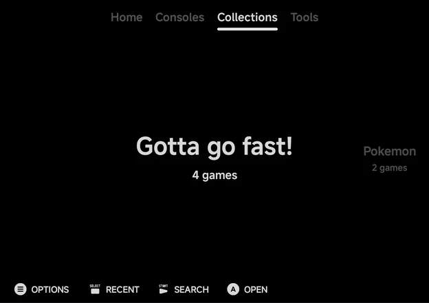

<figcaption>Carousel</figcaption>
</figure>

<figure markdown>

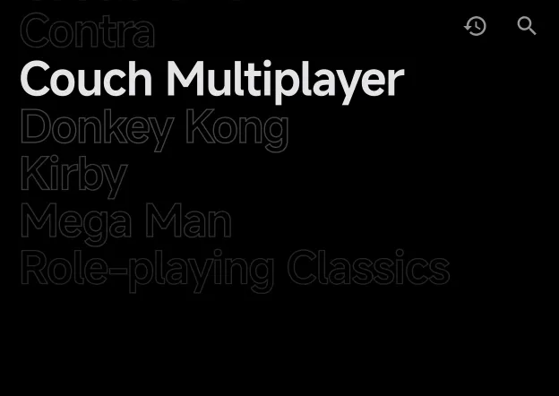

<figcaption>Minimal</figcaption>
</figure>

To build one from a game list:

1. Press `MENU` on a game.
2. Choose **Add to Collection**.
3. Pick an existing collection, or **New Collection…** to make one and name
   it.

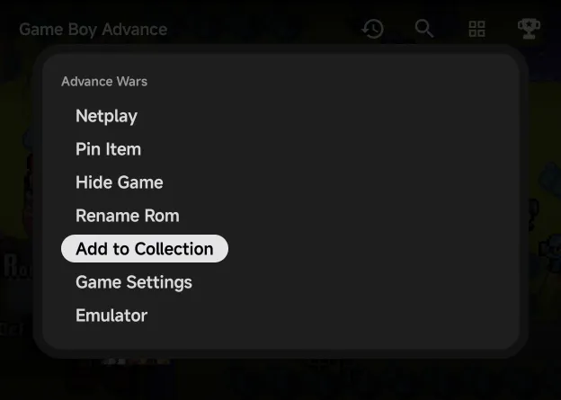

Press `MENU` on a collection, or long-press it, to **Rename** or **Delete**
it. Delete asks first, and removes only the list: the games stay in your
library.

??? info "More detail"
    - Collections are saved in the `Collections/` folder in your home folder.
    - In the Carousel each collection is only as wide as its name, and the
      space between neighbours stays the same, so short and long names sit
      evenly along the row.

## Tools

The built-in tools, each with its icon: **RetroAchievements**,
**Game Tracker**, **Artwork**, **Cheat Database**, **Device Sync** and
**Settings**, plus any Android apps you choose to show there (see
[Launcher Mode & Android Games](launcher.md)). By default it is a Grid; pick
its style in [Layouts](layouts.md#tools). The styles work as on
[Consoles](#consoles).

<figure markdown>

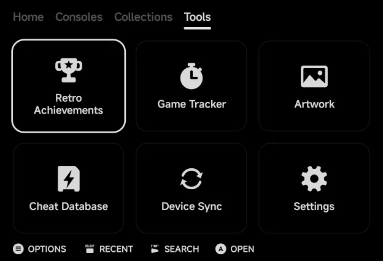

<figcaption>Grid</figcaption>
</figure>

<figure markdown>

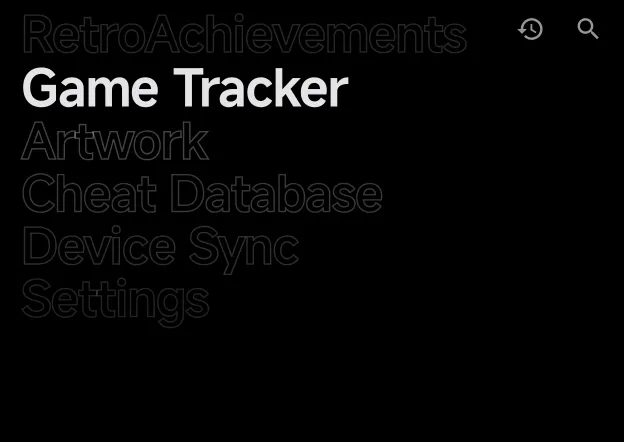

<figcaption>Minimal</figcaption>
</figure>

`A` **Open** opens the tool. `MENU` on a tool, or a long press, offers **Pin**
or **Unpin**, which puts it on [Home](#pinning-games-and-tools).

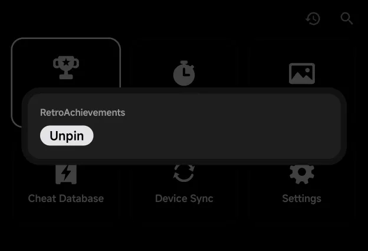

The tools have their own pages: [RetroAchievements](retroachievements.md),
[Game Tracker](game-tracker.md), [Artwork](artwork.md),
[Cheat Database](cheats.md), [Device Sync](device-sync.md) and
[Settings](settings.md).

??? info "More detail"
    In the Carousel each tool is only as wide as its icon, and the space
    between neighbours stays the same.

## Game lists

Opening a console or a collection shows its games. The page title names the
console or collection, e.g. **Sega Genesis**. The list is drawn in the game
lists' style from [Layouts](layouts.md#game-lists): **List**, **Grid**,
**Carousel** (the default), **Backdrop** or **Minimal**. It is the same for every game
list.

The selected game shows when you last played it and your total play time
("Today - 11m 0s"), plus your achievement progress where it has any. Game
names leave out the region and version text in brackets.

| Button | What it does |
| --- | --- |
| `MENU` **Options** | Open the game's context menu |
| `SELECT` | Open the [Game Switcher](game-switcher.md) |
| `START` | [Search](#searching-a-game-list) this list |
| `X` **Achievements** | Open the [achievements panel](#achievements-panel) |
| `Y` **Netplay** | Play the game with another device. Shown for games that have [netplay](netplay.md) |
| `B` **Back** | Return to the tab |
| `A` **Resume** / **Open** | Launch the game. **Resume** continues from its auto-save; **Open** shows when it has none |

A long press on a game opens the context menu too. To start a game with an
auto-save from the beginning, choose **Play from start** in its menu.

??? info "More detail"
    For games with achievements, the info line adds your progress and the
    next achievement to go for.

### List { #games-list }

The games as rows, with the selected game's picture filling the background
or in a box (see [List art](layouts.md#list-art)).

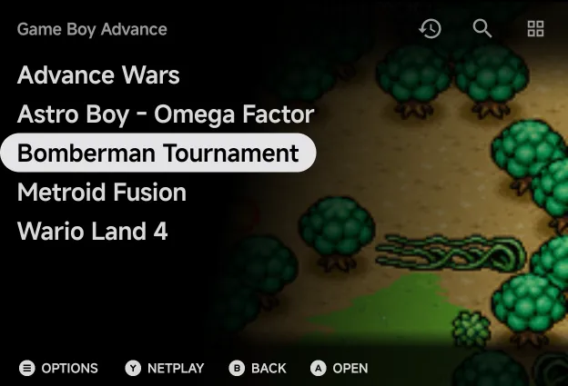

`Up` and `Down` wrap at the ends, as on a [tab](#consoles-list).

??? info "More detail"
    The selected game's last-played time, achievements and next achievement
    show only where the hints would be: with
    [Button hints](layouts.md#page-title-and-button-hints) hidden, or with
    touch alone. While the hint bar shows, they are left out.

### Grid { #games-grid }

Rows of tiles with each game's screenshot. The selected tile adds its name,
last-played time and achievement count.

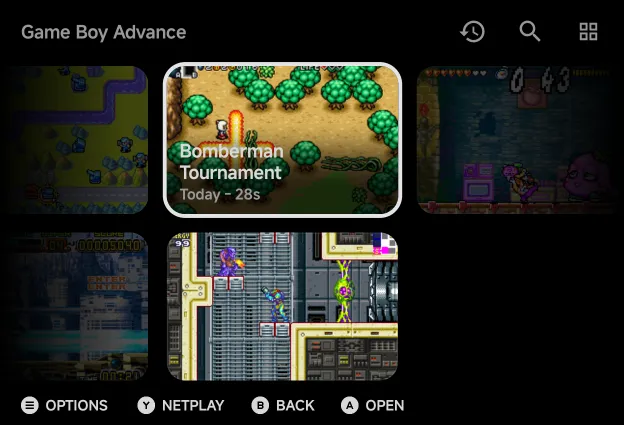

### Carousel { #games-carousel }

The default. The selected game is large in the middle, its name below its
picture, and its play time, achievement count and next achievement at the
bottom of the picture.

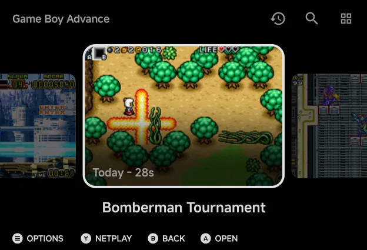

??? info "More detail"
    A game's stats sit over a dark fade. The side games get smaller the
    further they are from the middle.

### Backdrop { #games-backdrop }

The selected game's box art stands over its dimmed screenshot, with its
neighbours' boxes to the sides. Its caption gives the name, then the play
time and achievement count, then the next achievement on its own line.

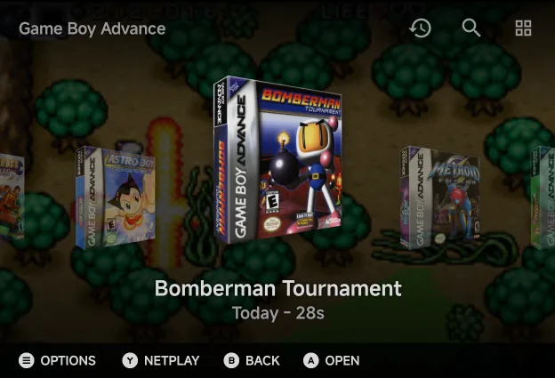

### Minimal { #games-minimal }

The games' names alone, big, as on [Minimal Home](#minimal), under the page
title: no art and no game info. `Up` and `Down` wrap as a
[List](#games-list) does.

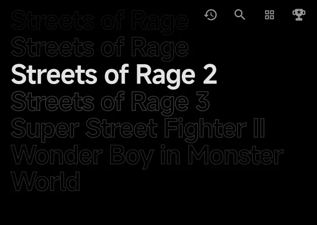

??? info "More detail"
    `A` fades the other names, then a dark band in your accent grows from the
    game's name over the screen as the game loads.

### Vertical game lists { #game-lists-alignment }

A Carousel or Backdrop game list can run down the screen (see
[Orientation](#orientation)), with the same caption lines. The stack sits on
the left and the details on the right; set **Game lists alignment** in
[Layouts](layouts.md#game-lists) to **Right** to swap the sides.

<figure markdown>

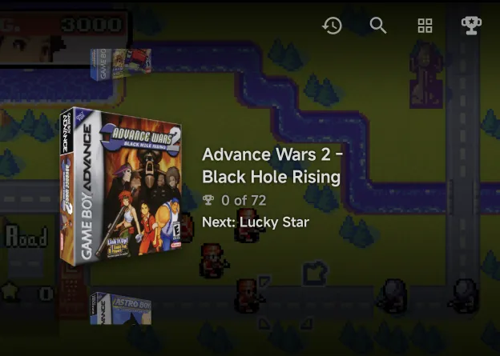

<figcaption>Backdrop, Vertical, Left</figcaption>
</figure>

<figure markdown>

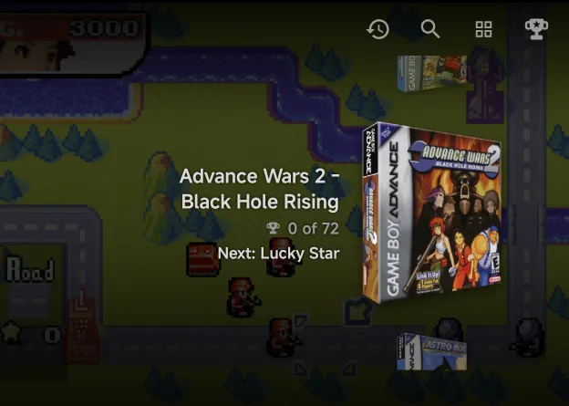

<figcaption>Backdrop, Vertical, Right</figcaption>
</figure>

### Title icons

On a phone or tablet, icons sit at the right of a game list's title:

| Icon | What it does |
| --- | --- |
| **Recent** | Open the [Game Switcher](game-switcher.md) |
| **Search** | [Search](#searching-a-game-list) this list |
| **Layout** | Pick the game list layout. It applies to every game list. See [Menu Layouts](layouts.md) |
| Trophy | Open or close the [achievements panel](#achievements-panel) |

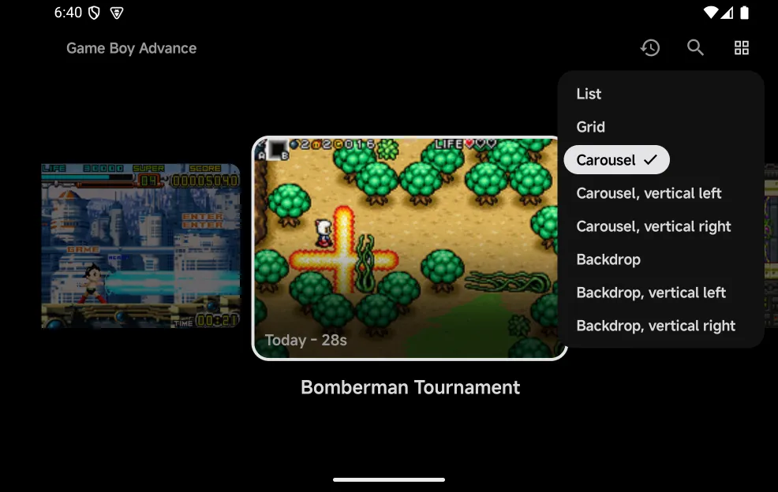

??? info "More detail"
    - The **Layout** dropdown offers **List**, **Grid**, **Carousel**,
      **Carousel, vertical left** / **right**, **Backdrop**, **Backdrop,
      vertical left** / **right** and **Minimal**.
    - **Layout options** and **Achievements panel** in Layouts → Game lists
      hide the Layout and trophy icons. See
      [Layouts](layouts.md#layout-options-and-achievements-panel).

### Searching a game list

`START`, or the **Search** icon, searches only the games of the list you are
in. The prompt is titled after the list, such as **Search Sega Genesis**.
`B` returns to the list, on the game you had selected in the results.
Matching works as in [Search](#how-matching-works).

??? info "More detail"
    The results are titled with the list and your words, such as **Sega
    Genesis: sonic**.

### Achievements panel

While you are signed in to [RetroAchievements](retroachievements.md), `X` or
the trophy icon opens a panel from the right with the selected game's
achievements. See [RetroAchievements on game lists](retroachievements.md#on-game-lists)
for its buttons.

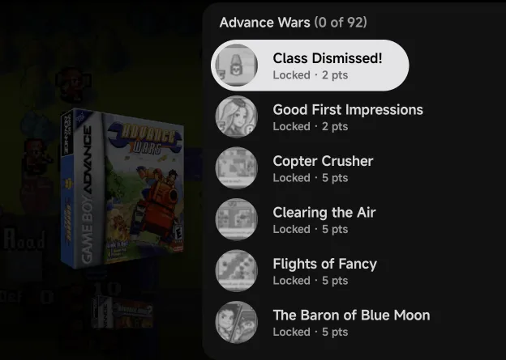

??? info "More detail"
    - Tapping the selected game's name or info line opens the panel too.
    - With **Achievements panel** hidden, `X` still opens it, and the game's
      menu ends with **Achievements**.

## Context menus

Press `MENU` on a game to see what you can do with it. The menu depends on
where the game is listed.

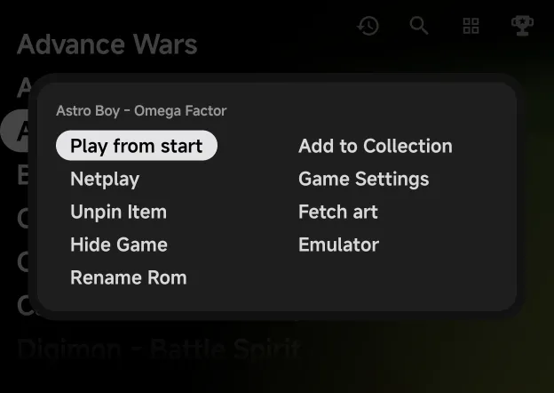

| Item | What it does |
| --- | --- |
| **Play from start** | Start the game from the beginning instead of its auto-save. Shown first when the game has one |
| **Pin Item** / **Unpin Item** | Pin the game to Home, or take it off |
| **Hide Game** | Hide the game from its list |
| **Rename Rom** | Change the name the list shows |
| **Add to Collection** | Add the game to a collection, or start a new one |
| **Game Settings** | This game's own emulator settings. See [Emulator Settings](emulator-settings.md) |
| **Netplay** | Play the game with another device. See [Netplay](netplay.md) |
| **Fetch art** | Download art for this game. See [Artwork](artwork.md) |
| **Emulator** | Pick which emulator runs this game. See [Emulators](emulators/index.md) |
| **Remove from Collection** | Take the game out of the collection you are in |
| **Achievements** | Open the [achievements panel](#achievements-panel). Shown last, only while its icon is hidden |

- **Hidden games** are listed in **Tools → Settings → Library → Hidden
  games**. Press `A` **Unhide** there to bring one back.
- **Unassigned games** are files in an extra ROM folder that the app could
  not match to a system. Open them from **Tools → Settings → Library →
  Unassigned games**, and use **Console** to say which system a game belongs
  to. See [Library & ROM folders](library.md).

??? info "More detail: which items show where"
    | List | Items |
    | --- | --- |
    | A console | **Play from start** when the game has an auto-save, then **Pin Item**, **Hide Game**, **Rename Rom**, **Add to Collection**, **Game Settings**, **Netplay**, **Fetch art**, and **Emulator** on systems with more than one emulator |
    | A collection | The same, with **Remove from Collection** at the end |
    | [Search](#search) results | The same as a console, without **Emulator** |
    | Unassigned games | **Hide Game**, **Rename Rom**, **Console** |
    | The Android console | **Pin Item** / **Unpin Item** only |

    - **Fetch art** shows only for systems the art sources know, and only
      when the game's art is incomplete, or when **Artwork → Replace existing
      art** is on.
    - **Netplay** shows only for systems that have [netplay](netplay.md).
      When the `Y` **Netplay** hint is not on screen (touch only, Button
      hints hidden, or **Netplay hint** hidden in
      [Layouts](layouts.md#page-title-and-button-hints)), **Netplay** moves
      up, right after **Play from start**. On Home too.
    - A menu with 9 to 16 items shows as two columns when the screen is wide
      enough. `Left` / `Right` move between the columns. `Up` / `Down` loop
      round the items.
    - The Android console holds the Android games you added. See
      [Launcher Mode & Android Games](launcher.md).

### Hidden tabs

When you hide a tab in [Layouts](layouts.md#showing-and-hiding-tabs), `MENU`
on any item of the main menu ends with an entry for each hidden tab
(**Consoles**, **Collections** or **Tools**). Pick one to open that tab over
the current one; `B` returns.

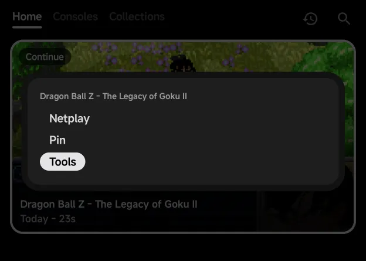

??? info "More detail"
    Only a hidden tab that has something in it is offered. Items that have no
    menu of their own, such as a console, get a menu with just these,
    captioned **NX Redux**.

## Search

Press `START` on the main menu, or tap the **Search** icon, to search all
your games. It works from any tab. In a game list, `START` searches only that
list: see [Searching a game list](#searching-a-game-list).

1. The **Search** prompt opens, with your last search filled in.
2. Type part of a name and press `A` or the keyboard's **Done**.
3. The matches open as a game list titled **Search:** and your words, such
   as **Search: mario kart**.

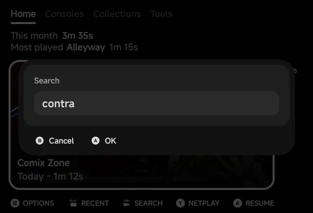

`B` or `START` closes the prompt without searching.

The results list games from every console, each with its console's tag, such
as `GBA`. It reads **No results** when nothing matches.

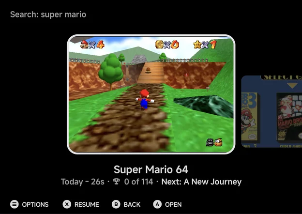

| Button | What it does |
| --- | --- |
| `MENU` **Options** | The game's context menu |
| `X` **Achievements** | Open the [achievements panel](#achievements-panel) |
| `Y` **Netplay** | Play the game with another device, for games that have [netplay](netplay.md) |
| `B` **Back** | Return to the tab and the item you searched from |
| `A` **Resume** / **Open** | Launch the game, from its auto-save when it has one |

??? info "More detail"
    - Search also works from the tab row. The hint reads **Search** once you
      have games.
    - The results use your game list style.

### How matching works

The search looks in each game's name, its file name and its console tag.

- **Case, accents and punctuation don't matter.** `pokemon` finds
  *Pokémon*, and `pac man` finds *Pac-Man*.
- **Words can come in any order**, and each can be part of a word.
  `kart mario` finds *Mario Kart: Super Circuit*.
- **No typos.** Each word you type has to be there.

??? info "More detail"
    - **Roman numerals and digits match.** `final fantasy 6` finds *Final
      Fantasy VI*, and `vi` still finds *Virtua Fighter*.
    - **Words can be glued together.** `pacman` finds *Pac-Man*.
    - Names that start with your search come first, then names where every
      word starts a word, then the rest. Each group is A to Z.
    - Unassigned games, games without an emulator and Android games are not
      searched.
