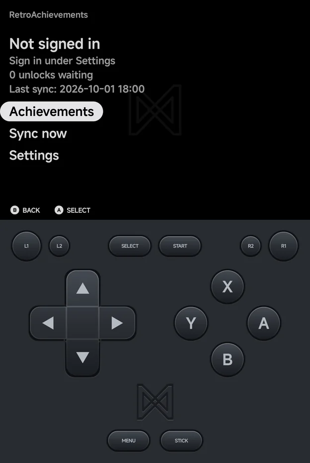
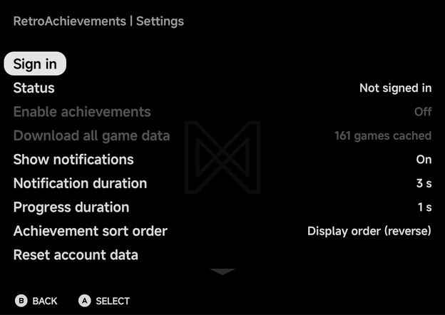
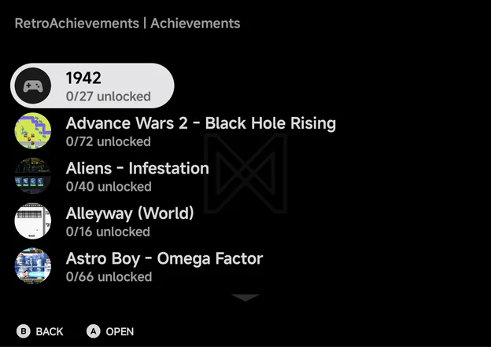
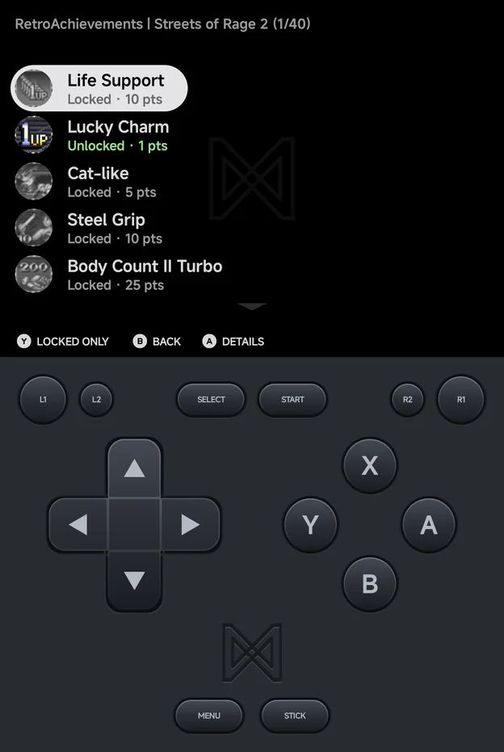

# RetroAchievements

NX Redux Mobile supports [RetroAchievements](https://retroachievements.org/),
with offline play. **Tools → RetroAchievements** is the home for the feature:
sign in, browse your achievements and change its settings there.

The home screen shows your username, your points, how many unlocks are
waiting to be synced and when you last synced, above three rows:
**Achievements**, **Sync now** and **Settings**. Signed out, it reads **Not
signed in** and **Sign in under Settings** instead.

!!! info "Softcore only"
    NX Redux Mobile is not an RA-approved hardcore client, so there is no
    hardcore mode. Unlocks count as softcore, and nothing is blocked
    while achievements are on: cheats and save states work as usual.

## Setting up

You need a free [retroachievements.org](https://retroachievements.org/)
account.

1. Open **Tools → RetroAchievements → Settings**.
2. Choose **Sign in**, enter your **Username** and **Password**, and choose
   **Sign in**.
3. **Status** shows **Signed in as** your username, and **Enable
   achievements** turns **On**.

The app keeps only the sign-in token RetroAchievements returns, not your
password.

Signed out, **Enable achievements** and **Download all game data** are dimmed.

The settings page also has:

| Row | Values | Default | What it does |
| --- | --- | --- | --- |
| **Enable achievements** | On, Off | On after you sign in | Track achievements in games. Needs a sign-in. |
| **Download all game data** | — | — | Cache achievement data for your whole library. See [Offline play](#offline-play). Needs a sign-in. |
| **Show notifications** | On, Off | On | Show unlock and progress notices in games. |
| **Notification duration** | 1–5 s | 3 s | How long achievement notices stay. |
| **Progress duration** | Off, 1–5 s | 1 s | How long a progress notice stays. |
| **Achievement sort order** | See [below](#sort-orders) | Unlocked first | How achievements are sorted, here and in the in-game menu. |
| **Reset account data** | — | — | Sign out and forget sessions and unsynced unlocks. Game data and badges stay. |
| **Erase all achievement data** | — | — | Delete every cached game, badge and unsynced unlock, and sign out. |
| **Reset settings to defaults** | — | — | Put the notification and sort settings back to their defaults and turn **Enable achievements** off. You stay signed in. |

- `A` changes a value. On **Notification duration**, **Progress duration**
  and **Achievement sort order**, `LEFT` / `RIGHT` work too.
- **Sign out**, **Reset account data** and **Erase all achievement data** ask
  to confirm first.
- Signing out turns achievements off, and signing in again needs your
  password. Your unsynced unlocks, game data and badges stay.

## Earning achievements

Start a recognised game and unlocks are tracked as you play.

- When the game loads, a notice shows its name and how many achievements you
  have, or **No achievements for this game**.
- An **Achievement Unlocked** notice with the badge pops up when you earn one.
- Progress notices, such as collectible counters, show for the **Progress
  duration**.
- The [in-game menu](in-game-menu.md#achievements)'s **Options** gains an
  **Achievements** row. Browse the game's achievements there, press `Y` to
  show only locked ones, and `X` to mute one achievement's notices.

??? info "More detail"
    With **Show notifications** off, unlock and progress notices, **Game
    Mastered!**, server errors and the connection lost and reconnected notices
    are hidden. These still show: the game loading, no achievements for this
    game, sign-in failed, offline at the start, first-time setup and synced
    unlocks.

## On the Home tab

Home's stats strip counts your achievements for the month: **This month**,
your play time, then the number of achievements you unlocked this calendar
month, such as **12 achievements**. Unlocks still waiting to be synced count
too. Signed out, it reads **Sign in** instead of a number. See
[Home](main-menu.md#home).

## Offline play

- **Earn offline.** With no connection, unlocks are saved on the phone and
  count as waiting. They show as **Pending sync** until they reach
  RetroAchievements.
- **Automatic sending.** The next time you start a game with a connection,
  waiting unlocks are sent, and a notice says how many were synced.
- **Cached game data.** A game you have played online once keeps working
  offline. A game the app has never seen needs a connection the first time,
  and says so.
- **Download all game data** caches achievement data and badges for every
  game in your library, so games you have never played online work offline
  too. A progress bar shows each game, and `B` cancels. When it is done, a
  notice counts the games cached, the games without achievements and the
  games skipped. Zipped and 7z games are unpacked to be identified.

## Syncing

**Sync now** on the home screen needs a connection. It does two things:

1. It sends any unlocks still waiting.
2. It refreshes your points and the progress of your cached games.

A notice then says how many unlocks were synced, **Up to date**, or **Sync
failed**. `B` cancels a sync; unlocks not yet sent stay waiting.

## Browsing your achievements

**Achievements** on the home screen lists every cached game with its art and
progress, such as `12/40 unlocked`, plus how many unlocks are pending sync.
It works offline. With nothing cached yet it shows **No cached games** and
**Play online once or download game data in Settings**.

Open a game to see its achievements. Each shows **Unlocked**, **Pending sync**
or **Locked**, with its points, in green, amber or grey. `Y` switches between
**Locked only** and **Show all**.

`A` opens an achievement's details: its badge, description, points, when it
was unlocked or its progress, its unlock rate, its type (`[Missable]`,
`[Progression]` or `[Win Condition]`) and whether it is muted.

On a wide landscape screen, such as an unfolded Fold held sideways, the
details show beside the list instead. See
[Foldables & Large Screens](foldables.md#two-pane-screens).

## Sort orders

**Achievement sort order** offers: **Unlocked first** (the default),
**Display order**, **Display order (reverse)**, **Most common first**,
**Rarest first**, **Most points first**, **Fewest points first**, **Title
A–Z**, **Title Z–A**, **Type** and **Type (reverse)**.
