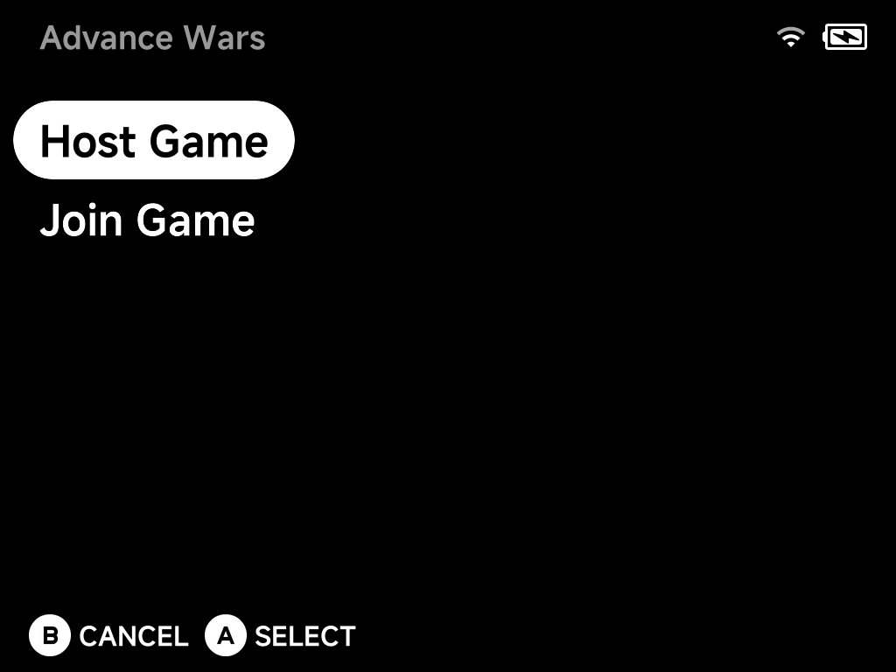

# Netplay

NX Redux includes [Netplay](https://github.com/mohammadsyuhada/nextui-netplay)
for **local wireless multiplayer**. When a game supports it, the hint bar in
the game list shows `Y NETPLAY`:

Press `Y` on a supported game to host or join over Wi-Fi or a device-hosted
hotspot — no manual IP entry, no persistent toggle to remember to turn back
off, and save data is synced automatically before the match starts.

## Starting a session

1. Both players pick the same game in their game list and press `Y`.
2. One player chooses **Host Game**, the other **Join Game**.
3. Devices discover each other automatically over the local network (or a
   hotspot hosted by one device); save data syncs before the match starts.

## Supported systems

- **GB Link** — Game Boy (gambatte): link cable games like Pokémon trades and
  battles.
- **GBA Link** — Game Boy Advance (gpSP): wireless adapter and link cable
  games.
- **Classic lockstep netplay** for the other supported built-in cores.
- **Sega Dreamcast** — GGPO netplay, up to 2 players
  ([details](emulators/dreamcast.md)).
- **Nintendo 64** — up to 4 players, with device-dependent limits
  ([details](emulators/nintendo-64.md)).

## During a session

Save states, fast-forward and rewind are automatically disabled during a
session to protect the connection.
