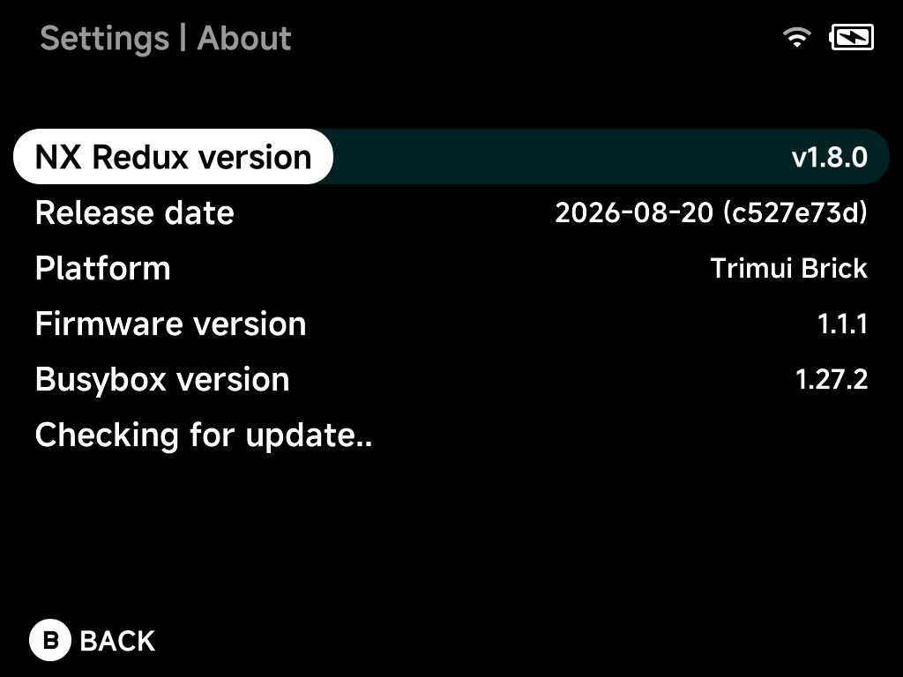

# About

Version information and the built-in updater.

## NX Redux version

The installed NX Redux release.

## Release date

Build date and the commit it was built from.

## Platform

The device model NX Redux is running on.

## Firmware version

The stock TrimUI firmware version — compare against the
[requirements](../getting-started.md#before-you-install).

## Busybox version

The system's Busybox version.

## Updater

Checks for a new NX Redux release (it starts checking when you open this
page) and downloads and installs the update from here.
