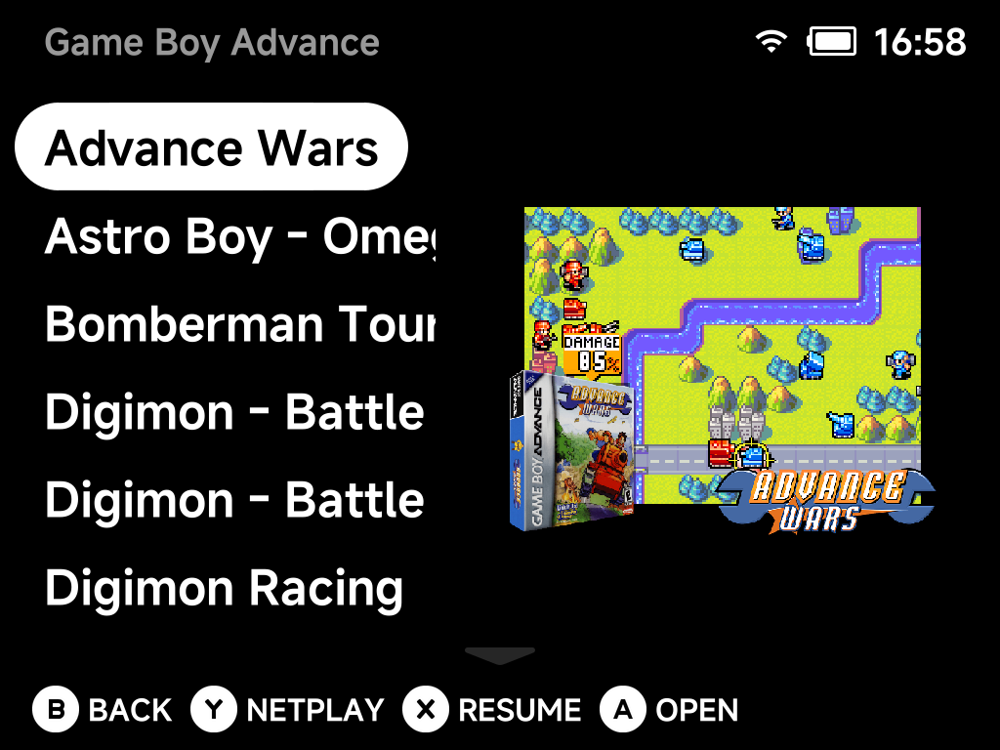
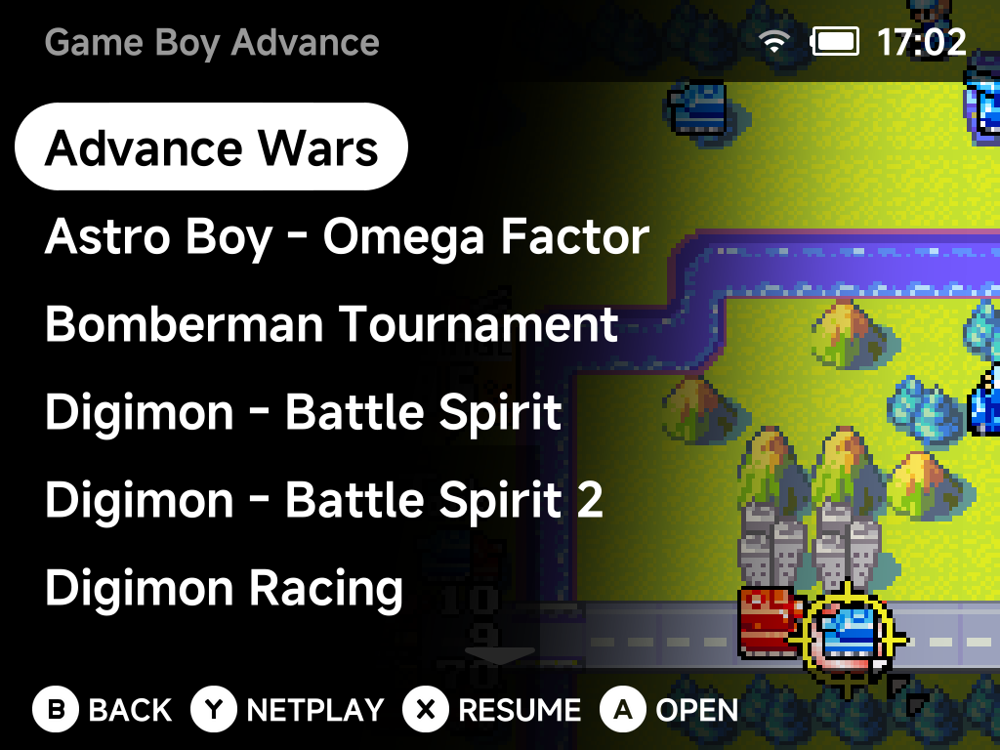
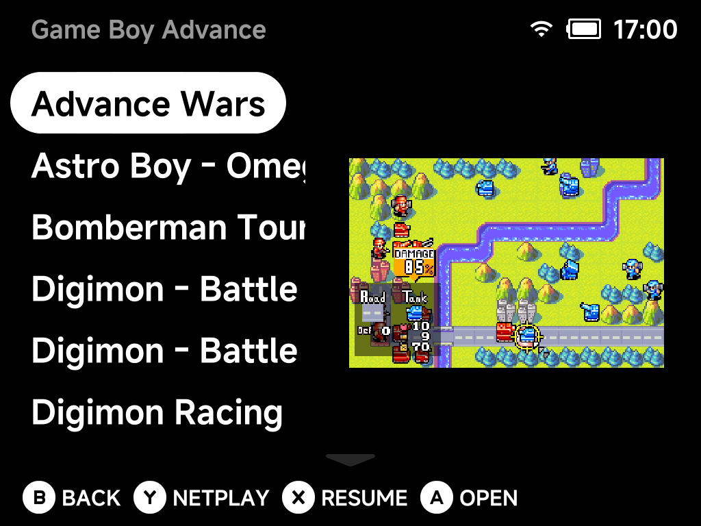
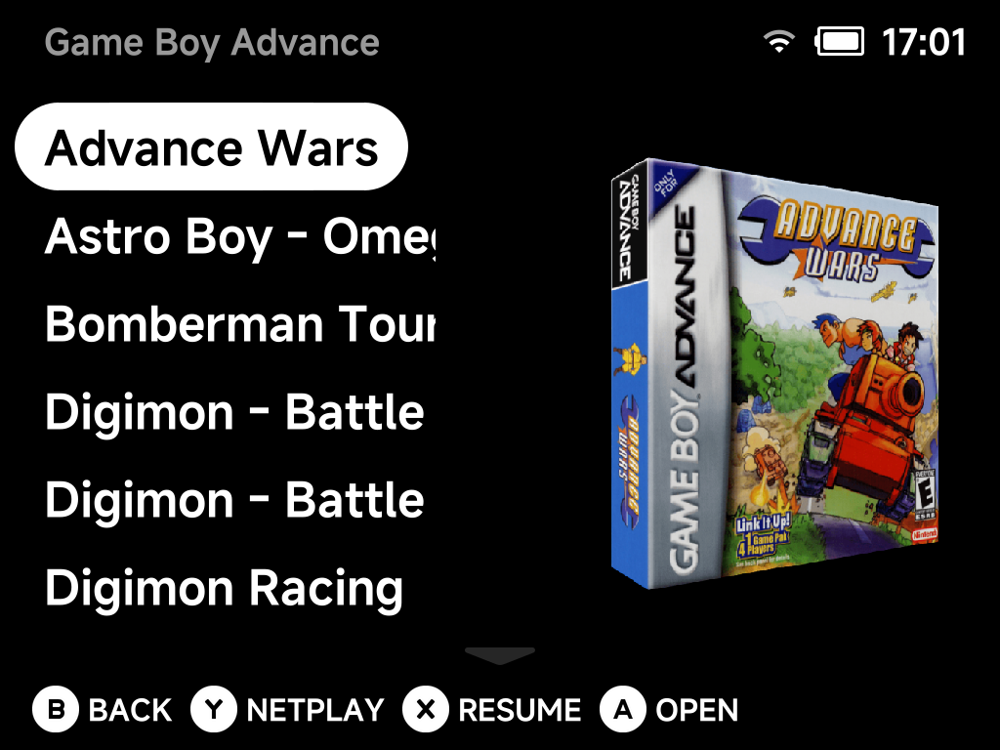

# Appearance

UI customization — colors (with live swatches), animations, and which
entries the main menu shows.

## Main color

The color used to render main UI elements.

## Main color opacity

Opacity of the main color, `10%`–`100%` in 10% steps. Below `100%` the pills
and selection capsules become translucent and show the wallpaper (`bg.png` at
the SD card root, or the per-folder art) through them.

## Primary accent color

The color used to highlight important things in the UI.

## Primary accent opacity

Opacity of the primary accent color, `10%`–`100%`. Below `100%` accented
elements become translucent and show the wallpaper through them.

## Secondary accent color

A secondary highlight color.

## Secondary accent opacity

Opacity of the secondary accent color, `10%`–`100%`. Below `100%` accented
elements become translucent and show the wallpaper through them.

## Hint info color

Color for button hints and info text.

## List text

List text color.

## List text selected

Color of the selected list entry's text.

## Show battery percentage

Show the battery level as a percentage in the status pill.

## Show search hint

Show or hide the START search button hint on the main menu. Hiding it only removes the hint; pressing START at the top level still opens search.

## Show menu animations

Enable or disable menu animations.

## Show menu transitions

Enable or disable the animated slide transitions between screens.

## Game art visible

Show game artwork in the main menu.

## Game art corner radius

Radius of the rounded corners on game art.

## Game art width

Percentage of the screen width used for game art: the size of the image on
the right, and the width left over for game titles. This applies to the
**Thumbnail** style only. The **Background** style has fixed geometry and
caps titles at 85% of the screen width.

## Game art style

How game art is shown in the game list.

- **Thumbnail** (default) — the art sits on the right side of the screen at
  the size set by *Game art width*, with rounded corners.

    *Thumbnail*

    

- **Background** — the art fills the screen height and fades diagonally into
  the list, with the titles over it. This style always uses the screenshot,
  whatever *Game art type* is set to, and shows an empty background for a game
  whose screenshot has not been fetched. *Game art corner radius* and *Game
  art width* have no effect here.

    *Background*

    

## Game art type

Which of the fetched images the game list shows in the **Thumbnail** style.
The [Artwork Manager](../apps/artwork-manager.md) stores all three per game;
when the chosen one is missing for a game, the Mix image is shown instead.

- **Mix** (default) — the screenshot with the box art and logo over it.

    *Mix*

    

- **Screenshot** — the in-game screenshot on its own.

    *Screenshot*

    

- **Box art** — the box art on its own.

    *Box art*

    

!!! note "Upgrading from v1.9.0 or older"
    Releases up to v1.9.0 saved only the Mix image. **Screenshot** and
    **Box art** therefore fall back to it, and the **Background** style,
    which never falls back, shows nothing at all for art fetched back then.
    To get the extra images for an existing library, open **Artwork Manager
    → Settings → Reset artwork**, then queue your systems again from the
    Library page.

## Show folder names at root

Show folder names in the root directory.

## Show Recents

Show the "Recently Played" entry in the main menu.

## Show Tools

Show the "Tools" entry in the main menu.

## Show Collections

Show the "Collections" entry in the main menu.

## Show Emulators

Show the emulator (system) folders in the main menu — turn this off for a
minimal menu of just your pinned games and shortcuts.

## Use folder background for ROMs

Use the emulator's background image behind its game list.

## Bootlogo

Change the device boot logo.

## Reset to defaults

Resets all options on this page to their default values.
