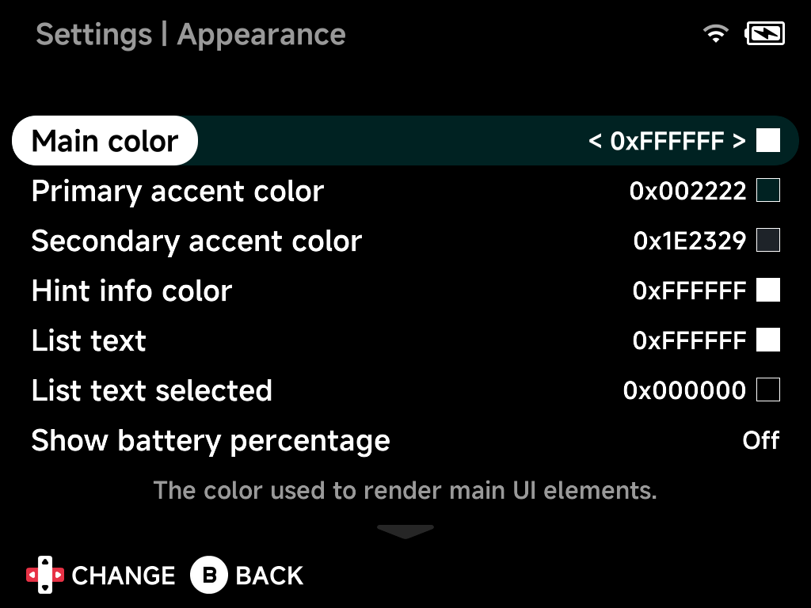

# Appearance

UI customization — colors (with live swatches), animations, and which
entries the main menu shows.

## Main color

The color used to render main UI elements.

## Primary accent color

The color used to highlight important things in the UI.

## Secondary accent color

A secondary highlight color.

## Hint info color

Color for button hints and info text.

## List text

List text color.

## List text selected

Color of the selected list entry's text.

## Show battery percentage

Show the battery level as a percentage in the status pill.

## Show menu animations

Enable or disable menu animations.

## Show menu transitions

Enable or disable the animated slide transitions between screens.

## Game art corner radius

Radius of the rounded corners on game art.

## Game art width

Percentage of the screen width used for game art.

## Show folder names at root

Show folder names in the root directory.

## Show Recents

Show the "Recently Played" entry in the main menu.

## Show Tools

Show the "Tools" entry in the main menu.

## Show Collections

Show the "Collections" entry in the main menu.

## Show Emulators

Show the emulator (system) folders in the main menu — turn this off for a
minimal menu of just your pinned games and shortcuts.

## Show game art

Show game artwork in the main menu.

## Use folder background for ROMs

Use the emulator's background image behind its game list.

## Bootlogo

Change the device boot logo.

## Reset to defaults

Resets all options on this page to their default values.
