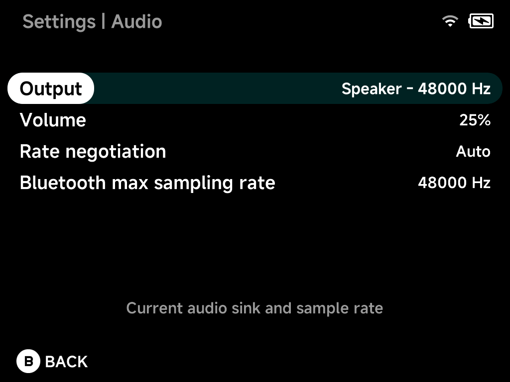

# Audio

NX Redux negotiates the audio sample rate with whatever output is active —
48 kHz on the speaker, the negotiated Bluetooth rate, or a USB DAC's
supported rates — with high-quality in-app resampling instead of silent
low-quality system resampling. Hot-plugging a USB-C DAC or connecting
Bluetooth mid-playback reroutes audio automatically; a headphone icon
appears in the status bar while an external output is active.

## Output

The current audio sink and its sample rate, live — e.g.
`Speaker – 48000 Hz`, or your DAC/Bluetooth device when connected.

## Volume

Master volume.

## Rate negotiation

`Auto` negotiates the best rate with the active output; forcing 48 kHz is
the escape hatch if a device misbehaves.

## Bluetooth max sampling rate

Caps the sample rate used for Bluetooth audio.
