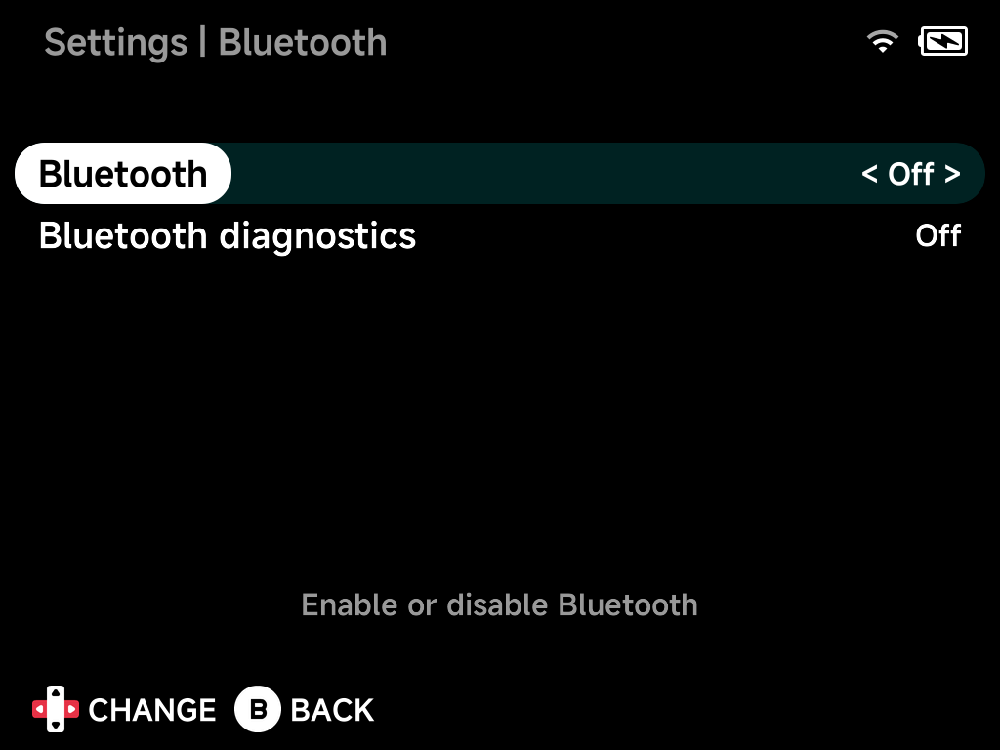

# Bluetooth

Bluetooth pairing. A connected audio device takes over sound output
automatically — see [Audio](audio.md). The [OSD](../guide/osd.md) has a
quick Bluetooth toggle too.

## Bluetooth

Enable or disable Bluetooth.

## Bluetooth diagnostics

Extra Bluetooth logging for troubleshooting.

## Device list

With Bluetooth on, discovered devices appear below — select one to pair
and connect.
