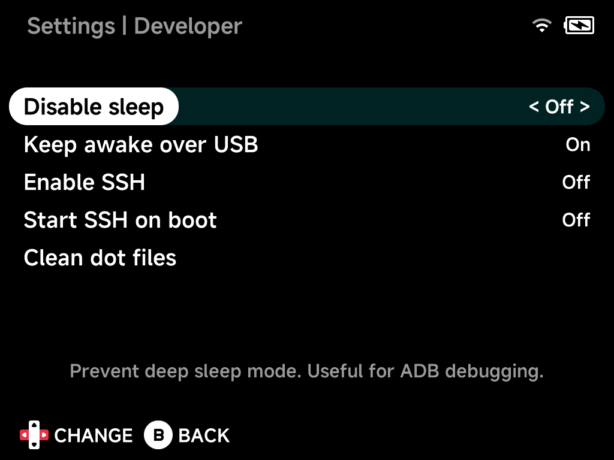

# Developer

Developer and debugging tools.

## Disable sleep

Prevent deep sleep mode — useful for ADB debugging.

## Keep awake over USB

Keep the screen on and block sleep while connected to a computer over USB.

## Enable SSH

Start or stop the SSH service.

## Start SSH on boot

Automatically start SSH when the device boots.

## Clean dot files

Remove macOS junk files copied to the SD card (`.DS_Store`, `._*`,
`.Trashes`, and friends).
