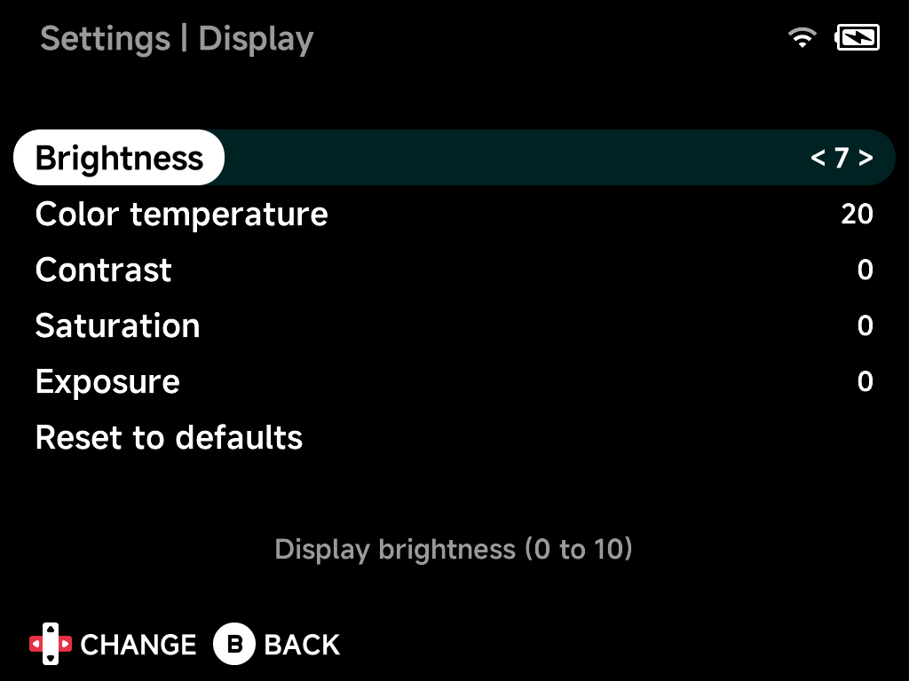

# Display

Panel tuning. Options marked *hardware-dependent* only appear on devices
whose panel supports them.

## Brightness

Display brightness, `0` to `10`.

## Color temperature

Color temperature, `0` to `40` — lower is warmer. *(Hardware-dependent.)*

## Contrast

Contrast enhancement, `-4` to `5`. *(Hardware-dependent.)*

## Saturation

Saturation enhancement, `-5` to `5`. *(Hardware-dependent.)*

## Exposure

Exposure enhancement, `-4` to `5`. *(Hardware-dependent.)*

## Reset to defaults

Resets all options on this page to their default values.
