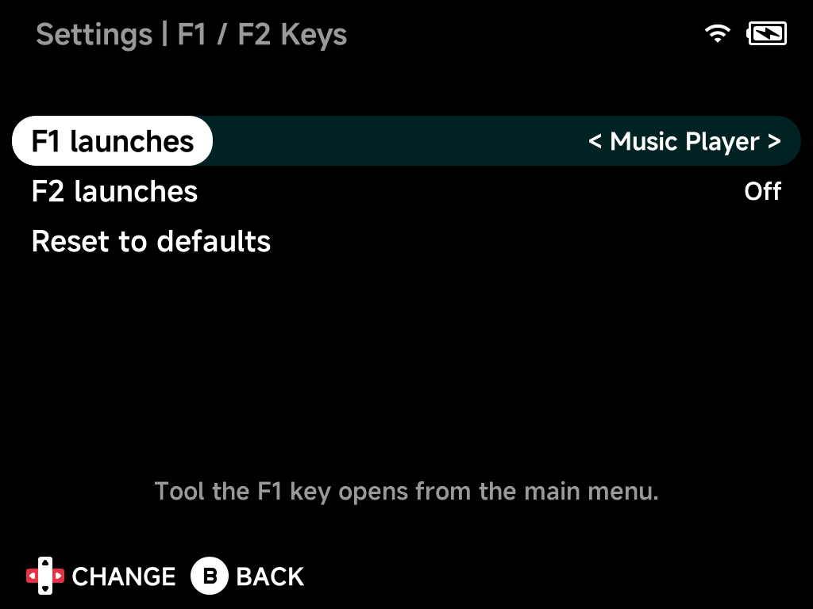

# F1 / F2 Keys

Give the two extra **F1** and **F2** keys a job on the main menu: assign
each one a tool, and pressing it anywhere while browsing launches that tool
— when you exit, you're right back where you were.

*(Brick and Brick Pro only — other devices don't have the F keys. In games
the keys stay free for emulator shortcut bindings; this page only affects
the menus. Hidden in [Simple Mode](simple-mode.md).)*

## F1 launches / F2 launches

Pick any installed tool, or `Off` to disable the key. The list offers the
same tools as the Tools menu; if an assigned tool is later uninstalled, the
key simply goes back to doing nothing.

## Reset to defaults

Sets both keys back to `Off`.
