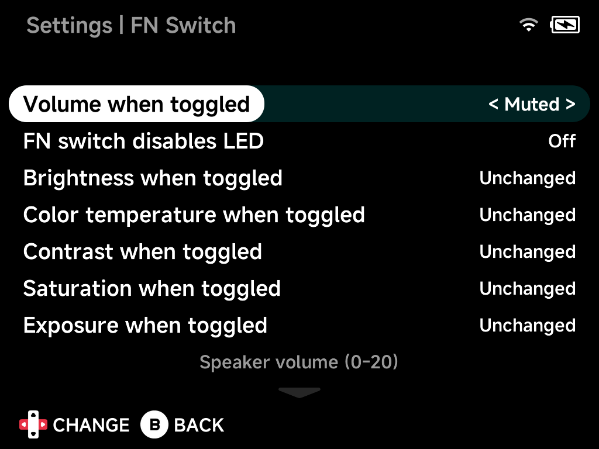

# FN Switch

What flipping the **FN switch** does. Each option applies while the switch
is toggled and reverts when you flip it back; display options can be left
`Unchanged`. It's a quick "night mode": muted volume, dimmed screen, LEDs
off — one flick.

## Volume when toggled

Speaker volume while toggled, `0`–`20` (`Muted` for silence).

## FN switch disables LED

Also turn the LEDs off while toggled.

## Brightness when toggled

Display brightness while toggled, `0`–`10`, or `Unchanged`.

## Color temperature when toggled

Color temperature while toggled, `0`–`40`, or `Unchanged`.
*(Hardware-dependent.)*

## Contrast when toggled

Contrast enhancement while toggled, `-4`–`5`, or `Unchanged`.
*(Hardware-dependent.)*

## Saturation when toggled

Saturation enhancement while toggled, `-5`–`5`, or `Unchanged`.
*(Hardware-dependent.)*

## Exposure when toggled

Exposure enhancement while toggled, `-4`–`5`, or `Unchanged`.
*(Hardware-dependent.)*

## Turbo fire A / B / X / Y / L1 / L2 / R1 / R2

Eight separate toggles — while the FN switch is on, the enabled buttons
auto-repeat (turbo fire) in games.

## Dpad mode when toggled

On devices without analog sticks: `Dpad` (default), `Joystick` (the D-pad
acts exclusively as an analog stick), or `Both` (D-pad sends both inputs at
once) — useful for games that expect a stick.

## Reset to defaults

Resets all options on this page to their default values.
