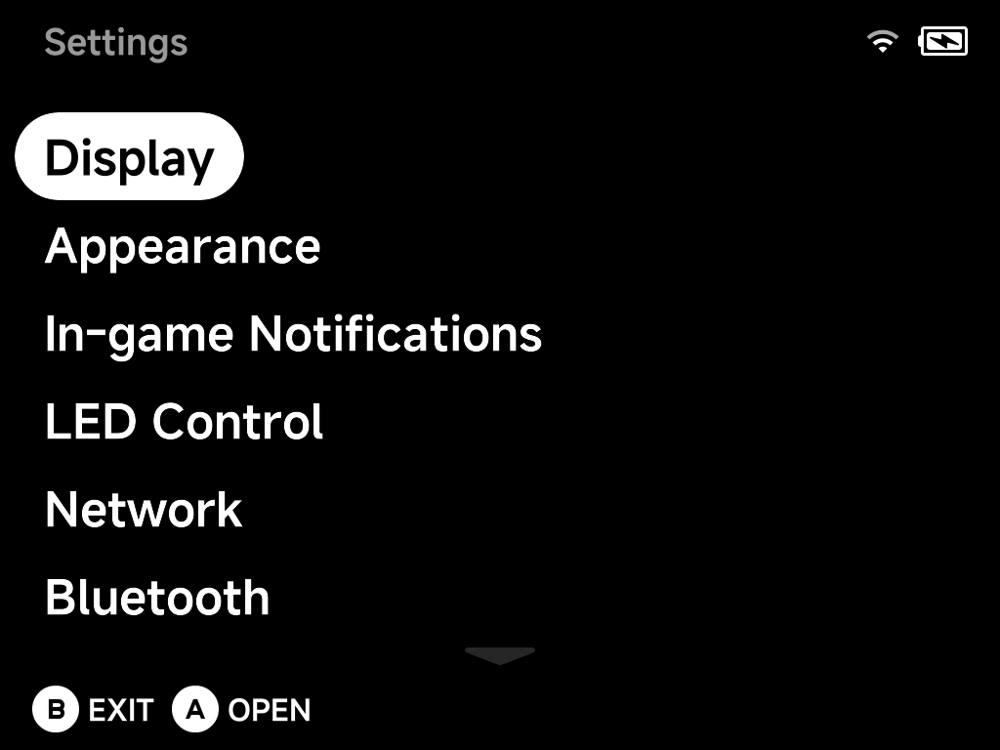

# Settings

Open **Tools → Settings** to configure the device. NX Redux consolidates
what used to be separate apps (LED Control, Input, Clock, Updater) into one
place — each page of the Settings app is documented on its own page here.

- [Display](display.md) — brightness and panel tuning
- [Appearance](appearance.md) — colors, animations and what the menus show
- [In-game Notifications](notifications.md) — save/load/screenshot toasts
- [LED Control](led-control.md) — per-zone lighting effects
- [Network](network.md) — Wi-Fi
- [Bluetooth](bluetooth.md) — pairing and audio
- [Audio](audio.md) — output routing and sample rates
- [FN Switch](fn-switch.md) — what the FN switch toggles, incl. turbo fire
- [Simple Mode](simple-mode.md) — the PIN-protected simplified menu
- [System](system.md) — timeouts, clock, saves, power
- [Developer](developer.md) — SSH, sleep control, cleanup
- [Input Tester](input-tester.md) — button test and joystick calibration
- [About](about.md) — versions and the built-in updater

Some pages only appear when the device has the hardware for them (LEDs,
Wi-Fi, Bluetooth, the FN switch, a fan); the screenshots in this section
are from a TrimUI Brick.
