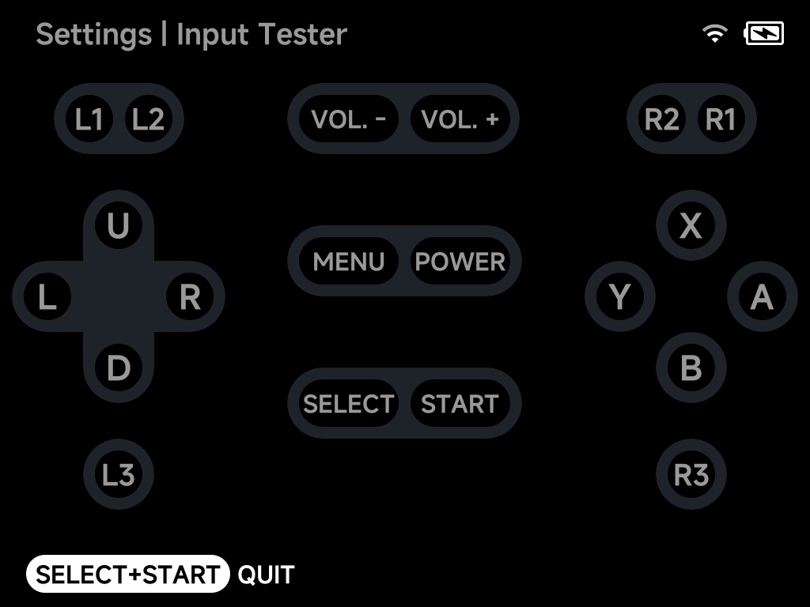
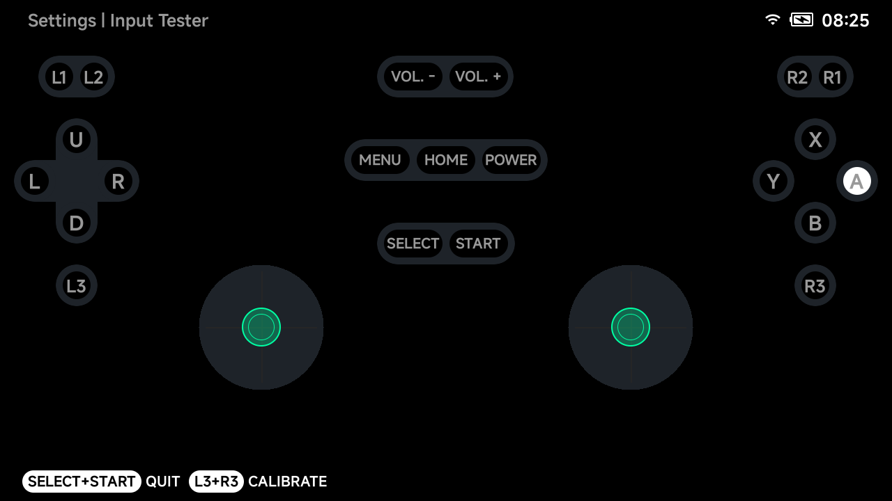

# Input Tester

A live test screen for every input — pressed buttons, D-pad directions and
stick clicks light up as you press them. Quit with `SELECT` + `START`.

The layout matches the device — on a Smart Pro S the two analog sticks are
shown with live position indicators:

## Joystick calibration

On devices with analog sticks (Smart Pro, Smart Pro S, Brick Pro), press
`L3` + `R3` in the Input Tester to start the guided joystick calibration —
follow the on-screen instructions to re-center and range-calibrate the
sticks.
