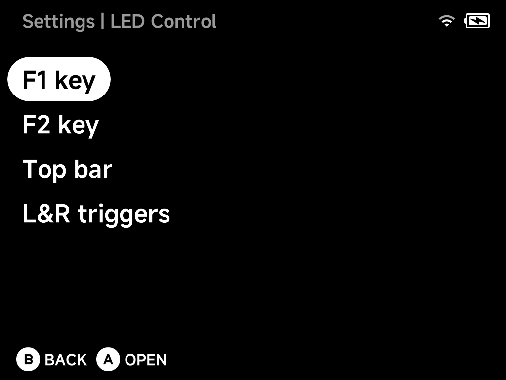
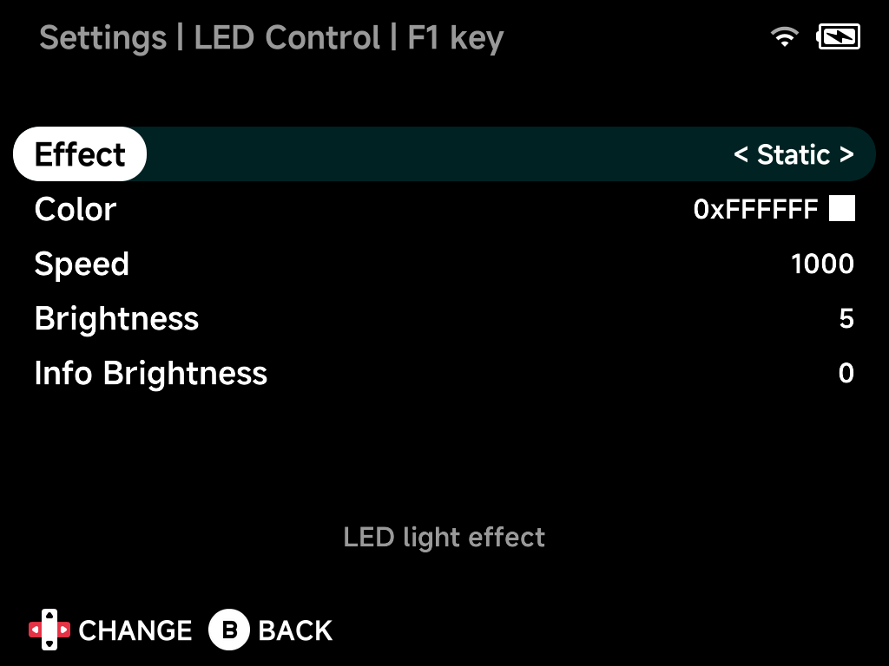

# LED Control

Lighting per LED zone — on the Brick: the **F1 key**, **F2 key**, **Top
bar** and **L&R triggers**. Pick a zone to configure it; every zone offers
the same options below. (Quick LED on/off lives in the
[OSD](../guide/osd.md).)

Opening a zone shows its options — here the F1 key:

## Effect

The lighting effect for the zone: Linear, Breathe, Interval Breathe,
Static, Blink 1–3, Rainbow, Twinkle, Fire, Glitter, NeonGlow, Firefly,
Aurora and Reactive — plus zone-specific extras (Topbar Rainbow and Topbar
night on the top bar; LR Rainbow and LR Reactive on the triggers).

## Color

The LED color, chosen from the color palette.

## Speed

Animation speed of the chosen effect.

## Brightness

LED brightness level (per zone where the hardware supports it, otherwise
for all LEDs).

## Info Brightness

LED brightness used for status lighting — charging and low battery.
