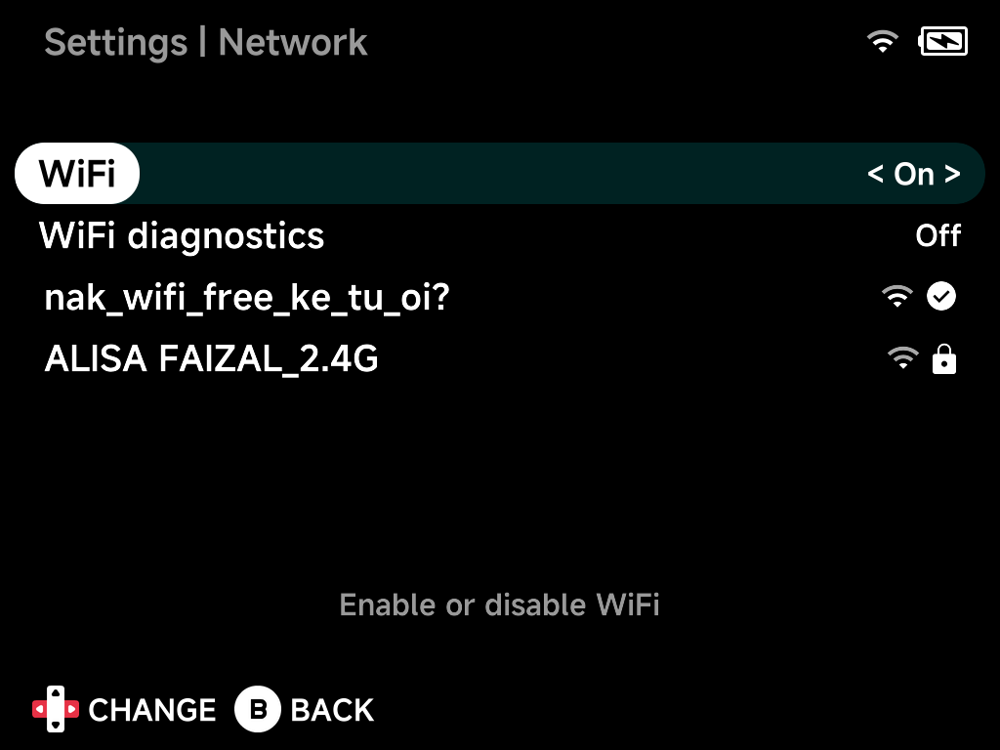

# Network

Wi-Fi configuration. The [OSD](../guide/osd.md)'s Wi-Fi toggle flips the
same radio from anywhere.

## WiFi

Enable or disable Wi-Fi.

## WiFi diagnostics

Extra Wi-Fi logging for troubleshooting.

## Network list

With Wi-Fi on, nearby networks are listed with signal strength and lock
icons — the connected network shows a check mark. Select one to connect,
entering the password with the on-screen keyboard; a known network offers
**Forget**.
