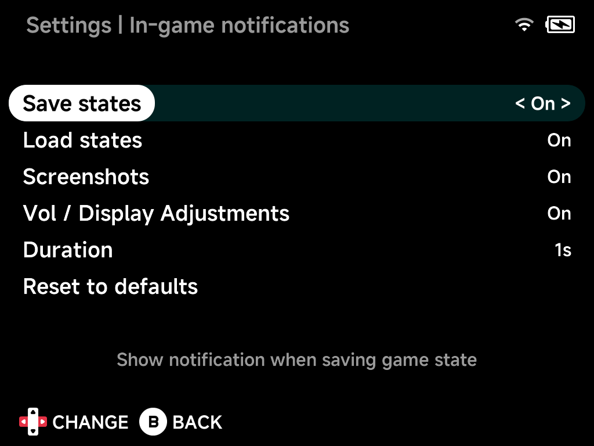

# In-game Notifications

Which in-game toasts appear, and for how long.
(RetroAchievements notifications have their own settings — see
[RetroAchievements](../apps/retroachievements.md).)

## Save states

Show a notification when saving game state.

## Load states

Show a notification when loading game state.

## Screenshots

Show a notification when taking a screenshot.

## Vol / Display Adjustments

Show an overlay for volume, brightness and color temperature adjustments.

## Duration

How long notifications stay on screen.

## Reset to defaults

Resets all options on this page to their default values.
