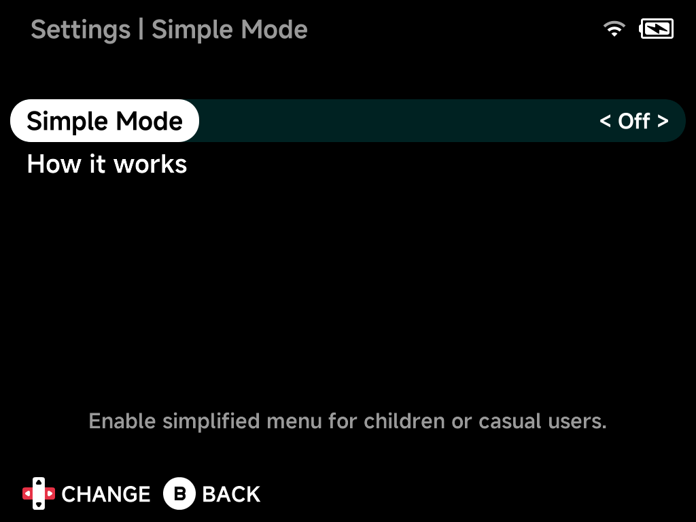

# Simple Mode

The simplified menu for children or casual users — see the
[Simple Mode guide](../guide/simple-mode.md) for what it changes.

## Simple Mode

Enable the simplified menu. Turning it on asks you to set a **4-digit
PIN**, which then protects Settings (and turning Simple Mode back off).

## How it works

An on-device explanation of Simple Mode, including how to recover from a
forgotten PIN (delete `.userdata/shared/enable-simple-mode` from the SD
card on a computer).
