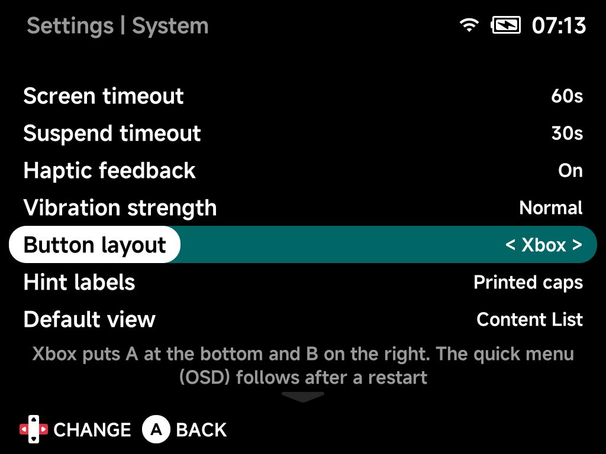

# System

Power behavior, clock, save formats and system maintenance. Options marked
*device-dependent* appear only where the hardware calls for them.

## Screen timeout

Period of inactivity before the screen turns off, `0`–`600` s.

## Suspend timeout

Time before the device goes to sleep after the screen is off, `5`–`600` s.

## Haptic feedback

Enable or disable haptic feedback on certain actions in the OS: a short
pulse when the device goes to sleep or wakes, and a light tap right before
the power actually cuts on shutdown, so you know it is safe to put the device
down. There is no pulse at the start of shutdown. On by default.

These pulses only fire while the **Motor** toggle in the
[On-Screen Display](../guide/osd.md) is on — that toggle is the master
vibration switch for the whole device, games included.

## Vibration strength

`Light`, `Normal` (default) or `Strong`. Sets how hard the motor rumbles for
everything — game rumble, the sleep and wake pulses and the shutdown tap.
Each time you change it the motor gives one pulse at the new level so you can
feel it straight away. Game rumble is often brief and partial (cartridge
rumble emulation), so `Strong` makes those bursts hit nearly as hard as a
full one, while `Light` tones everything down.

## Default view

The initial view to show on boot — the content list or the
[Game Switcher](../guide/game-switcher.md).

## Game Switcher games

Which recently played games appear in the Game Switcher — `Resumable only`
(the default) or all recent games.

## Show 24h time format

Show the clock in 24-hour format.

## Show clock

Show the clock in the status pill.

## Set time and date automatically

Sync time via NTP (requires internet).

## Set time and date manually

Adjust the date and time with the clock editor.

## Time zone

Your time zone.

## Save format

Format for battery saves in `Saves/<TAG>/`: `MinUI` (`.sav`),
`Retroarch (compressed)` / `Retroarch (uncompressed)` (`.srm`), or
`Generic`. Default: **Retroarch (uncompressed)** — directly compatible
with RetroArch on other devices.

## Save state format

Naming/format for save states: `MinUI` (`.st0`…), `Retroarch-ish` or
`Retroarch` (`.state`, `.state1`…), each compressed or uncompressed.
Default: **Retroarch (uncompressed)**.

## Use extracted file name

For zipped ROMs, use the extracted file's name instead of the archive
name (affects save/state matching).

## Safe poweroff

Bypasses the stock shutdown procedure to avoid the "limbo bug".
*(TrimUI devices.)*

## Restore stock files

Restores the console's factory OSD files and reverts NX boot patches, if
any — the NX OSD is unaffected. *(Device-dependent.)*

## Fan Speed

Fan speed: Quiet / Normal / Performance or a percentage. *(Devices with
active cooling — Smart Pro S.)*

## Refresh emulator/roms list

Clears the cached emulator/ROMs list so it rescans on the next launch.

## Reset to defaults

Resets all options on this page to their default values.
